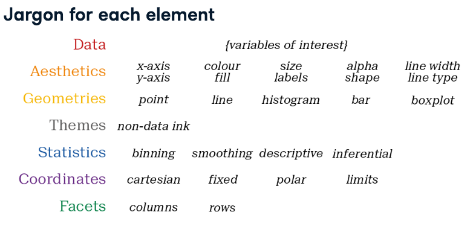
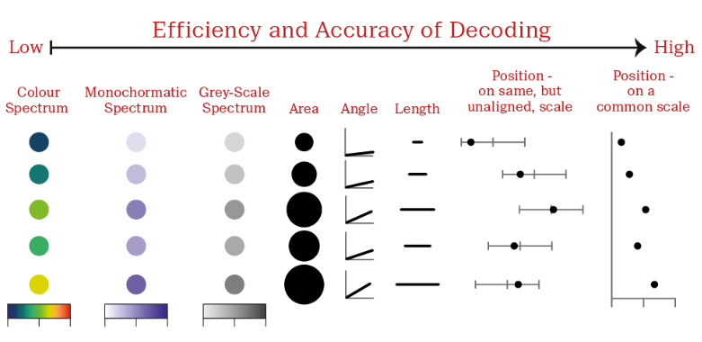
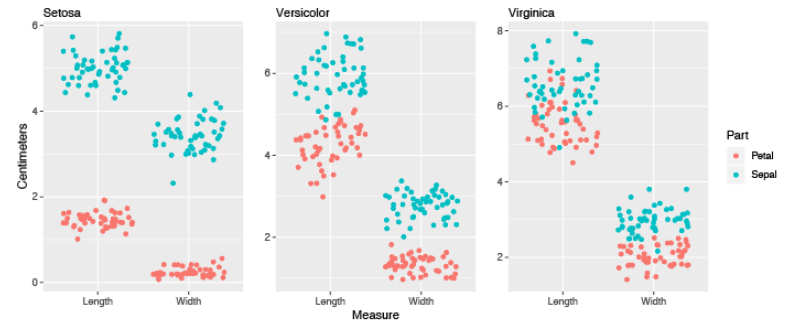
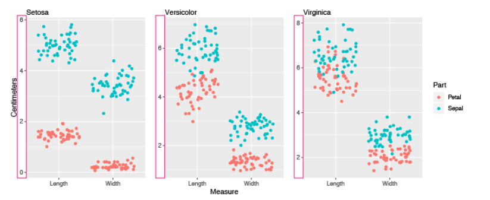
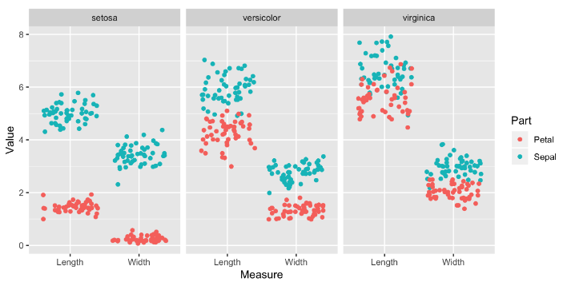
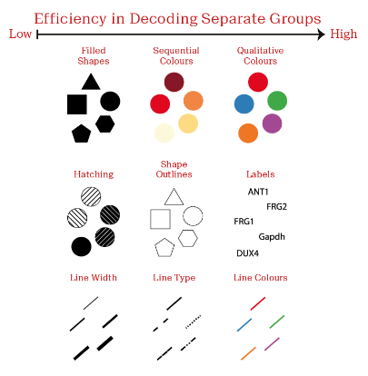
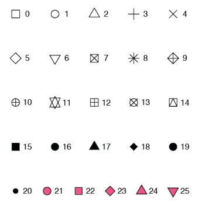
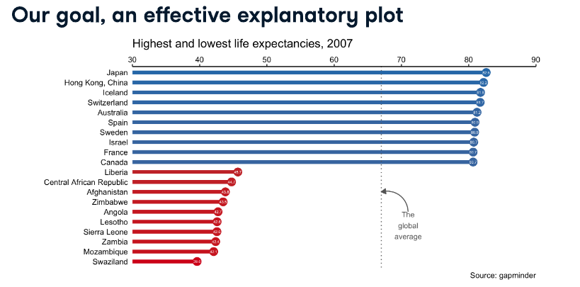

# Chapter 1: Introduction

In this chapter we’ll get you into the right frame of mind for developing meaningful visualizations with R. You’ll understand that as a communications tool, visualizations require you to think about your audience first. You’ll also be introduced to the basics of ggplot2 - the 7 different grammatical elements (layers) and aesthetic mappings.

## Video 1.1: Introduction to ggplot2

This is an introduction to data visualization with ggplot2. We will cover the basics of ggplot2 and how to create different types of plots using ggplot2.

### A scatter plot

```{r}
mammals <- MASS::mammals
```

```{r}
library(ggplot2)
ggplot(mammals, aes(x = body, y = brain)) +
  geom_point()
```

### Explore with a linear model

```{r}
ggplot(mammals, aes(x = body, y = brain)) +
  geom_point(alpha = 0.6) +
  stat_smooth(
    method = "lm", 
    color = "red",
    se = FALSE
  )
```

### Explore: fine-tuning

```{r}
ggplot(mammals, aes(x = body, y = brain)) +
  geom_point(alpha = 0.6) +
  coord_fixed() +
  scale_x_log10() +
  scale_y_log10() +
  stat_smooth(
    method = "lm", 
    color = "#C42126",
    se = FALSE,
    size = 1
  )
```

```{r}
# Load necessary libraries
library(ggplot2)
library(gridExtra)

# Load Anscombe's Quartet data
data(anscombe)

# Create a list of data frames for each dataset in the quartet
anscombe_list <- list(
  data.frame(x = anscombe$x1, y = anscombe$y1, group = "Dataset 1"),
  data.frame(x = anscombe$x2, y = anscombe$y2, group = "Dataset 2"),
  data.frame(x = anscombe$x3, y = anscombe$y3, group = "Dataset 3"),
  data.frame(x = anscombe$x4, y = anscombe$y4, group = "Dataset 4")
)

# Create a function to generate a plot for each dataset
plot_anscombe <- function(data) {
  ggplot(data, aes(x = x, y = y)) +
    geom_point() +
    geom_smooth(method = "lm", se = FALSE, color = "red") +
    labs(title = data$group[1]) +
    theme_minimal()
}

# Generate plots for each dataset
plots <- lapply(anscombe_list, plot_anscombe)

# Arrange the plots in a 2x2 grid
grid.arrange(grobs = plots, ncol = 2)

```

## Video 1.2: The grammar of graphics

Course 1: core competencies

| Element    | Description                            |
|------------|----------------------------------------|
| Data       | The data-set being plotted.            |
| Aesthetics | The scales onto which we map our data. |
| Geometries | The visual elements used for our data. |
| Themes     | All non-data ink.                      |

Course 2: Tools for EDA \* remaining 3 layers \* best practices for data viz

### The seven grammatical elements of ggplot2

| Element     | Description                                       |
|-------------|---------------------------------------------------|
| Data        | The data-set being plotted.                       |
| Aesthetics  | The scales onto which we map our data.            |
| Geometries  | The visual elements used for our data.            |
| Themes      | All non-data ink.                                 |
| Statistics  | Representations of our data to aid understanding. |
| Coordinates | The space on which the data will be plotted.      |
| Facets      | Plotting small multiples.                         |



## Video 1.3: ggplot2 layers

-   Two key concepts:
    1.  layer grammatical elements
    2.  aesthetic mappings

```{r}
iris
```

### Iris geometries

```{r}
g <- ggplot(iris, aes(x = Sepal.Length, y = Sepal.Width)) +
  geom_jitter()
g
```

### Iris themes

```{r}
g <- g +
  labs(x = "Sepal Length (cm)", y = ("Sepal Width (cm)")) +
  theme_classic()
g
```

# Chapter 2: Aesthetics

Aesthetic mappings are the cornerstone of the grammar of graphics plotting concept. This is where the magic happens - converting continuous and categorical data into visual scales that provide access to a large amount of information in a very short time. In this chapter you’ll understand how to choose the best aesthetic mappings for your data.

## Video 2.1: Visible Aesthetics

### Mapping onto the X and Y axes

```{r}
ggplot(iris, aes(x = Sepal.Length, y = Sepal.Width)) +
  geom_point()
```

### Mapping onto color

```{r}
ggplot(iris, aes(x = Sepal.Length, y = Sepal.Width, color = Species)) +
  geom_point()
```

-   `Species`, a dataframe column, is *mapped* onto color, a visible aesthetic.
-   Map aesthetics visible in `aes()`.

### Mapping onto the color aesthetic in geom

```{r}
ggplot(iris) +
  geom_point(aes(x = Sepal.Length, y = Sepal.Width, col = Species))
```

Only necessary if: \* All layers should *not* inherit the same aesthetics. \* Mixing different data sources.

### Typical visible aesthetics:

| Aesthetic  | Description                                  |
|------------|----------------------------------------------|
| `x`        | X axis position                              |
| `y`        | Y axis position                              |
| `fill`     | Fill color                                   |
| `color`    | color of points, outlines of other geoms     |
| `size`     | Area or radius of points, thickness of lines |
| `alpha`    | transparency                                 |
| `linetype` | line dash pattern                            |
| `labels`   | text on a plot or axes                       |
| `shape`    | shape                                        |

## Video 2.2: Using Attributes

### Aesthetics? Attributes!

```{r}
ggplot(iris, aes(x = Sepal.Length,
                 y = Sepal.Width,
                 )) +
  geom_point(color = "red")
```

-   Set attributes in `geom_*()` functions.
-   The **color** attribute is set to **"red"**.

```{r}
ggplot(iris, aes(x = Sepal.Length,
                 y = Sepal.Width,
                 )) +
  geom_point(size = 10)
```

```{r}
ggplot(iris, aes(x = Sepal.Length,
                 y = Sepal.Width,
                 )) +
  geom_point(shape = 4)
```

## Video 2.3: Modifying Aesthetics

### Positions

Adjustment for overlapping points: - `identity` - `dodge` - `stack` - `fill` - `jitter` - `jitterdodge` - `nudge`

### position = "identity" (default)

```{r}
ggplot(iris, aes(x = Sepal.Length,                  
                 y = Sepal.Width,                  
                 color = Species)) +   
  geom_point()

```

```{r}
ggplot(iris, aes(x = Sepal.Length,                  
                 y = Sepal.Width,                  
                 color = Species)) +   
  geom_point(position = "identity")

```

### position = "jitter"

```{r}
ggplot(iris, aes(x = Sepal.Length,                  
                 y = Sepal.Width,                  
                 color = Species)) +   
  geom_point(position = "jitter")

```

### `position_jitter()`

```{r}
posn_j <- position_jitter(0.1)

ggplot(iris, aes(x = Sepal.Length,                  
                 y = Sepal.Width,                  
                 col = Species)) + 
  geom_point(position = posn_j)

```

```{r}
posn_j <- position_jitter(0.1,
                          seed = 136)

ggplot(iris, aes(x = Sepal.Length,                  
                 y = Sepal.Width,                  
                 col = Species)) + 
  geom_point(position = posn_j)

```

-   Set arguments for the position
-   Consistency across plots & layers

### Scale functions

-   `scale_x_*()`, e.g. `scale_x_continuous()`
-   `scale_y_*()`
-   `scale_color_*()`, e.g. `scale_color_discrete()`
-   `scale_fill_*()`
-   `scale_shape_*()`
-   `scale_linetype_*()`
-   `scale_size_*()`

### `scale_*_*()`

```{r}
ggplot(iris, aes(x = Sepal.Length,                  
                 y = Sepal.Width,                  
                 color = Species)) +   
  geom_point(position = "jitter") +
  scale_x_continuous("Sepal Length") +
  scale_color_discrete("Species")
```

### The limits argument

```{r}
ggplot(iris, aes(x = Sepal.Length,                  
                 y = Sepal.Width,                  
                 color = Species)) +   
  geom_point(position = "jitter") +
  scale_x_continuous("Sepal Length", 
                     limits = c(2, 8)) +
  scale_color_discrete("Species")
```

### The breaks argument

```{r}
ggplot(iris, aes(x = Sepal.Length,                   
                 y = Sepal.Width,                  
                 color = Species)) +   
  geom_point(position = "jitter") +  
  scale_x_continuous("Sepal Length",                      
                     limits = c(2, 8),                      
                     breaks = seq(2, 8, 3)) +  
  scale_color_discrete("Species")

```

### The expand argument

```{r}
ggplot(iris, aes(x = Sepal.Length,                   
                 y = Sepal.Width,                  
                 color = Species)) +   
  geom_point(position = "jitter") +  
  scale_x_continuous("Sepal Length",                      
                     limits = c(2, 8),                      
                     breaks = seq(2, 8, 3),                     
                     expand = c(0, 0)) +  
  scale_color_discrete("Species")

```

### The labels argument

```{r}
ggplot(iris, aes(x = Sepal.Length,                   
                 y = Sepal.Width,                  
                 color = Species)) +   
  geom_point(position = "jitter") +  
  scale_x_continuous("Sepal Length",                      
                     limits = c(2, 8),                      
                     breaks = seq(2, 8, 3),                     
                     expand = c(0, 0),                      
                     labels = c("Setosa", 
                                "Versicolor", 
                                "Virginica")) +  
  scale_color_discrete("Species")
```

### `labs()`

```{r}
ggplot(iris, aes(x = Sepal.Length,                  
                 y = Sepal.Width,                  
                 color = Species)) +  
  geom_point(position = "jitter") +  
  labs(x = "Sepal Length",        
       y = "Sepal Width",        
       color = "Species")

```

## Video 2.4: Aesthetics Best Practices

### Which aesthetics?

-   Use your creative know-how, and
-   Follow some clear guidelines
-   Jacques Bertin’s Semiology of Graphics, 1967
-   William Cleveland’s Visualizing Data, 1993
-   William Cleveland's The Elements of Graphing Data, 1985

### Form follows function

-   Primary function: accurate and efficient representations
-   Secondary: visually appealing, beautiful plots
-   Guiding principles:
    -   Never:
        -   Misrepresent or obscure data
        -   Confuse viewers with complexity
    -   Always:
        -   Consider the audience and the purpose of every plot

### best choices for aesthetics

-   Efficient: provides a faster overview than numeric summaries
-   Accurate: minimizes information loss

### Aesthetics - continuous variables

```{r}
ggplot(iris, aes(x = Sepal.Length,                 
                 y = Sepal.Width,                 
                 color = Species)) +   
  geom_point()

```

```{r}
ggplot(iris, aes(color = Sepal.Length,                 
                 y = Sepal.Width,                 
                 x = Species)) +   
  geom_point()

```











### Aesthetics - categorical variables

```{r}
ggplot(iris, aes(x = Sepal.Length,
                 y = Sepal.Width,
                 col = Species)) +
  geom_point()
```

```{r}
ggplot(iris, aes(x = Sepal.Length,
                 y = Sepal.Width,
                 col = Species)) +
  geom_point(position = "jitter",
             alpha = 0.5)
```

# Chapter 3: Geometries

## Video 3.1: Scatter plots

### 48 geometries

``` markdown
| geom_*     |            |            |            |            |            |            |
|------------|------------|------------|------------|------------|------------|------------|
| abline     | contour    | dotplot    | jitter     | pointrange | ribbon     | spoke      |
| area       | count      | errorbar   | label      | polygon    | rug        | step       |
| bar        | crossbar   | errorbarh  | line       | qq         | segment    | text       |
| bin2d      | curve      | freqpoly   | linerange  | qq_line    | sf         | tile       |
| blank      | density    | hex        | map        | quantile   | sf_label   | violin     |
| boxplot    | density2d  | histogram  | path       | raster     | sf_text    | vline      |
| col        | density_2d | hline      | point      | rect       | smooth     |            |
```

### Common plot types

``` markdown
| Plot type | Possible Geoms |
| --- | --- |
| scatter plots | points, jitter, abline, smooth, count |
```

### Scatter plots

-   Each geom can accept specific aesthetic mappings, e.g. geom_point():

``` markdown
| Essential |
| --- |
| x, y |
```

```{r}
ggplot(iris, aes(x = Sepal.Length, 
                 y = Sepal.Width)) +
  geom_point()
```

``` markdown
| Essential | Optional |
| --- | --- |
| x, y | alpha, color, fill, shape, size, stroke |
```

```{r}
ggplot(iris, aes(x = Sepal.Length,
                 y = Sepal.Width,
                 col = Species)) +
  geom_point()
```

### Geom-specific aesthetic mappings

```{r}
# These result in the same plot! 
ggplot(iris, aes(x = Sepal.Length, 
                 y = Sepal.Width, 
                 col = Species)) +   
  geom_point()

ggplot(iris, aes(x = Sepal.Length, 
                 y = Sepal.Width)) +   
  geom_point(aes(col = Species))
```

-   Control aesthetic mappings of each layer independently.

```{r}
head(iris, 3) # Raw data
```

```{r}
library(dplyr)
iris %>% 
  group_by(Species) %>% 
  summarise_all(mean) -> iris.summary

iris.summary # Summary statistics
```

```{r}
ggplot(iris, aes(x = Sepal.Length, y = Sepal.Width, col = Species)) +
  # Inherits both data and aes from ggplot()   
  geom_point() + 
  # Different data, but inherited aes  
  geom_point(data = iris.summary, shape = 15, size = 5)

```

### Shape attribute values



### Example

```{r}
ggplot(iris, aes(x = Sepal.Length, y = Sepal.Width, col = Species)) +   
  geom_point() +  
  geom_point(data = iris.summary, shape = 21, size = 5,              
             fill = "black", stroke = 2)

```

### On the fly stats by ggplot2

-   See the second course for the stats layer.
-   Note: avoid plotting only the mean without a measure of spread, e.g. standard deviation

### `position = "jitter"`

```{r}
ggplot(iris, aes(x = Sepal.Length, 
                 y = Sepal.Width, 
                 col = Species)) +   
  geom_point(position = "jitter")

```

### `geom_jitter()`

A shortcut to \`geom_point(position = "jitter")

```{r}
ggplot(iris, aes(x = Sepal.Length, 
                 y = Sepal.Width, 
                 col = Species)) +   
  geom_jitter()

```

### Don't forget to adjust alpha

-   Combine jittering with alpha blending if necessary

```{r}
ggplot(iris, aes(x = Sepal.Length, 
                 y = Sepal.Width, 
                 col = Species)) +   
  geom_jitter(alpha = 0.6)

```

### Hollow circles also help

-   `shape = 1` is a hollow circle
-   Not necessary to also use alpha blending.

```{r}
ggplot(iris, aes(x = Sepal.Length, 
                 y = Sepal.Width, 
                 col = Species)) +   
  geom_jitter(shape = 1)
```

## Video 3.2: Histograms

### Common plot types

``` markdown
| Plot type | Possible Geoms |
| --- | --- |
| scatter plots | points, jitter, abline, smooth, count |
| **Bar plots** | **histogram, bar, col, errorbar** |
| Line plots | line, path |
```

### Histograms

```{r}
ggplot(iris, aes(x = Sepal.Width)) +
  geom_histogram()
```

-   A plot of binned values, ie a statistical function.

``` markdown
`stat_bin()` using `bins = 30`.
Pick better value with `binwidth`.
```

### Default of 30 even bins

```{r}
ggplot(iris, aes(x = Sepal.Width)) +
  geom_histogram()
```

```{r}
# Default bin width:
diff(range(iris$Sepal.Width)) / 30
```

### Intuitive and meaningful bin widths

```{r}
ggplot(iris, aes(x = Sepal.Width)) +   
  geom_histogram(binwidth = 0.1)

# Always set meaningful bin widths for your data.
# No spaces between bars.
```

### Reposition tick marks

```{r}
ggplot(iris, aes(x = Sepal.Width)) +   
  geom_histogram(binwidth = 0.1,                 
                 center = 0.05)
# Always set meaningful bin widths for your data.
# No spaces between bars.
# X axis labels are between bars
```

### Different species

```{r}
ggplot(iris, aes(x = Sepal.Width,                  
                 fill = Species)) +   
  geom_histogram(binwidth = .1,                  
                 center = 0.05)
```

### Default position is "stack"

```{r}
ggplot(iris, aes(x = Sepal.Width,                 
                 fill = Species)) +   
  geom_histogram(binwidth = .1,                  
                 center = 0.05,                 
                 position = "stack") 
```

### position = "dodge"

```{r}
ggplot(iris, aes(x = Sepal.Width,                  
                 fill = Species)) +   
  geom_histogram(binwidth = .1,                  
                 center = 0.05,                  
                 position = "dodge")
```

### position = "fill"

```{r}
ggplot(iris, aes(x = Sepal.Width,                  
                 fill = Species)) +   
  geom_histogram(binwidth = .1,                  
                 center = 0.05,                  
                 position = "fill")
```

## Video 3.3: Bar Plots

### Bar plots, with a categorical X-axis

-   Use `geom_bar()` or `geom_col()`

| Geom         | Stat       | Action                                        |
|--------------|------------|-----------------------------------------------|
| `geom_bar()` | "count"    | counts the number of cases at each x position |
| `geom_col()` | "identity" | plot actual values                            |

-   All positions from before are available
-   Two types:
    -   Absolute counts
    -   Distributions

### Habits of mammals

```{r}
str(msleep)
```

### Bar plot

```{r}
ggplot(msleep, aes(x = vore)) +
  geom_bar()
```

### Plotting distributions instead of absolute counts

```{r}
library(tidyr)
# Calculate Descriptive Statistics:
iris %>%   
  select(Species, Sepal.Width) %>%   
  gather(key, value, -Species) %>%   
  group_by(Species) %>%   
  summarise(avg = mean(value),             
            stdev = sd(value)) -> iris_summ_long

iris_summ_long
```

### Plotting distributions

```{r}
ggplot(iris_summ_long, aes(x = Species,                            
                           y = avg)) +   
  geom_col() +  
  geom_errorbar(aes(ymin = avg - stdev,                     
                    ymax = avg + stdev),                 
                width = 0.1)
```

## Video 3.4: Line Plots

```{r}
library(beaver)
str(beaver2)
```

```{r}
ggplot(beaver2, aes(x = time, y = temp)) +
  geom_line()
```

```{r}
ggplot(beaver1, aes(x = time, 
                    y = temp,
                    color = factor(activ))
                    ) +
  geom_line()

```

### The fish catch dataset

```{r}
fish <- fish.tidy
str(fish)
```

### Linetype aesthetic

```{r}
ggplot(fish, aes(x = Year, 
                 y = Capture, 
                 linetype = Species)) +
  geom_line()
```

### Size aesthetic

```{r}
ggplot(fish, aes(x = Year,
                 y = Capture,
                 size = Species)) +
  geom_line()
```

### Color aesthetic

```{r}
ggplot(fish, aes(x = Year,
                 y = Capture,
                 color = Species)) +
  geom_line()
```

### Fill aesthetic with `geom_area()`

```{r}
ggplot(fish, aes(x = Year,
                 y = Capture,
                 fill = Species)) +
  geom_area()
```

### Using position = "fill"

```{r}
ggplot(fish, aes(x = Year,
                 y = Capture,
                 fill = Species)) +
  geom_area(position = "fill")
```

### `geom_ribbon()`

```{r}
ggplot(fish, aes(x = Year,                  
                 y = Capture,                  
                 fill = Species)) +   
  geom_ribbon(aes(ymax = Capture,                   
                  ymin = 0),               
              alpha = 0.3)
```

# Chapter 4: Themes

## Video 4.1: Themes from scratch

### The themes layer

-   All non-data ink
-   Visual elements not part of the data
-   Three types:

``` markdown
| type | modified using|
| --- | --- |
| text | element_text() |
| line | element_line() |
| rect | element_rect() |
```

### A starting plot...

```{r}
ggplot(iris, aes(x = Sepal.Length, y = Sepal.Width, color = Species)) +
  geom_jitter(alpha = 0.6)
```

### The text elements

``` markdown
theme(
text  
  axis.title     
    axis.title.x      
      axis.title.x.top      
      axis.title.x.bottom     
    axis.title.y      
      axis.title.y.left      
      axis.title.y.right   t
  title     
    legend.title     
    plot.title    
    plot.subtitle     
    plot.caption     
    plot.tag  
  axis.text     
    axis.text.x       
      axis.text.x.top      
      axis.text.x.bottom     
    axis.text.y      
      axis.text.y.left      
      axis.text.y.right  
  legend.text  
  strip.text    
    strip.text.x    
    strip.text.y)
```

### Adjusting theme elements

```{r}
ggplot(iris, aes(x = Sepal.Length, 
                 y = Sepal.Width, 
                 color = Species)) +   
  geom_jitter(alpha = 0.6) +  
  theme(axis.title = element_text(color = "blue"))

```

### A starting plot...

```{r}
ggplot(iris, aes(x = Sepal.Length, y = Sepal.Width, color = Species)) +
  geom_jitter(alpha = 0.6)
```

### Line elements

``` markdown
theme(
line,  
  axis.ticks,    
    axis.ticks.x,       
      axis.ticks.x.top,      
      axis.ticks.x.bottom,    
    axis.ticks.y,      
      axis.ticks.y.left,       
      axis.ticks.y.right,   
    axis.line,      
      axis.line.x,         
        axis.line.x.top,        
        axis.line.x.bottom,      
      axis.line.y,        
        axis.line.y.left,         
        axis.line.y.right,   
  panel.grid,    
    panel.grid.major,       
      panel.grid.major.x,       
      panel.grid.major.y,     
    panel.grid.minor,      
      panel.grid.minor.x,      
      panel.grid.minor.y)
```

### A starting plot

```{r}
ggplot(iris, aes(x = Sepal.Length, y = Sepal.Width, color = Species)) +
  geom_jitter(alpha = 0.6)
```

### Rect elements

``` markdown
theme(
rect,  
  legend.background,   
  legend.key,  
  legend.box.background,   
  panel.background,  
  panel.border,  
  plot.background,   
  strip.background,     
    strip.background.x,     
    strip.background.y)
```

### Hierarchical naming reflects inheritance rules

e.g. text:

``` markdown
text  
  axis.title     
    axis.title.x      
      axis.title.x.top      
      axis.title.x.bottom     
    axis.title.y      
      axis.title.y.left      
      axis.title.y.right
```

e.g. Lines

``` markdown
line  
  axis.ticks    
    axis.ticks.x       
      axis.ticks.x.top      
      axis.ticks.x.bottom    
    axis.ticks.y      
      axis.ticks.y.left,      
      axis.ticks.y.right    
    axis.line      
      axis.line.x         
        axis.line.x.top        
        axis.line.x.bottom      
      axis.line.y        
        axis.line.y.left         
        axis.line.y.right
```

### `element_blank()`

```{r}
ggplot(iris, aes(x = Sepal.Length, 
                 y = Sepal.Width, 
                 color = Species)) +   
  geom_jitter(alpha = 0.6) +   
  theme(line = element_blank(),        
        rect = element_blank(),        
        text = element_blank())

```

## Video 4.2: Theme flexibility

### Ways to use themes

1)  From scratch (last video)
2)  **Theme layer object**
3)  Built-in themes
    -   `ggplot2` or `ggthemes` packages
4)  Built-in themes from other packages
5)  Update/Set default theme

### Defining theme objects

-   Useful when you have many plots.
-   Provides consistency in style
-   Apply a specific theme everywhere

```{r}
z <- ggplot(iris, aes(x = Sepal.Length, y = Sepal.Width, color = Species)) +   
  geom_jitter(alpha = 0.6) +  
  scale_x_continuous("Sepal Length (cm)", limits = c(4,8), expand = c(0,0)) +  
  scale_y_continuous("Sepal Width (cm)", limits = c(1.5,5), expand = c(0,0)) +  
  scale_color_brewer("Species", palette = "Dark2", labels = c("Setosa", "Versicolor", "Virginica"))

```

```{r}
z + theme(text = element_text(family = "serif", size = 14),          
          rect = element_blank(),          
          panel.grid = element_blank(),          
          title = element_text(color = "#8b0000"),          
          axis.line = element_line(color = "black"))
```

```{r}
theme_iris <- theme(text = element_text(family = "serif", size = 14),          
                    rect = element_blank(),          
                    panel.grid = element_blank(),          
                    title = element_text(color = "#8b0000"),          
                    axis.line = element_line(color = "black"))
```

### Reusing theme objects

```{r}
z + theme_iris
```

```{r}
m <- ggplot(iris, aes(x = Sepal.Width)) +
  geom_histogram(binwidth = 0.1,
                 center = 0.05)
m
```

```{r}
m + theme_iris
```

```{r}
m +
  theme_iris +
  theme(axis.line.x = element_blank())
```

### Using built-in themes

-   Use `theme_*()` functions to access built-in themes

```{r}
z +
  theme_classic()
```

```{r}
z +
  theme_classic() +
  theme(text = element_text(family = "serif"))
```

### The `ggthemes` package

-   Use the `ggthemes` package for more functions.

```{r}
library(ggthemes)
z + 
  theme_tufte()
```

### Updating themes

```{r}
original <- theme_update(text = element_text(family = "serif", size = 14),
                         rect = element_blank(),                         
                         panel.grid = element_blank(),                         
                         title = element_text(color = "#8b0000"),                         
                         axis.line = element_line(color = "black"))

```

```{r}
z
```

### Setting themes

```{r}
theme_set(original)

# Alternatively
# theme_set(theme_grey())
```

## Video 4.3: Effective Explanatory Plots



### Complete data

```{r}
gm2007_full <- gapminder %>% 
  dplyr::select(country, lifeExp, continent, year) %>% 
  filter(year == 2007) %>% 
  dplyr::select(-year)

dplyr::glimpse(gm2007_full)
```

### First exploratory plots - distributions

```{r}
ggplot(gm2007_full, aes(x = lifeExp)) +
  geom_histogram()
```

```{r}
gm2007_full_arranged <- gm2007_full %>%
  arrange(lifeExp) %>%
  mutate(index = row_number())

ggplot(gm2007_full_arranged,         
       aes(index, lifeExp)) +  
  geom_point()
```

```{r}
ggplot(gm2007_full_arranged,         
       aes(index, lifeExp, col = continent)) +  
  geom_point()

```

```{r}
dplyr::glimpse(gm2007_full_arranged) 
gm2007_full_arranged %>% dplyr::select(-index)
```

```{r}
top10 <- gm2007_full_arranged %>% 
  top_n(10, lifeExp) #%>% 
  #dplyr::select(-index)

bottom10 <- gm2007_full_arranged %>% 
  top_n(-10, lifeExp) #%>% 
  #dplyr::select(-index)
top_bottom <- bind_rows(top10, bottom10)

ggplot(top_bottom, aes(x = lifeExp, y = reorder(country, lifeExp), color = lifeExp)) +
  geom_point(size = 3) +
  scale_color_gradient(low = "navy", high = "skyblue") +
  labs(x = "Life Expectancy", y = "Country", color = "Life Expectancy") +
  theme_minimal()
```

```{r}
ggplot(top_bottom, aes(x = lifeExp, y = reorder(country, lifeExp), color = lifeExp)) +
  geom_point(size = 3) +
  geom_segment(aes(x = 30, xend = lifeExp, yend = reorder(country, lifeExp)), size = 1) +
  scale_color_gradient(low = "#00008B", high = "#4682B4") +
  labs(x = "Life Expectancy", y = "Country", color = "Life Expectancy") +
  theme_minimal() +
  theme(plot.title = element_text(size = 20, face = "bold")) +
  ggtitle("Use intuitive and attractive geoms")
```

```{r}
ggplot(top_bottom, aes(x = lifeExp, y = reorder(country, lifeExp), color = lifeExp)) +
  geom_point(size = 3) +
  geom_segment(aes(x = 30, xend = lifeExp, yend = reorder(country, lifeExp)), size = 2) +
  geom_text(aes(label = round(lifeExp, 1)), hjust = -0.3, size = 3) +
  scale_color_gradient(low = "red", high = "darkblue") +
  labs(x = "Life Expectancy", y = "Country", color = "Life Expectancy") +
  theme_minimal() +
  theme(plot.title = element_text(size = 20, face = "bold")) +
  ggtitle("Add text labels to your plot")
```

```{r}
ggplot(top_bottom, aes(x = lifeExp, y = reorder(country, lifeExp), color = lifeExp)) +
  geom_point(size = 3) +
  geom_segment(aes(x = 30, xend = lifeExp, yend = reorder(country, lifeExp)), size = 2) +
  geom_text(aes(label = round(lifeExp, 1)), hjust = -0.3, size = 3) +
  scale_color_gradient(low = "red", high = "blue") +
  scale_x_continuous(limits = c(30, 90), position = "top") +
  labs(y = "Country", color = "Life Expectancy") +
  theme_minimal(base_size = 15) +
  theme(
    plot.title = element_text(size = 20, face = "bold"),
    panel.background = element_rect(fill = "grey90"),
    axis.title.x = element_blank()
  ) +
  labs(title="Add useful titles and citations", subtitle = "Highest and lowest life expectancies, 2007")
```

### Add useful titles and citations

```{r}
ggplot(top_bottom, aes(x = lifeExp, y = reorder(country, lifeExp), color = lifeExp)) +
  geom_point(size = 3) +
  geom_segment(aes(x = 30, xend = lifeExp, yend = reorder(country, lifeExp)), size = 2) +
  geom_text(aes(label = round(lifeExp, 1)), hjust = -0.3, size = 3) +
  scale_color_gradient(low = "red", high = "blue") +
  scale_x_continuous(limits = c(30, 90), position = "top") +
  labs(
    y = "Country", 
    color = "Life Expectancy",
    title = "Highest and lowest life expectancies, 2007", 
    caption = "Source: gapminder"
  ) +
  theme_minimal(base_size = 15) +
  theme(
    plot.title = element_text(size = 16, face = "bold"),
    panel.background = element_blank(),  
    axis.title.x = element_blank()
  )
```

\`\`\`
