# Description

Often in data science, you'll encounter fascinating data that is spread across multiple tables. This course will teach you the skills you'll need to join multiple tables together to analyze them in combination. You'll practice your skills using a fun dataset about LEGOs from the Rebrickable website. The dataset contains information about the sets, parts, themes, and colors of LEGOs, but is spread across many tables. You'll work with the data throughout the course as you learn a total of six different joins! You'll learn four mutating joins: inner join, left join, right join, and full join, and two filtering joins: semi join and anti join. In the final chapter, you'll apply your new skills to Stack Overflow data, containing each of the almost 300,000 Stack Overflow questions that are tagged with R, including information about their answers, the date they were asked, and their score. Get ready to take your dplyr skills to the next level!

# Chapter 1: Joining Tables

## Video 1.1: The `inner_join` verb

### LEGO dataset


In this course, you'll master the important skill of joining multiple tables together, so that they can be analyzed in combination. You'll work with a fun dataset about the construction toys known as LEGOs. The data comes from the Rebrickable website, and has tons of fun information about the sets, parts, themes, and colors that make up LEGO history. The dataset is fascinating, but it's spread across many tables. You'll run into this kind of data a lot if you work in data science.

### The `sets` table

In this chapter you'll be focusing on one dplyr verb, inner join, and you'll start by working with the sets table in the LEGO data. This table contains one row for each of the 4,977 LEGO sets, starting with sets like "Medium Gift Set" back in 1949. Notice that there is a column that's not useful on its own: `theme_id`. That's because the useful information- the theme name- is in a separate table, called `themes`.

```{r}
sets <- readRDS("data/sets.rds")
str(sets)
```

### Linking two tables

The `theme_id` variable in the `sets` table links to the `id` variable in the `themes` table. For any individual set, we could find a theme that matches it.

```{r}
library(dplyr)
sets %>% 
  head(3)
```

```{r}
themes <- readRDS("data/themes.rds")

themes %>% 
  head(3)
```

### `inner_join`

To see the theme that each set is associated with, we'll need to join the two tables. To do this, you use `inner_join`. This joins the first table "sets" to the second table "themes". Notice that the argument `by = theme_id = id`. That tells inner join how to match the tables: linking `theme_id` in the first table to `id` in the second table. Notice that in the output, you've combined the two tables, combining each set with its theme. But because both tables had a variable called name, you end up with `name.x`, with the set's name, and `name.y`, with the theme's name, because you can not have two variables with the same name. Inner join lets you customize this to be more readable!

```{r}
sets %>% 
  inner_join(themes, by = c("theme_id" = "id")) %>% 
  head()
```

### Customizing your join

Add another argument, `suffix = c("_set", "_theme")`. This appends underscore set or underscore theme to the shared columns, which gets the much more readable name underscore set and name underscore theme.

```{r}
sets %>% 
  inner_join(themes, by = c("theme_id" = "id"), suffix = c("_set", "_theme")) %>% 
  head()
```

### Most common themes

Now we can answer interesting questions about the data. For instance, we could find out what the most common themes are in LEGO history by piping again to count `name_theme`, with `sort = TRUE`. This pattern of taking two tables, finding a link between them, and joining them together is very common, and will enable you to make a lot of interesting discoveries throughout this course.

```{r}
sets %>% 
  inner_join(themes, by = c("theme_id" = "id"), suffix = c("_set", "_theme")) %>% 
  count(name_theme, sort = TRUE) %>% 
  head(10)
```

### Other LEGO tables

For starters: in the exercises you'll learn about two new tables from the LEGO dataset, `parts` and `part_categories`, and then practice joining them together. A part is a shape, like a gear, a 2 by 4 brick, or a figurine, and they'll come up a lot in this course.

```{r}
parts <- readRDS("data/parts.rds")
parts %>% 
  head(3)
```

```{r}
part_categories <- readRDS("data/part_categories.rds")
part_categories %>% 
  head(3)
```

## **What columns would you join on?**

You'll be joining together the `parts` and `part_categories` tables. You can first inspect them in the console. To join these two tables together using the `inner_join` verb, what columns would you join from each table?

Since you'll be working with dplyr throughout the course, the package will be preloaded for you in each exercise.

**Possible answers**

`c("id" = "part_num")`

`c("part_cat_id" = "id")` \<- correct answer

`c("part_num" = "part_cat_id")`

`c("part_material_id" = "part_categories")`

```{r}
colnames(parts)
```

```{r}
colnames(part_categories)
```

## **Joining parts and part categories**

The `inner_join` is the key to bring tables together. To use it, you need to provide the two tables that must be joined and the columns on which they should be joined.

In this exercise, you'll join a list of LEGO parts, available as `parts`, with these parts' corresponding categories, available as `part_categories`. For example, the part `Sticker Sheet 1 for Set 1650-1` is from the `Stickers` part category. You can join these tables to see all parts' categories!

**Instructions 1/2**

-   Add the correct joining verb, the name of the second table, and the joining column for the second table.

```{r}
# Add the correct verb, table, and joining column
parts %>% 
  inner_join(part_categories, by = c("part_cat_id" = "id"))
```

**2/2**: Now, use the `suffix` argument to add `"_part"` and `"_category"` suffixes to replace the `name.x` and `name.y` fields.

```{r}
# Use the suffix argument to replace .x and .y suffixes
parts %>% 
  inner_join(part_categories, by = c("part_cat_id" = "id"), suffix = c("_part", "_category"))
```

## Video 1.2: Joining with a one-to-many relationship

### Joining `sets` and `themes`

Each set has exactly one theme, so the joined table has exactly as many observations as the sets table: 4,977.

```{r}
sets %>%  
  inner_join(themes, by = c("theme_id" = "id"), suffix = c("_set","_theme"))
```

### The `inventories` table

But not all joins work that way. Let's introduce a new table, `inventories`. An inventory represents a product that's made up of some combination of parts. Notice that inventories has the variable `set_num`, which suggests it links to the `set_num` variable from our `sets` table.

```{r}
inventories <- readRDS("data/inventories.rds")
head(inventories)
```

### Joining `sets` and `inventories`

Let's try using that variable to join `sets` to `inventories`. Something convenient is that when the variables you're joining by have the same name, you can just write `by = "set_num"`. This is in contrast to the way we earlier did `c("theme_id" = "id")`. Notice that while we started with 4,977 sets, our joined result now has 5,056. This is because each set can have multiple versions, each of which gets its own inventory item. For instance, we can see that Medium Gift Set from 1949 has three versions, and Single 2 by 4 brick has five versions.

```{r}
sets %>%  
  inner_join(inventories, by = "set_num")
```

### Filtering the joined table

One way we can confirm our understanding is to filter this joined table for only the first version. Notice this results in a table with 4,976 observations, compared to our 4,977. This means there's one set that doesn't have a version 1, which is probably a data quality issue. An inner join keeps an observation only if it has an exact match between the first and the second tables. We'll return to how we could find a missing observation in later chapters, and you'll also see that paying close attention to the number of rows before and after a join is an important part of understanding your data.

```{r}
sets %>%  
  inner_join(inventories, by = "set_num") %>%  
  filter(version == 1)
```

### Parts and pieces

In the exercises, you'll be returning to the parts table. But you'll also see each LEGO piece has another attribute besides its part: its color.

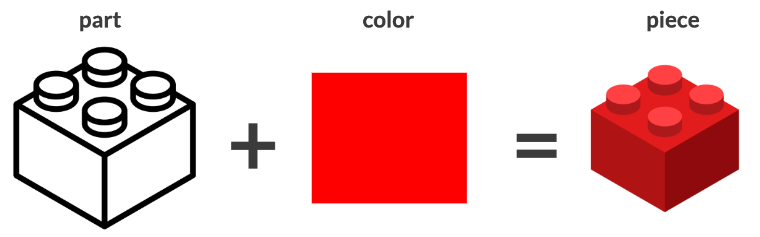

### The `inventory` parts

The `inventory_parts` table is what combines a part and a color. That combination describes a single LEGO piece, which in turn is a part of an inventory. You'll see how all of these connect in the rest of this chapter.

```{r}
inventory_parts <- readRDS("data/inventory_parts.rds")
head(inventory_parts)
```

## **Joining parts and inventories**

The LEGO data has many tables that can be joined together. Often times, some of the things you care about may be a few tables away (we'll get to that later in the course). For now, we know that `parts` is a list of all LEGO parts, and a new table, `inventory_parts`, has some additional information about those parts, such as the `color_id` of each part you would find in a specific LEGO kit.

Let's join these two tables together to observe how joining `parts` with `inventory_parts` increases the size of your table because of the one-to-many relationship that exists between these two tables.

**Instructions**

-   Connect the `parts` and `inventory_parts` tables by their **part numbers** using an inner join.

```{r}
# Combine the parts and inventory_parts tables
parts %>%
  inner_join(inventory_parts, by = "part_num")
```

## **Joining in either direction**

An `inner_join` works the same way with either table in either position. The table that is specified first is arbitrary, since you will end up with the same information in the resulting table either way.

Let's prove this by joining the same two tables from the last exercise in the opposite order!

**Instructions**

-   Connect the `inventory_parts` and `parts` tables by their **part numbers** using an inner join.

```{r}
# Combine the parts and inventory_parts tables
inventory_parts %>%
  inner_join(parts, by = "part_num")
```

## Video 1.3: Joining three or more tables

So far you've learned to join two tables together, but the same approach can join three or more.

### Joining `sets` and `inventories`

In the last lesson, you joined the sets table with the inventories table. Notice that the joined version keeps the `theme_id`.

```{r}
sets %>% 
  inner_join(inventories, by = "set_num")
```

### The `themes` table

What if we wanted to join the theme names, from the `themes` table, into this table as well?

```{r}
themes <- readRDS("data/themes.rds")
head(themes)
```

### Adding another join

You can pipe any number of joins together, just like you can combine other `dplyr` verbs. With this second join, remember that you'll have to specify that you're matching `theme_id` to `id` in the `themes` table. That first join between sets and themes didn't need a suffix argument, because none of the variable names were duplicated. But this new join brings in a second name column.

```{r}
sets %>% 
  inner_join(inventories, by = "set_num") %>% 
  inner_join(themes, by = c("theme_id" = "id"))
```

### Recall: suffix

So recall that you can add suffix, and specify that we want the suffixes `_set` and `_theme`. Notice that in a series of joins, each will usually have different `by` arguments, and often they'll have different suffix arguments. This will depend on the details of the tables you're joining.

```{r}
sets %>% 
  inner_join(inventories, by = "set_num") %>% 
  inner_join(themes, by = c("theme_id" = "id"), suffix = c("_set", "_theme"))
```

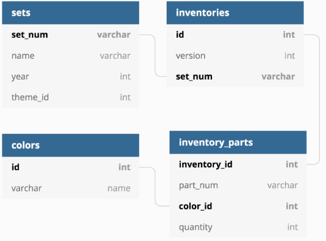

In the exercises, you'll learn how to join not just three, but four tables together: `sets`, `inventories`, `inventory_parts`, and `colors`. This will let you answer questions like "what are the most common colors of parts in Lego sets?" And you'll also get accustomed to working with data that spans a large number of tables.

## **Joining three tables**

You can string together multiple joins with `inner_join` and the pipe (`%>%`), both with which you are already very familiar!

We'll now connect `sets`, a table that tells us about each LEGO kit, with `inventories`, a table that tells us the specific version of a given set, and finally to `inventory_parts`, a table which tells us how many of each part is available in each LEGO kit.

So if you were building a Batman LEGO set, `sets` would tell you the name of the set, `inventories` would give you IDs for each of the versions of the set, and `inventory_parts` would tell you how many of each part would be in each version.

**Instructions**

-   Combine the `inventories` table with the `sets` table.

-   Next, join the `inventory_parts` table to the table you created in the previous join by the inventory IDs.

```{r}
sets %>%
  # Add inventories using an inner join 
  inner_join(inventories, by = "set_num") %>%
  # Add inventory_parts using an inner join 
  inner_join(inventory_parts, by = c("id" = "inventory_id"))
```

## **What's the most common color?**

Now let's join an additional table, `colors`, which will tell us the color of each part in each set, so that we can answer the question, "what is the most common color of a LEGO piece?"

**Instructions 1/2**

-   Inner join the `colors` table using the `color_id` column from the previous join and the `id` column from `colors`; use the suffixes `"_set"` and `"_color"`.

```{r}
colors <- readRDS("data/colors.rds")

# Add an inner join for the colors table
sets %>%
  inner_join(inventories, by = "set_num") %>%
  inner_join(inventory_parts, by = c("id" = "inventory_id")) %>%
  inner_join(colors, by = c("color_id" = "id"), suffix=c("_set", "_color"))
```

**2/2**: Count the `name_color` column and sort the results so the most prominent colors appear first.

```{r}
# Count the number of colors and sort
sets %>%
  inner_join(inventories, by = "set_num") %>%
  inner_join(inventory_parts, by = c("id" = "inventory_id")) %>%
  inner_join(colors, by = c("color_id" = "id"), suffix = c("_set", "_color")) %>%
  count(name_color, sort = TRUE)
```

# Chapter 2: Left and Right Joins

## Video 2.1: The `left_join` verb

What's the difference between the Batmobile and the Batwing?

### Batmobile vs. Batwing

Well, they're both vehicles owned by the superhero Batman, though the Batmobile is a car and the Batwing can fly. We might not be able to tell which one would win in a fight, but, with the datasets we're using, we can look at what parts are included in one of their LEGO sets but not the other.

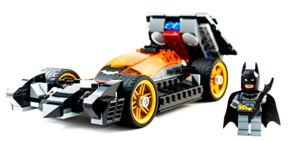

### Recall: inner join

Let's start with an inner join combining the `inventory_parts` and `inventories` tables, where you saw in Chapter 1 that this is how you combine `sets` and `inventory_parts`. For simplicity, we're also using select to remove the id and version variables, since we don't need them, and arrange to sort in descending order of quantity, which represents how many of a piece appear in each set.

```{r}
inventory_parts_joined <- inventories %>%  
  inner_join(inventory_parts, by = c("id" = "inventory_id")) %>%  
  select(-id,-version) %>%  
  arrange(desc(quantity))
inventory_parts_joined
```

### Filter for LEGO sets

Now, you can use the filter verb to extract just two LEGO sets- the Batmobile and the Batwing- based on their set numbers. We're giving you the set numbers here, and we'll be doing something similar for you in each of the exercises.

```{r}
batmobile <- inventory_parts_joined %>%  
  filter(set_num =="7784-1") %>%  
  select(-set_num)

batwing <- inventory_parts_joined %>%  
  filter(set_num =="70916-1")%>%  
  select(-set_num)

```

### Comparing tables

This results in two tables, each containing three variables, that look like this.

```{r}
batmobile
```

```{r}
batwing
```

### Parts and pieces

Each observation is a LEGO piece. Recall that a piece is a combination of a part and a color, like a gray wheel or a red 2 by 4 brick. For now, we're leaving out the part and color names: you've learned how you can join them in when you want them.


### Joining with multiple columns

As you learned in Chapter 1, you can find out what pieces are in common between the Batmobile and the Batwing using an inner join. But, unlike the joins in Chapter 1, there are two columns you need to join on. Each of these observations isn't just a part, but a combination of a part and a color. Notice, you can specify this with `by = c("part_num", "color_id")` unquote. That specifies we want to join on both columns. Notice, we also added the suffixes batmobile and batwing, so that we can tell the quantity columns apart. This shows that the first part appears 28 times in the Batmobile set, but only 17 times in the Batwing set.

```{r}
batmobile %>%  
  inner_join(batwing, by = c("part_num","color_id"), suffix =c("_batmobile","_batwing"))
```

### The left join

But what if we wanted to keep parts that were in the Batmobile but not the Batwing? An inner join keeps only observations that appear in both tables. But if you want to keep all the observations in one of the tables, you can use a different `dplyr` verb: `left_join`. Notice that the `quantity` `batwing` column now has NAs in it, representing missing values. For instance, the first piece, with `part_num` 3023 and `color_id` 72, appears 62 times in the Batmobile but never appears in the Batwing.

```{r}
batmobile %>%  
  left_join(batwing, 
            by = c("part_num","color_id"), 
            suffix = c("_batmobile","_batwing")
            )
```

### Join review

We didn't have that piece in the inner join: since it wasn't in the second table, it didn't appear in the join. That's what left join means: you keep all the observations in the first, or "left", of the two tables, whether or not it occurs in the second, or "right", table. With a few more joins to the colors and parts tables, you could add the details on each part and color. You'll practice doing this in the exercises.

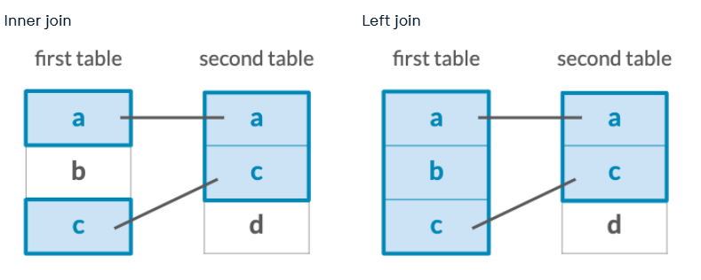

## **Left joining two sets by part and color**

In the video, you learned how to left join two LEGO sets. Now you'll practice your ability to do this looking at two new sets: the Millennium Falcon and Star Destroyer sets. We've created these for you and they have been preloaded for you:

```{r}
millennium_falcon <- inventory_parts_joined %>%   
    filter(set_num == "7965-1")

star_destroyer <- inventory_parts_joined %>%   
    filter(set_num == "75190-1") 
```

**Instructions**

-   Left join the `star_destroyer` and `millennium_falcon` tables on the `part_num` and `color_id` columns with the suffixes `_falcon` and `_star_destroyer`.

```{r}
# Combine the star_destroyer and millennium_falcon tables
millennium_falcon %>%
  left_join(star_destroyer, 
            by = c("part_num", "color_id"), 
            suffix = c("_falcon", "_star_destroyer")
            )
```

## **Left joining two sets by color**

In the videos and the last exercise, you joined two sets based on their part and color. What if you joined the datasets by color alone? As with the last exercise, the Millennium Falcon and Star Destroyer sets have been created and preloaded for you:

```         
millennium_falcon <- inventory_parts_joined %>%   
    filter(set_num == "7965-1") 
```

```         
star_destroyer <- inventory_parts_joined %>%   
    filter(set_num == "75190-1") 
```

**Instructions 1/3**

-   Sum the `quantity` column by `color_id` in the Millennium Falcon dataset.

```{r}
# Aggregate Millennium Falcon for the total quantity in each part
millennium_falcon_colors <- millennium_falcon %>%
  group_by(color_id) %>%
  summarize(total_quantity = sum(quantity))
```

**2/3**: Now, sum the `quantity` column by `color_id` in the Star Destroyer dataset.

```{r}
# Aggregate Millennium Falcon for the total quantity in each part
millennium_falcon_colors <- millennium_falcon %>%
  group_by(color_id) %>%
  summarize(total_quantity = sum(quantity))

# Aggregate Star Destroyer for the total quantity in each part
star_destroyer_colors <- star_destroyer %>%
  group_by(color_id) %>%
  summarize(total_quantity = sum(quantity))
```

**3/3**: Left join the two datasets, `millennium_falcon_colors` and `star_destroyer_colors`, using the `color_id` column and the `_falcon` and `_star_destroyer` suffixes.

```{r}
# Aggregate Millennium Falcon for the total quantity in each part
millennium_falcon_colors <- millennium_falcon %>%
  group_by(color_id) %>%
  summarize(total_quantity = sum(quantity))

# Aggregate Star Destroyer for the total quantity in each part
star_destroyer_colors <- star_destroyer %>%
  group_by(color_id) %>%
  summarize(total_quantity = sum(quantity))

# Left join the Millennium Falcon colors to the Star Destroyer colors
millennium_falcon_colors %>%
  left_join(star_destroyer_colors, by = "color_id", suffix = c("_falcon", "_star_destroyer"))
```

## **Finding an observation that doesn't have a match**

Left joins are really great for testing your assumptions about a data set and ensuring your data has integrity.

For example, the `inventories` table has a `version` column, for when a LEGO kit gets some kind of change or upgrade. It would be fair to assume that all `sets` (which joins well with `inventories`) would have at least a version 1. But let's test this assumption out in the following exercise.

**Instructions**

-   Use a `left_join` to join together `sets` and `inventory_version_1` using their common column.

-   `filter` for where the `version` column is `NA` using `is.na`.

```{r}
inventory_version_1 <- inventories %>%
  filter(version == 1)

# Join versions to sets
sets %>%
  left_join(inventory_version_1, by = "set_num") %>%
  # Filter for where version is na
  filter(is.na(version))
```

## Video 2.2: The `right_join` verb

In the last lesson, you learned about the left join verb.

### The right join

You used it to examine all the pieces in the Batmobile LEGO set and see which appeared and which were missing in the Batwing LEGO set.

```{r}
batmobile %>%  
  left_join(batwing, 
            by =c("part_num","color_id"), 
            suffix =c("_batmobile","_batwing")
            )
```

### The left and right join

Once you've seen a left join, it might not surprise you to learn that there's also a right join. Just as left joins keep all the observations from the first (or "left") table, whether or not they appear in the second (or "right") table, a right join keeps all the observations in the second (or "right") table, whether or not they appear in the first table.

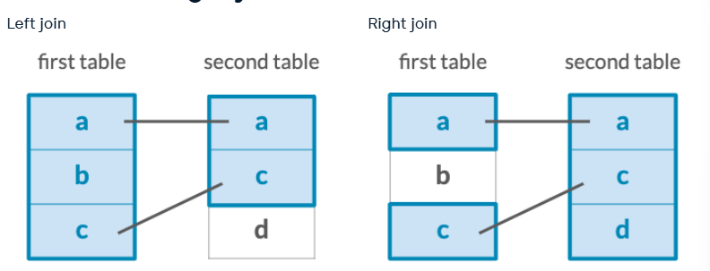

### Mirror images

Notice that with a right join of `batmobile` on `batwing`, we see `NA`s in the quantity `batmobile` column, but not quantity `batwing`. This shows us that left joins and right joins are mirror images of each other. Besides comparing the Batmobile and Batwing LEGO sets, let's consider another case where we'd use right join in practice, to determine how often each theme appears among the sets in our database.

```{r}
batmobile %>%  
  right_join(batwing, 
             by = c("part_num","color_id"), 
             suffix = c("_batmobile","_batwing")
             )
```

### Count and sort

You can use `dplyr`'s count verb to calculate the number of sets that has each `theme_id`, along with `sort = TRUE` to arrange them. Knowing the most common is `theme_id` 501 is not very helpful, so let's add more information, like the name of each theme.

```{r}
sets %>%  
  count(theme_id, sort = TRUE)
```

### Inner join

You could use an inner join for this. That tells us that the most common theme is called "Gear", and the second most common is called "Friends". But this is missing something: specifically, any themes that never occurred in any set in this database. That wouldn't have a zero in this data: it just would not appear. But a right join would keep those themes that never occurred.

```{r}
sets %>%  
  count(theme_id, sort =TRUE)%>%  inner_join(themes, by =c("theme_id"="id"))
```

### Right join

Notice this has `NA`s in the `n` column for anything that wasn't in the count table- for instance, the Farm theme, in the eighth observation. Now, we know from our data that those `NA`s in `n` should really be zeros.

```{r}
sets %>%  
  count(theme_id, sort = TRUE) %>%  
  right_join(themes, by =c("theme_id" = "id"))
```

### Replace `NA`s

So let's introduce a new verb from the tidyr package: `replace_na`. By piping your result to `replace_na`, list parentheses `n = 0`, we can replace any `NA` in the `n` column with zero. Notice that the Farm observation now has a zero rather than an `NA`. The `replace_na` verb often appears when you're doing joins: you'll gain practice with it in the exercises and in the rest of the course.

```{r}
library(tidyr)
sets %>%  
  count(theme_id, sort = TRUE) %>%  
  right_join(themes, 
             by =c("theme_id" = "id")) %>%  
  replace_na(list(n =0))
```

## **Counting part colors**

Sometimes you'll want to do some processing *before* you do a join, *and* prioritize keeping the second (right) table's rows instead. In this case, a right join is for you.

In this exercise, we'll count the `part_cat_id` from `parts`, before using a `right_join` to join with `part_categories`. The reason we do this is because we don't only want to know the count of `part_cat_id` in `parts`, but we also want to know if there are any `part_cat_id`s *not* present in `parts`.

**Instructions 1/2**

-   Use the `count` verb to count each `part_cat_id` in the `parts` table.

-   Use a `right_join` to join `part_categories`. You'll need to use the `part_cat_id` from the count and the `id` column from `part_categories`.

```{r}
parts %>%
  # Count the part_cat_id
  count(part_cat_id) %>%
  # Right join part_categories
  right_join(part_categories, by = c("part_cat_id" = "id"))
```

**2/2:** `filter` for where the column `n` is NA.

```{r}
parts %>%
  count(part_cat_id) %>%
  right_join(part_categories, by = c("part_cat_id" = "id")) %>%
  # Filter for NA
  filter(is.na(n))
```

## **Cleaning up your count**

In both left and right joins, there is the opportunity for there to be NA values in the resulting table. Fortunately, the `replace_na` function can turn those NAs into meaningful values.

In the last exercise, we saw that the `n` column had NAs after the `right_join`. Let's use the `replace_na` column, which takes a `list` of column names and the values with which NAs should be replaced, to clean up our table.

**Instructions**

-   Use `replace_na` to replace NAs in the `n` column with the value `0`.

```{r}
parts %>%
  count(part_cat_id) %>%
  right_join(part_categories, by = c("part_cat_id" = "id")) %>%
  # Use replace_na to replace missing values in the n column
  replace_na(list(n=0))
```

## Video 2.3: Joining tables to themselves

Let's take another look at the themes table.

### The `themes` table

Notice that besides the `theme_id` and the `name`, there's a column `parent_id`. That means the table has a relationship to itself. This is a hierarchical table, and having a `parent_id` is a common way to represent this hierarchical relationship. For example, the themes "Arctic Technic", "Competition", "Expert Builder", and "Model" all have the `parent_id` 1. Based on the first column, we can see that that ID corresponds to the first theme, called "Technic". We can also see that the next five rows have the parent id 5, which we can see corresponds to the theme "Model".

```{r}
themes
```

### The hierarchy of themes

These ten observations communicate a hierarchy of themes like this. The Technic theme has four children, and its child theme Model also has five children themes. How could we explore the relationship between themes and parents? Well, you've already learned to join two tables together. But did you know you can also join a table to itself, by matching each theme to its parents?

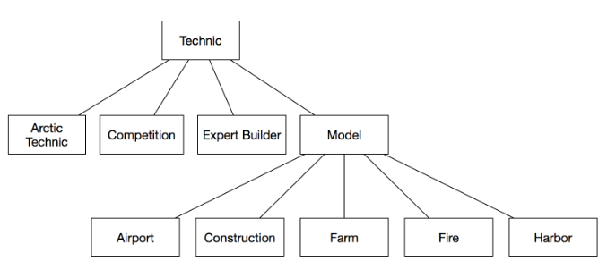

### Child-parent table

If we inner join `themes` to itself, and use the `parent_id` column on the left to match the `id` column on the right, we end up with a table of child-parent relationships. Notice that Arctic Technic, under `name.x`, is now linked to its parent, Technic. Similarly, Airport is linked to its parent Model.

```{r}
themes %>%  
  inner_join(themes, 
             by = c("parent_id" = "id")
             )
```

### Adding a suffix

We can make this a bit more readable by noticing that the `.x` is the child and `.y` is the parent, and adding a `suffix` argument. We now have a table of themes alongside the name of their parent themes, which is convenient for exploring the hierarchy of themes.

```{r}
themes %>%  
  inner_join(themes, 
             by = c("parent_id" = "id"), 
             suffix = c("_child", "_parent")
             )
```

### Lord of the Rings themes: parent

For example, there are LEGO sets that are themed around the fantasy series "The Lord of the Rings". You could filter on `name_child` to find out what the theme's parent is. This filter shows that the parent theme is called "The Hobbit and Lord of the Rings."

```{r}
themes %>%  
  inner_join(themes, 
             by = c("parent_id" = "id"), 
             suffix = c("_child", "_parent")) %>%     
  filter(name_child == "The Lord of the Rings")
```

### Lord of the Rings themes: children

What if you wanted to find out all of the children of that theme instead? You could filter on the `name_parent` attribute instead. This shows that the three children of that theme are the three books in the Lord of the Rings trilogy: The Fellowship of the Ring, the Two Towers, and the Return of the King.

```{r}
themes %>%  
  inner_join(themes, 
             by = c("parent_id" = "id"), 
             suffix = c("_child", "_parent")) %>%  
  filter(name_parent == "The Lord of the Rings")
```

### The Lord of the Rings trilogy

Based on all this, we start to understand the shape of our data. In the exercises you'll explore these hierarchical relationships some more, and how you could use the left join verb from this chapter to discover which themes have no children.

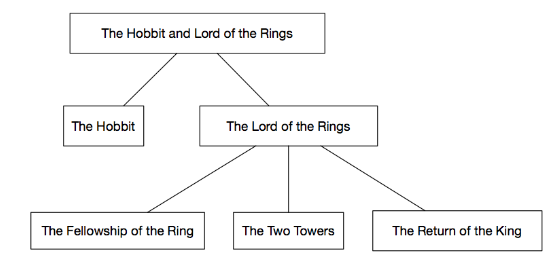

## **Joining themes to their children**

Tables can be joined to themselves!

In the `themes` table, which is available for you to inspect in the console, you'll notice there is both an `id` column and a `parent_id` column. Keeping that in mind, you can join the `themes` table to itself to determine the parent-child relationships that exist for different themes.

In the videos, you saw themes joined to their own parents. In this exercise, you'll try a similar approach of joining themes to their own *children*, which is similar but reversed. Let's try this out to discover what children the theme `"Harry Potter"` has.

**Instructions**

-   Inner join `themes` to their own children, resulting in the suffixes `"_parent"` and `"_child"`, respectively.

-   Filter this table to find the children of the `"Harry Potter"` theme.

```{r}
themes %>% 
  # Inner join the themes table
  inner_join(themes, by=c("id" = "parent_id"), suffix = c("_parent", "_child")) %>%
  # Filter for the "Harry Potter" parent name 
  filter(name_parent == "Harry Potter")
```

## **Joining themes to their grandchildren**

We can go a step further than looking at themes and their children. Some themes actually have *grandchildren*: their children's children.

Here, we can inner join `themes` to a filtered version of itself *again* to establish a connection between our last join's children and *their* children.

**Instructions**

-   Use another inner join to combine `themes` again with itself.

    -   Be sure to use the suffixes `"_parent"` and `"_grandchild"` so the columns in the resulting table are clear.

    -   Update the `by` argument to specify the correct columns to join on. If you're unsure of what columns to join on, it might help to look at the result of the first join to get a feel for it.

```{r}
# Join themes to itself again to find the grandchild relationships
themes %>% 
  inner_join(themes, 
             by = c("id" = "parent_id"), 
             suffix = c("_parent", "_child")) %>%
  inner_join(themes, 
             by = c("id_child" = "parent_id"), 
             suffix = c("_parent", "_grandchild")
             )
```

## **Left joining a table to itself**

So far, you've been inner joining a table to itself in order to find the children of themes like `"Harry Potter"` or `"The Lord of the Rings"`.

But some themes might not have any children at all, which means they won't be included in the inner join. As you've learned in this chapter, you can identify those with a `left_join` and a `filter()`.

**Instructions**

-   Left join the themes table to its own children, with the suffixes `_parent` and `_child` respectively.

-   Filter the result of the join to find themes that have no children.

```{r}
themes %>% 
  # Left join the themes table to its own children
  left_join(themes, 
            by = c("id" = "parent_id"), 
            suffix=c("_parent", "_child")
            ) %>%
  # Filter for themes that have no child themes
  filter(is.na(name_child))
```

# Chapter 3: Full, Semi, and Anti Joins

## Video 3.1: The `full_join` verb

In Chapter 2, you learned about left and right joins.

### Left and right joins

You used them to join tables like the Batmobile and Batwing, and see which pieces were in one but not the other. What if instead of keeping all the observations in the left or the right tables, you wanted to keep all observations in both tables, whether or not they matched to each other?

```{r}
batwing %>%  
  left_join(batwing, 
            by =c("part_num", "color_id"), 
            suffix = c("_batmobile", "_batwing")
            )
```

### The full join

In this lesson: you'll learn another of `dplyr`'s joining verbs: `full_join`.

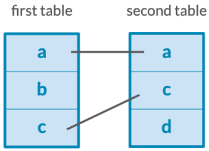

### Joining and filtering

Let's start with the same joining and filtering that was applied in Chapter 2, where we filter for just the Batmobile and the Batwing sets. In the exercises, we'll help you create similar subsets of the LEGO pieces.

```{r}
inventory_parts_joined <- inventories %>%  
  inner_join(inventory_parts, by = c("id" = "inventory_id")) %>%  
  arrange(desc(quantity)) %>%  
  select(-id,-version)

batmobile <- inventory_parts_joined %>%  
  filter(set_num =="7784-1") %>%  
  select(-set_num)

batwing <- inventory_parts_joined %>%  
  filter(set_num =="70916-1") %>%  
  select(-set_num)

```

### Batmobile vs. Batwing

Recall that this results in two tables with three variables.

```{r}
batmobile
```

```{r}
batwing
```

### Joining it all together

A left join would keep all the observations in batmobile, a right join would keep all the observations in batwing. A full join keeps all the observations in either. All the other arguments, like by and suffix, are the same.

**Left join**: keep all `batmobile`

```{r}
batmobile %>%  
  left_join(batwing, 
            by =c("part_num", "color_id"), 
            suffix = c("_batmobile", "_batwing")
            )
```

**Right join**: keep all `batwing`

```{r}
batmobile %>%  
  right_join(batwing, 
             by = c("part_num", "color_id"), 
             suffix = c("_batmobile","_batwing")
             )
```

**Full join**: keep all both

```{r}
batmobile %>%  
  full_join(batwing, 
            by = c("part_num", "color_id"), 
            suffix = c("_batmobile","_batwing")
            )

```

### Full join result

The result of `full_join` has `NA`s in both, though in this preview we may not see them. Notice, there are 440 observations, which is more than either of the tables had originally. When you do a full join, you're looking at all the pieces from the Batmobile and all the pieces from the Batwing, as if you opened up the two boxes and poured them out next to each other.

```{r}
batmobile %>%  
  full_join(batwing, 
            by = c("part_num", "color_id"), 
            suffix = c("_batmobile","_batwing")
            )
```

### Replace `NA`: multiple variables

Just as you learned to do with right join in the last chapter, you can use `replace_na` from the `tidyr` package to replace `NA`s in quantity `batmobile` and quantity `batwing` columns with `0`. Notice that you can replace `NA`s in multiple variables by separating them with commas.

```{r}
library(tidyr)
batmobile %>%  
  full_join(batwing, 
            by = c("part_num", "color_id"), 
            suffix = c("_batmobile", "_batwing")
            ) %>%  
  replace_na(list(quantity_batmobile = 0,                  
                  quantity_batwing = 0)
             )

```

In the exercises, you'll be using full joins along with other dplyr verbs to compare, not just two sets, like the Batmobile and the Batwing, but also two themes, specifically Batman and Star Wars. Let's get started!

## **Differences between Batman and Star Wars**

In the video, you compared two sets. Now, you'll compare two themes, each of which is made up of many sets.

First, you'll need to join in the `themes`. Recall that doing so requires going through the `sets` first. You'll use the `inventory_parts_joined` table from the video, which is already available to you in the console.

```{r}
inventory_parts_joined <- inventories %>%   
    inner_join(inventory_parts, by = c("id" = "inventory_id")) %>%   
    arrange(desc(quantity)) %>%   
    select(-id, -version) 
```

**Instructions**

In order to join in the themes, you'll first need to combine the `inventory_parts_joined` and `sets` tables.

-   Then, combine the first join with the `themes` table, using the suffix argument to clarify which table each `name` came from (`"_set"` or `"_theme"`).

```{r}
# Start with inventory_parts_joined table
inventory_parts_joined %>%
  # Combine with the sets table 
  inner_join(sets, by="set_num") %>%
  # Combine with the themes table 
  inner_join(themes, by=c("theme_id" = "id"), suffix=c("_set", "_theme"))
```

```{r}
# Start with inventory_parts_joined table
inventory_parts_joined %>%
  # Combine with the sets table 
  inner_join(sets, by="set_num") %>%
  # Combine with the themes table 
  inner_join(themes, by=c("theme_id" = "id"), suffix=c("_set", "_theme"))
```

## **Aggregating each theme**

Previously, you combined tables to compare themes. Before doing this comparison, you'll want to aggregate the data to learn more about the pieces that are a part of each theme, as well as the colors of those pieces.

The table you created previously has been preloaded for you as `inventory_sets_themes`. It was filtered for each theme, and the objects have been saved as `batman` and `star_wars`.

```{r}
inventory_sets_themes <- inventory_parts_joined %>%   
    inner_join(sets, by = "set_num") %>%   
    inner_join(themes, by = c("theme_id" = "id"), suffix = c("_set", "_theme"))  
    
batman <- inventory_sets_themes %>%   
    filter(name_theme == "Batman")  

star_wars <- inventory_sets_themes %>%   
    filter(name_theme == "Star Wars")
```

**Instructions**

-   Count the part number and color id for the parts in Batman and Star Wars, weighted by quantity.

```{r}
# Count the part number and color id, weight by quantity
batman %>%
  count(part_num, color_id, wt=quantity)

star_wars %>%
  count(part_num, color_id, wt=quantity)
```

## **Full joining Batman and Star Wars LEGO parts**

Now that you've got separate tables for the pieces in the `batman` and `star_wars` themes, you'll want to be able to combine them to see any similarities or differences between the two themes. The aggregating from the last exercise has been saved as `batman_parts` and `star_wars_parts`, and is preloaded for you.

batman_parts \<- batman %\>%

count(part_num, color_id, wt = quantity)

star_wars_parts \<- star_wars %\>%

count(part_num, color_id, wt = quantity)

```{r}
batman_parts <- batman %>%   
    count(part_num, color_id, wt = quantity)  

star_wars_parts <- star_wars %>%   
    count(part_num, color_id, wt = quantity)
```

**Instructions**

-   Combine the `star_wars_parts` table with the `batman_parts` table; use the suffix argument to include the `"_batman"` and `"_star_wars"` suffixes.

-   Replace all the NA values in the `n_batman` and `n_star_wars` columns with 0s.

```{r}
batman_parts %>%
  # Combine the star_wars_parts table 
  full_join(star_wars_parts, 
            by = c("part_num", 
                   "color_id"), 
            suffix = c("_batman", 
                       "_star_wars")
            ) %>%
  # Replace NAs with 0s in the n_batman and n_star_wars columns 
  replace_na(list(n_batman = 0, 
                  n_star_wars = 0)
             )
```

## **Comparing Batman and Star Wars LEGO parts**

The table you created in the last exercise includes the part number of each piece, the color id, and the number of each piece in the Star Wars and Batman themes. However, we have more information about each of these parts that we can gain by combining this table with some of the information we have in other tables. Before we compare the themes, let's ensure that we have enough information to make our findings more interpretable. The table from the last exercise has been saved as `parts_joined` and is preloaded for you.

```{r}
parts_joined <- batman_parts %>%   
  full_join(star_wars_parts, 
            by = c("part_num", 
                   "color_id"), 
            suffix = c("_batman", 
                       "_star_wars")
            ) %>%   
  replace_na(list(n_batman = 0, 
                  n_star_wars = 0)
             ) 
```

**Instructions**

-   Sort the number of star wars pieces in the `parts_joined` table in descending order.

-   Inner join the `colors` table to the `parts_joined` table.

-   Combine the `parts` table to the previous join using an inner join; add `"_color"` and `"_part"` suffixes to specify whether or not the information came from the `colors` table or the `parts` table.

```{r}
parts_joined %>%
  # Sort the number of star wars pieces in descending order 
  arrange(desc(n_star_wars)) %>%
  # Join the colors table to the parts_joined table
  inner_join(colors, by=c("color_id" = "id")) %>%
  # Join the parts table to the previous join 
  inner_join(parts, by="part_num", suffix=c("_color", "_part"))
```

## Video 3.2: The `semi-join` and `anti-join` verbs

You've learned about four joining verbs so far: `inner_join`, `left_join`, `right_join`, and `full_join`.

### Mutating verbs

All of these are what we call *mutating verbs*: they combine the variables from your two tables.

-   `inner_join`

-   `left_join`

-   `right_join`

-   `full_join`

### Review: left join

For example, when you left joined `batmobile` and `batwing`, you ended up with a new column you did not have in `batmobile`: specifically, `quantity_batwing`.

```{r}
batmobile %>%  
  left_join(batwing, 
            by = c("part_num", "color_id"), 
            suffix = c("_batmobile", "_batwing")
            )
```

### Filtering joins

-   Keeps or removes observations from the first table.

-   Doesn't add new variables

-   `semi_join`

-   `anti_join`

### Filtering joins: `semi_join`

-   `semi_join`: what observations in X are **also** in Y?

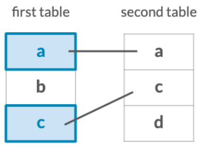

### Filtering joins: `anti_join`

-   `anti_join`: what observations in X are **not** in Y?

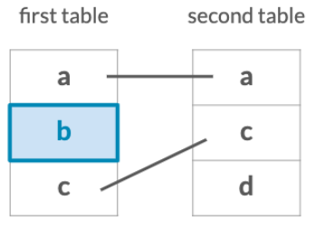

### The `semi_join`

Let's start with `semi_join`. What parts used in the Batmobile set are also used in the Batwing set? This semi join takes us from the 173 pieces that are in the Batmobile set and reduces it to the 45 pieces that are also in the Batwing set. But notice that we still have the same three variables - `part_num`, `color_id`, and `quantity`: that the Batmobile set started with. We kept Batmobile's quantity variable, and didn't even have to specify a suffix. This is useful for when we want to filter down a table without modifying it further.

```{r}
batmobile %>%  
  semi_join(batwing, 
            by = c("color_id", "part_num")
            )
```

### The `anti_join`

The opposite of a semi join is an anti join. Anti joins ask: *what observations in the first table are not in the second table*? In this case, what pieces are in the `batmobile` but not in the `batwing`. Notice again, we did not specify a suffix. The result tells us that there are 128 pieces in the Batmobile that are not in the Batwing.

```{r}
batmobile %>%  
  anti_join(batwing, 
            by = c("color_id", "part_num")
            )
```

### Filtering with `semi_join`

These verbs aren't useful just for comparing Batman's rides. You could use them to filter down the other tables we've worked with. For example, you might want to know what themes ever appear in a set. A semi join tells you that 569 themes make at least one appearance.

```{r}
themes %>% 
  semi_join(sets, 
            by = c("id" = "theme_id")
            )
```

### Filtering with `anti_join`

Conversely, you could use anti join to [*find the themes that never appear in a set in our database*]{.underline}. This filters down to the 96 that don't match to anything.

```{r}
themes %>%  
  anti_join(sets, 
            by = c("id" = "theme_id")
            )
```

### The joining verbs

In the exercises, you'll find other useful applications of the semi and anti joins. Before long, you'll have six joining verbs in your dplyr arsenal.

-   `inner_join`

-   `left_join`

-   `right_join`

-   `full_join`

-   `semi_join`

-   `anti_join`

## **Something within one set but not another**

In the videos, you learned how to filter using the semi- and anti join verbs to answer questions you have about your data. Let's focus on the `batwing` dataset, and use our skills to determine which parts are in both the `batwing` and `batmobile` sets, and which sets are in one, but not the other. While answering these questions, we'll also be determining whether or not the parts we're looking at in both sets also have the same color in common.

The `batmobile` and `batwing` datasets have been preloaded for you.

```{r}
batmobile <- inventory_parts_joined %>%   
    filter(set_num == "7784-1") %>%   
    select(-set_num)  

batwing <- inventory_parts_joined %>%   
    filter(set_num == "70916-1") %>%   
    select(-set_num) 
```

**Instructions**

-   Filter the `batwing` set for parts that are **also** in the `batmobile`, whether or not they have the same color.

-   Filter the `batwing` set for parts that **aren't** also in the `batmobile`, whether or not they have the same color.

```{r}
# Filter the batwing set for parts that are also in the batmobile set
batwing %>%
  semi_join(batmobile, by="part_num")

# Filter the batwing set for parts that aren't in the batmobile set
batwing %>%
  anti_join(batmobile, by="part_num")
```

## **What colors are included in at least one set?**

Besides comparing two sets directly, you could also use a filtering join like `semi_join` to find out which colors ever appear in any inventory part. Some of the colors could be optional, meaning they aren't included in any sets.

The `inventory_parts` and `colors` tables have been preloaded for you.

**Instructions**

-   Use the `inventory_parts` table to find the colors that are included in at least one set.

```{r}
# Use inventory_parts to find colors included in at least one set
colors %>%
  semi_join(inventory_parts, by=c("id" = "color_id"))
```

## **Which set is missing version 1?**

Each set included in the LEGO data has an associated version number. We want to understand the version we are looking at to learn more about the parts that are included. Before doing that, we should confirm that there aren't any sets that are missing a particular version.

Let's start by looking at the first version of each set to see if there are any sets that don't include a first version.

**Instructions**

-   Use `filter()` to extract `version` `1` from the `inventories` table; save the filter to `version_1_inventories`.

-   Use `anti_join` to combine `version_1_inventories` with `sets` to determine which set is missing a version 1.

```{r}
# Use filter() to extract version 1 
version_1_inventories <- inventories %>%
  filter(version == 1)

# Use anti_join() to find which set is missing a version 1
sets %>%
  anti_join(version_1_inventories, by="set_num")
```

## Video 3.3: Visualizing set differences

So far in this chapter, you've been working with the `batmobile` and `batwing` tables, which contain the pieces for each of the two LEGO sets. Let's say that instead of working with pieces, you wanted to examine and compare the colors used in each set. This will take a little effort, but it will make a great and intuitive visualization of the differences in the color palettes between the Batmobile and the Batwing.

### Aggregating sets into colors

Before doing any joining, you'll want to aggregate each set into colors. You've learned how to do this in `dplyr` with `group_by` and `summarize`. You can create a total column equal to the sum of the quantity column. We could do the same aggregation for both the `batmobile` and `batwing` sets. You now have two tables, one for each set, where each table has one observation per color. The tables have only the `color_id`s right now, but we'll be joining in the color names later.

```{r}
batmobile_colors <- batmobile %>%  
  group_by(color_id) %>%  
  summarize(total = sum(quantity))

batmobile_colors
```

```{r}
batwing_colors <- batwing %>%  
  group_by(color_id) %>%  
  summarize(total = sum(quantity))
batwing_colors
```

### Comparing color schemes of sets

Earlier in this chapter you learned about full join, and in Chapter 2 you learned about `replace_na` from `tidyr`. Using these together, you can combine both tables into one table, and replace `na`s in the `total_batmobile` and `total_batwing` columns. This is the format you'll want for comparing the color schemes of the two sets.

```{r}
batmobile_colors %>%  
  full_join(batwing_colors, 
            by = "color_id", 
            suffix = c("_batmobile", "_batwing")
            ) %>%  
  replace_na(list(total_batmobile = 0, 
                  total_batwing = 0)
             )
```

### Adding the color names

We still have only the `color_id`s, so we'll want to bring in the color names using an `inner_join`, joining the `color_id` column to the `id` column. There's still a little more `dplyr` processing to do before we can have a meaningful comparison of the two sets. First, the two quantities are hard to compare because the two sets have different total numbers of pieces. You'll want to normalize each of the colors, by turning them into fractions of the total.

```{r}
batmobile_colors %>%  
  full_join(batwing_colors, 
            by = "color_id", 
            suffix = c("_batmobile", "_batwing")) %>%  
  replace_na(list(total_batmobile = 0, 
                  total_batwing = 0)
             ) %>%  
  inner_join(colors, 
             by = c("color_id" = "id")
             )
```

### Adding fractions

You've probably learned before that you can add or change columns with the mutate verb. You can turn the columns into fractions by dividing each of the columns by its sum: total batmobile divided by sum total batmobile, and you can do the same to total batwing. Now, instead of looking at the raw number of pieces, you can see that Batmobile is 51-point-6 percent black pieces, while Batwing is only 39-point-7 percent black pieces.

```{r}
batmobile_colors %>%  
  full_join(batwing_colors, 
            by = "color_id", 
            suffix = c("_batmobile", "_batwing")
            ) %>%  
  replace_na(list(total_batmobile = 0, 
                  total_batwing = 0)
             ) %>%  
  inner_join(colors, 
             by = c("color_id" = "id")
             ) %>%  
  mutate(total_batmobile = total_batmobile / sum(total_batmobile),
         total_batwing = total_batwing / sum(total_batwing))
```

### The differences between fractions

There's one more step in our comparison within the joined data. What you care about most is the difference between fractions: the Batmobile has more black pieces, and the Batwing has more dark bluish gray. You can add this in as one more step in the `mutate:` \`difference = total_batmobile minus total batwing. We'll save this object as colors underscore joined. This has taken a lot of work! But, now that you've processed the joined data, we can easily see which colors are more represented in one set or the other.

```{r}
colors_joined <- batmobile_colors %>%  
  full_join(batwing_colors, 
            by = "color_id", 
            suffix = c("_batmobile", "_batwing")
            ) %>%  
  replace_na(list(total_batmobile = 0, 
                  total_batwing = 0)
             ) %>%  
  inner_join(colors, 
             by = c("color_id" = "id") 
             ) %>%  
  mutate(total_batmobile = total_batmobile / sum(total_batmobile),        
         total_batwing = total_batwing / sum(total_batwing),         
         difference = total_batmobile - total_batwing
         )

colors_joined
```

### Visualizing the data

After processing the data, we're ready to visualize it. This isn't a visualization course though, so we won't go over how the visualization works, and we'll provide the visualization code for you in the exercises. But, if you're interested, the code uses a scale fill manual to set up the colors to match the RGB values, and a function from forcats called `fct_reorder` (`forcats` package) to reorder the columns meaningfully.

```{r}
library(ggplot2)
library(forcats)

color_palette <- setNames(colors_joined$rgb, colors_joined$name)
colors_joined %>%  
  mutate(name = fct_reorder(name, difference)
         ) %>%  
  ggplot(aes(name, 
             difference, 
             fill = name)
         ) +  
  geom_col() +  
  coord_flip() +  
  scale_fill_manual(values = color_palette, guide = "none")

```

Here's the resulting bar plot. Notice that, thanks to your joining and post-processing, you've got an interpretable visualization of the comparison between the two sets. The bars on the right, like Black and Light Bluish Gray, have positive differences, meaning they're more common in the batmobile set. The colors on the left, like Red and Dark Bluish Gray, are more common in the Batwing. This shows how joining two tables together can fit with other data manipulation and visualization tasks as a part of a larger data science workflow.

### Comparing Batman and Star Wars themes

In the exercises, you'll use a similar approach to compare two entire LEGO themes to discover the differences in LEGO color schemes between Batman and Star Wars.


## **Aggregating sets to look at their differences**

To compare two individual sets, and the kinds of LEGO pieces that comprise them, we'll need to aggregate the data into separate themes. Additionally, as we saw in the video, we'll want to add a column so that we can understand the fractions of specific pieces that are part of each set, rather than looking at the numbers of pieces alone.

The `inventory_parts_themes` table has been preloaded for you.

```{r}
inventory_parts_themes <- inventories %>%   
    inner_join(inventory_parts, by = c("id" = "inventory_id")) %>%   
    arrange(desc(quantity)) %>%   
    select(-id, -version) %>%   
    inner_join(sets, by = "set_num") %>%   
    inner_join(themes, by = c("theme_id" = "id"), suffix = c("_set", "_theme")) 
```

**Instructions**

-   Add a filter for the `"Batman"` theme to create the `batman_colors` object.

-   Add a `fraction` column to `batman_colors` that displays the total divided by the sum of the total.

-   Repeat the steps to filter and aggregate the `"Star Wars"` set data to create the `star_wars_colors` object.

-   Add a `fraction` column to `star_wars_colors` to display the fraction of the total.

```{r}
batman_colors <- inventory_parts_themes %>%
  # Filter the inventory_parts_themes table for the Batman theme
  filter(name_theme == "Batman") %>%
  group_by(color_id) %>%
  summarize(total = sum(quantity)) %>%
  # Add a fraction column of the total divided by the sum of the total 
  mutate(fraction = total / sum(total))

# Filter and aggregate the Star Wars set data; add a fraction column
star_wars_colors <- inventory_parts_themes %>%
  filter(name_theme == "Star Wars") %>%
  group_by(color_id) %>%
  summarize(total = sum(quantity)) %>%
  mutate(fraction = total / sum(total))
```

## **Combining sets**

The data you aggregated in the last exercise has been preloaded for you as `batman_colors` and `star_wars_colors`. Prior to visualizing the data, you'll want to combine these tables to be able to directly compare the themes' colors.

```{r}
batman_colors <- inventory_parts_themes %>%   
  filter(name_theme == "Batman") %>%   
  group_by(color_id) %>%   
  summarize(total = sum(quantity)) %>%   
  mutate(fraction = total / sum(total)) 

star_wars_colors <- inventory_parts_themes %>%   
  filter(name_theme == "Star Wars") %>%   
  group_by(color_id) %>%   
  summarize(total = sum(quantity)) %>%   
  mutate(fraction = total / sum(total)) 
```

**Instructions 1/2**

-   Join the `batman_colors` and `star_wars_colors` tables; be sure to include all observations from both tables.

-   Replace the NAs in the `total_batman` and `total_star_wars` columns.

```{r}
batman_colors %>%
  # Join the Batman and Star Wars colors
  full_join(star_wars_colors, by = "color_id", suffix = c("_batman", "_star_wars")) %>%
  # Replace NAs in the total_batman and total_star_wars columns
  replace_na(list(total_batman = 0, total_star_wars = 0)) %>%
  inner_join(colors, by = c("color_id" = "id")) 
```

**2/2:** Add a `difference` column which is the difference between `fraction_batman` and `fraction_star_wars`, and a `total` column, which is the sum of `total_batman` and `total_star_wars`.

-   Add a `filter` to select observations where `total` is at least 200.

```{r}
batman_colors %>%
  full_join(star_wars_colors, by = "color_id", suffix = c("_batman", "_star_wars")) %>%
  replace_na(list(total_batman = 0, total_star_wars = 0)) %>%
  inner_join(colors, by = c("color_id" = "id")) %>%
  # Create the difference and total columns
  mutate(difference = fraction_batman - fraction_star_wars,
         total = total_batman + total_star_wars) %>%
  # Filter for totals greater than 200
  filter(total >= 200)
```

## **Visualizing the difference: Batman and Star Wars**

In the last exercise, you created `colors_joined`. Now you'll create a bar plot with one bar for each color (`name`), showing the difference in fractions.

Because factors and visualization are beyond the scope of this course, we've done some processing for you: here is the code that created the `colors_joined` table that will be used in the video.

```{r}
library(dplyr)
library(forcats)

colors_joined <- batman_colors %>%   
    full_join(star_wars_colors, 
              by = "color_id", 
              suffix = c("_batman", "_star_wars")) %>%   
    replace_na(list(total_batman = 0, total_star_wars = 0)) %>%   
    inner_join(colors, by = c("color_id" = "id")) %>%   
    mutate(difference = (fraction_batman - fraction_star_wars),          
           total = (total_batman + total_star_wars)) %>%   
    filter(total >= 200) %>%   
    mutate(name = as_factor(name)) %>%   # Ensure name is a factor
    mutate(name = fct_reorder(name, difference))   # Reorder factor levels based on the difference
```

-   Create a bar plot using the `colors_joined` table to display the most prominent colors in the Batman and Star Wars themes, with the bars colored by their `name`.

```{r}
# Create a bar plot using colors_joined and the name and difference columns
ggplot(colors_joined, aes(name, difference, fill = name)) +
  geom_col() +
  coord_flip() +
  scale_fill_manual(values = color_palette, guide = "none") +
  labs(y = "Difference: Batman - Star Wars")
```

# Chapter 4: Case Study: Joins on Stack Overflow Data

## Video 4.1: Stack Overflow Questions

So far in this course, you've learned to use six `dplyr` verbs.

### The joining verbs

You've also seen how they can be applied to combine data across a number of tables describing LEGO toys. For this last chapter, you're going to apply everything you've learned to a different dataset, to see how these joining verbs are useful in a variety of circumstances. Specifically, you'll be looking at Stack Overflow questions and answers about the programming language R.

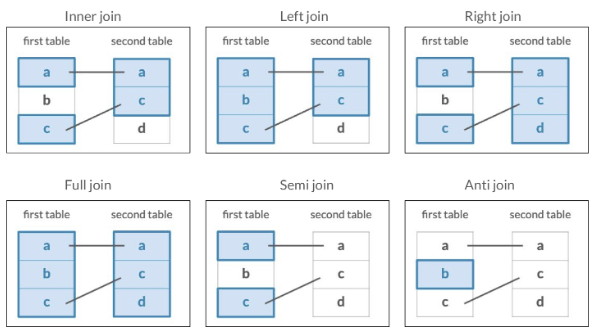

### The `questions` table

If you've been programming for a while, you may have come across Stack Overflow questions online. Each question comes with a score based on people voting up or voting down, and can have several tags, including one for R. As you'll see in the next lesson, each question can also have one or more answers.

The questions table contains each of the almost 300,000 Stack Oveflow questions that are tagged with R, along with the date they were asked and their score. A positive score means people upvoted the question, a negative means they downvoted it. Some of the most interesting information we could get is what other tags, besides R, is on each of these questions. There are tags like `dplyr`, `ggplot2`, `tidyr`, and others that you might have run into in this or other courses. But to get that information, you'll have to do some joining.

```{r}
questions <- readRDS("data/questions.rds")
questions
```

### The `question_tags` and `tags` tables

The `question_tags` table matches each question, based on an id, to a tag, which also has an ID. Notice this is an intermediate table: it doesn't have any data on the question or the tag themselves. We saw this in tables like inventory sets in the LEGO dataset as well, and it's typical for data from web databases. The tags table, in turn, links tag IDs to tag names. You'll need to join both of those to question tags to learn useful insights about the data. This can be done with a sequence of inner joins.

```{r}
question_tags <- readRDS("data/question_tags.rds")
question_tags
```

```{r}
tags <- readRDS("data/tags.rds")
tags
```

### Joining `question_tags` with `questions`

First, you'd join `questions` with the `question_tags` table, based on their `question_id`.

```{r}
questions %>% 
  inner_join(question_tags, by = c("id" = "question_id"))
```

### Joining `tags`

Second, you'd join the `tags` table into the result, matching `tag_id` to `id`. We save this as `questions_with_tags`. Notice that since questions can have multiple tags, there are 500,000 question-tag pairs in this table, even though there were only 300,000 questions to start.

```{r}
questions_with_tags <- questions %>% 
  inner_join(question_tags, by = c("id" = "question_id")) %>% 
  inner_join(tags, by = c("tag_id" = "id"))
questions_with_tags
```

### Most common tags

There's a lot you can learn from this joined data. For instance, you could find what the most common tags that appear on R questions are, using `dplyr`'s count verb with sort equals true. Some of the most common tags on R questions include ggplot2, dataframe, Shiny, and of course, the package you're learning about in this course: dplyr.

```{r}
questions_with_tags %>% 
  count(tag_name, sort = TRUE)
```

## **Left joining questions and tags**

Three of the Stack Overflow survey datasets are `questions`, `question_tags`, and `tags`:

-   `questions`: an ID and the score, or how many times the question has been upvoted; the data only includes R-based questions

-   `question_tags`: a tag ID for each question and the question's id

-   `tags`: a tag id and the tag's name, which can be used to identify the subject of each question, such as ggplot2 or dplyr

In this exercise, we'll be stitching together these datasets and replacing NAs in important fields.

Note that we'll be using `left_join`s in this exercise to ensure we keep all questions, even those without a corresponding tag. However, since we know the `questions` data is all R data, we'll want to manually tag these as R questions with `replace_na`.

**Instructions 1/3**

-   Join together `questions` and `question_tags` using the `id` and `question_id` columns, respectively.

```{r}
# Join the questions and question_tags tables
questions %>%
  left_join(question_tags, by = c("id" = "question_id"))
```

**2/3**: Use another join to add in the `tags` table.

```{r}
# Join in the tags table
questions %>%
  left_join(question_tags, by = c("id" = "question_id")) %>%
  left_join(tags, by = c("tag_id" = "id"))
```

**3/3**: Use `replace_na` to change the `NA`s in the `tag_name` column to `"only-r"`.

```{r}
# Replace the NAs in the tag_name column
questions %>%
  left_join(question_tags, by = c("id" = "question_id")) %>%
  left_join(tags, by = c("tag_id" = "id")) %>%
  replace_na(list(tag_name = "only-r"))
```

## **Comparing scores across tags**

The complete dataset you created in the last exercise is available to you as `questions_with_tags`. Let's do a quick bit of analysis on it! You'll use familiar dplyr verbs like `group_by`, `summarize`, `arrange`, and `n` to find out the average score of the most asked questions.

**Instructions**

-   Aggregate by the `tag_name`.

-   Summarize to get the mean score for each question, `score`, as well as the total number of questions, `num_questions`.

-   Arrange `num_questions` in descending order to sort the answers by the most asked questions.

```{r}
questions_with_tags %>% 
  # Group by tag_name
  group_by(tag_name) %>%
  # Get mean score and num_questions
  summarize(score = mean(score),
        	num_questions = n()) %>%
  # Sort num_questions in descending order
  arrange(desc(num_questions))
```

## **What tags never appear on R questions?**

The `tags` table includes all Stack Overflow tags, but some have nothing to do with `R`. How could you filter for just the tags that never appear on an R question? The `tags` and `question_tags` tables have been preloaded for you.

**Instructions**

-   Use a join to determine which tags never appear on an R question.

```{r}
# Using a join, filter for tags that are never on an R question
tags %>%
  anti_join(question_tags, by = c("id" = "tag_id"))
```

## Video 4.2: Joining `questions` and `answers`

So far in this chapter you've been joining a dataset of Stack Overflow questions to their associated tags, which lets you understand what packages and keywords appear alongside R questions.

### The `answers` table

Next, you'll look at the answers that are associated with each question. Stack Overflow questions are answered by other users on the site, and each could have zero or multiple answers, which means this is a "one-to-many" relationship.

```{r}
answers <- readRDS("data/answers.rds")
answers
```

### The question ID

The answers table has an id, creation date, and score, just like the questions table, but it also has a question ID, which links to the questions table. This means we could join them based on those columns. There's a lot you can discover about this data, depending on the type of join you use and the ways you aggregate afterwards.

```{r}
questions %>% 
  inner_join(answers, by = c("id" = "question_id"))
```

### The joining verbs

Now that you're well practiced in joining tables, you'll be using the exercises to further adjust this join, such as adding suffixes to each column. You'll also use other joins and dplyr verbs to explore this question and answer data.


## **Finding gaps between questions and answers**

Now we'll join together `questions` with `answers` so we can measure the time between questions and answers.

Make sure to explore the tables and columns in the console before starting the exercise. Can you tell how are questions identified in the `questions` table? How can you identify which answer corresponds to which question using the `answers` table?

**Instructions**

**100 XP**

-   Use an inner join to combine the `questions` and `answers` tables using the suffixes `"_question"` and `"_answer"`, respectively.

-   Subtract `creation_date_question` from `creation_date_answer` within the `as.integer()` function to create the `gap` column.

```{r}
questions %>%
  # Inner join questions and answers with proper suffixes
  inner_join(answers, 
             by = c("id" = "question_id"), 
             suffix = c("_question", "_answer")
             ) %>%
  # Subtract creation_date_question from creation_date_answer to create gap
  mutate(gap = as.integer(creation_date_answer - creation_date_question))
```

## **Joining question and answer counts**

We can also determine how many questions actually yield answers. If we count the number of answers for each question, we can then join the answers counts with the `questions` table.

**Instructions**

-   Count and sort the `question_id` column in the `answers` table to create the `answer_counts` table.

-   Join the `questions` table with the `answer_counts` table and include all observations from the `questions` table.

-   Replace the NA values in the `n` column with 0s.

```{r}
# Count and sort the question id column in the answers table
answer_counts <- answers %>%
  count(question_id, sort = TRUE)

# Combine the answer_counts and questions tables
questions %>%
  left_join(answer_counts, by = c("id" = "question_id")) %>%
  # Replace the NAs in the n column
  replace_na(list(n = 0))
```

## **Joining questions, answers, and tags**

Let's build on the last exercise by adding the `tags` table to our previous joins. This will allow us to do a better job of identifying which R topics get the most traction on Stack Overflow. The tables you created in the last exercise have been preloaded for you as `answer_counts` and `question_answer_counts`.

```{r}
answer_counts <- answers %>%     
  count(question_id, sort = TRUE)  

question_answer_counts <- questions %>%     
  left_join(answer_counts, by = c("id" = "question_id")) %>%     
  replace_na(list(n = 0)) 
```

**Instructions**

-   Combine the `question_tags` table with `question_answer_counts` using an `inner_join`.

-   Now, use another `inner_join` to add the `tags` table.

```{r}
question_answer_counts %>%
  # Join the question_tags tables
  inner_join(question_tags, by = c("id" = "question_id")) %>%
  # Join the tags table
  inner_join(tags, by = c("tag_id" = "id"))
```

## **Average answers by question**

The table you created in the last exercise has been preloaded for you as `tagged_answers`. You can use this table to determine, on average, how many answers each questions gets.

```{r}
tagged_answers <- question_answer_counts %>%     
  inner_join(question_tags, by = c("id" = "question_id")) %>%     
  inner_join(tags, by = c("tag_id" = "id")) 
```

Some of the important variables from this table include: `n`, the number of answers for each question, and `tag_name`, the name of each tag associated with each question.

Let's use some of our favorite dplyr verbs to find out how many answers each question gets on average.

**Instructions**

-   Aggregate the `tagged_answers` table by `tag_name`.

-   Summarize `tagged_answers` to get the count of `questions` and the `average_answers`.

-   Sort the resulting `questions` column in descending order.

```{r}
tagged_answers %>%
  # Aggregate by tag_name
  group_by(tag_name)  %>%
  # Summarize questions and average_answers
  summarize(questions = n(),
            average_answers = mean(n)) %>%
  # Sort the questions in descending order
  arrange(desc(questions))  
```

## Video 4.3: The `bind_rows` verb

You'll end the course by learning one more dplyr verb that combines two tables together, in a slightly different way than the six join verbs do.

### Comparing tables

So far when we've combined tables, we've combined them based on values that match between them. For instance, you've joined questions and answers based on the id linking to the question id. But notice that these two tables also have a similar structure, even having three variables- id, creation date, and score- in common. In some situations, instead of joining one next to the other, we may want to stack one on top of the other.

```{r}
questions
```

```{r}
answers
```

### Binding rows

We do this with the `bind_rows` verb. When we use it to combine the two tables, we end up with a combination of questions and answers in one table, which we could call "posts", since it describes them both. We originally had 294,000 questions and 380,000 answers, but now we have 675,000 posts. Notice that in those first ten observations question id is always NA, because those were questions originally, and only the answers table had that column. It's often useful in this posts table to keep track of which observations are questions and which are answers. A common approach when combining tables with bind rows is to mutate in an extra column that distinguishes each of them before you do the bind rows.

```{r}
questions %>% 
  bind_rows(answers)
```

### Using `bind_rows`

Here's an example. We mutate in a column called type to the questions table, and then to the answers table. Notice that the outcome now has a type column, with either question or answer. The two tables have been combined so that you can work with them using the same dplyr verbs, but the observations can still be distinguished.

```{r}
questions_type <- questions %>% 
  mutate(type = "question")
```

```{r}
answers_type <- answers %>% 
  mutate(type = "answer")

posts <- bind_rows(questions_type, answers_type)
posts
```

### Aggregating

What could you do with this combined table? Well, consider that you could do some aggregations. If we wanted to find the average score of questions and of answers, you could do that with a group by and summarize. We see that the average answer is higher rated than the average question. But the aggregations can get a lot more complicated than that. For instance, we could look at question and answer activity over time.

```{r}
posts %>% 
  group_by(type) %>% 
  summarize(average_score = mean(score))
```

### Creating date variable

You haven't yet used the creation date variable in questions or in answers. To use it, you might want to calculate a variable for year, rather than just date. You can do this with the year() function from the lubridate package, which takes a date and turns it into the relevant year. Notice that the date 2014-03-01 becomes just the number 2014.

```{r}
library(lubridate)

posts %>% 
  mutate(year = year(creation_date))
```

### Counting date variable

You can follow this up with a count, to find the number of posts of each type each year. After running this count, notice that we now have the number of R questions and the number of R answers that were posted within each year.

```{r}
posts %>% 
  mutate(year = year(creation_date)) %>% 
  count(year, type)
```

### Plotting date variable

This is especially useful for a visualization, since it's ready for using in ggplot2.

```{r}
questions_answers_year <- posts %>% 
  mutate(year = year(creation_date)) %>% 
  count(year, type)

ggplot(questions_answers_year, aes(year, n, color = type)) +
  geom_line()
```

## **Joining questions and answers with tags**

To learn more about the `questions` and `answers` tables, you'll want to use the `question_tags` table to understand the tags associated with each question that was asked, and each answer that was provided. You'll be able to combine these tables using two inner joins on both the `questions` table and the `answers` table.

**Instructions**

-   Use two inner joins to combine the `question_tags` and `tags` tables with the `questions` table.

-   Now, use two inner joins to combine the `question_tags` and `tags` tables with the `answers` table.

```{r}
# Inner join the question_tags and tags tables with the questions table
questions %>%
  inner_join(question_tags, by = c("id" = "question_id")) %>%
  inner_join(tags, by = c("tag_id" = "id"))

# Inner join the question_tags and tags tables with the answers table
answers %>%
  inner_join(question_tags, by = "question_id") %>%
  inner_join(tags, by = c("tag_id" = "id"))
```

## **Binding and counting posts with tags**

The tables you created in the previous exercise have been preloaded as `questions_with_tags` and `answers_with_tags`. First, you'll want to combine these tables into a single table called `posts_with_tags`. Once the information is consolidated into a single table, you can add more information by creating a date variable using the `lubridate` package, which has been preloaded for you.

```{r}
questions_with_tags <- questions %>%   
  inner_join(question_tags, by = c("id" = "question_id")) %>%   
  inner_join(tags, by = c("tag_id" = "id")) 

answers_with_tags <- answers %>%   
  inner_join(question_tags, by = "question_id") %>%   
  inner_join(tags, by = c("tag_id" = "id"))
```

**Instructions**

-   Combine the `questions_with_tags` and `answers_with_tags` tables into `posts_with_tags`.

-   Add a `year` column to the `posts_with_tags` table, then count posts by `type`, `year`, and `tag_name`.

```{r}
# Combine the two tables into posts_with_tags
posts_with_tags <- bind_rows(questions_with_tags %>% mutate(type = "question"),
                              answers_with_tags %>% mutate(type = "answer"))

# Add a year column, then count by type, year, and tag_name
posts_with_tags %>%
  mutate(year = year(creation_date)) %>%
  count(type, year, tag_name)
```

## **Visualizing questions and answers in tags**

In the last exercise, you modified the `posts_with_tags` table to add a `year` column, and aggregated by `type`, `year`, and `tag_name`. The modified table has been preloaded for you as `by_type_year_tag`, and has one observation for each type (question/answer), year, and tag. Let's create a plot to examine the information that the table contains about questions and answers for the `dplyr` and `ggplot2` tags. The `ggplot2` package has been preloaded for you.

```{r}
by_type_year_tag <- posts_with_tags %>%   
  mutate(year = year(creation_date)) %>%   
  count(type, year, tag_name) 
```

**Instructions**

-   Filter the `by_type_year_tag` table for the dplyr and ggplot2 tags.

-   Create a line plot with that filtered table that plots the frequency (`n`) over time, colored by question/answer and faceted by tag.

```{r}
# Filter for the dplyr and ggplot2 tag names 
by_type_year_tag_filtered <- by_type_year_tag %>%
  filter(tag_name == "dplyr" | tag_name == "ggplot2")

# Create a line plot faceted by the tag name 
ggplot(by_type_year_tag_filtered, aes(year, n, color = type)) +
  geom_line() +
  facet_wrap(~ tag_name)
```
