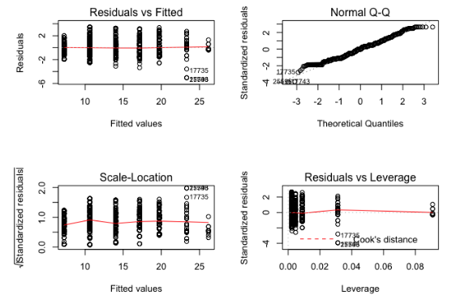
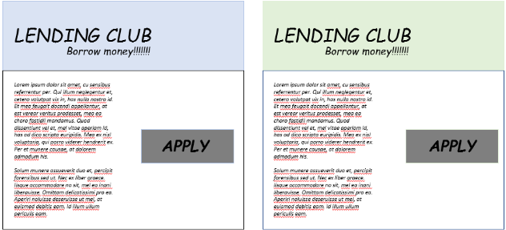

# Chapter 1: Introduction to Experimental Design

## Video 1.1: Introduction to Experimental Design

Hello, my name is Joanne and I’m here to teach you about experimental design in R.

### Intro to experimental design

An experiment starts with a question and involves collecting data with the question in mind and will include analyzing the data to seek an answer. In this course, we’ll focus on asking good questions - in statistical language, formulating clear hypotheses, design the data collection process, and the analysis of collected data.

-   Starts with a question (hypothesis)
-   Collecting & analyzing the data

### Steps of an experiment

The three high-level steps of an experiment are planning, design, and analysis. For planning, you start with your hypothesis -- your question, or even a series of questions. What are you hoping to answer? What is the population of interest, those to whom it applies? What will your dependent variable be, the outcome, which hopefully can be measured to answer the question? What are your independent or explanatory variables, the variables you think may explain the dependent variable?

-   Planning
    -   dependent variable = outcome
    -   independent variable(s) = explanatory variables
-   Design
-   Analysis

### Key components of an experiment

The three key components of an experiment include randomization, replication, and blocking. All of these are done to assess variability across our study population, meaning we're looking to explain the variation in an outcome by the different explanatory variables. In order to reduce bias, we need to randomize, create a replicable experiment, and sometimes block. Say we want to test who can score the most free-throws in 5 minutes. We select as one group the high school basketball team, and for the other an English class; this is an incredibly biased experiment right out of the gate. Any conclusions we draw will be based on our poor selection of groups and lack of randomization.

-   Randomization
-   Replication
-   Blocking

### Randomization

In this video, we'll look at randomization, which is a key tenet of any experiment. Randomization helps ensure that variability in outcome due to outside factors that we're not studying in an experiment are evenly distributed among treatment groups. One example of randomization is double-blind medical trials, where neither the patient nor the researcher knows if the patient is receiving treatment or not. The patient is randomized by a third party into one of the two groups.

-   Evenly distributes any variability in outcome due to outside factors across treatment groups
-   Example:
    -   double-blind medical trials
    -   neither the patient nor the doctor knows who is getting the treatment
    -   group assignment made randomly by 3rd party.

### Recap: t-tests

Recall that a t-test can help you answer some of your research questions by comparing the means of two groups. Let's perform a t-test on the famous mtcars dataset to test if the mean of mpg differs from 40. First, built-in data can be loaded with the data() function. The dataset will be loaded as a dataframe with the same name passed as an argument to data(). For example, you can load the mtcars dataset using data("mtcars"). To conduct a two-sided t-test with mtcars, you'll use the function t-dot-test(), where the argument x is the outcome in question, alternative is set to "two.sided", and mu is the value you're testing to see if the mean of mpg is not equal to. Throughout the course, the package broom will also be very helpful. It is designed to work with dplyr package and summarizes key information about models, say for instance, t-dot-test outputs, in tidy tibbles. tidy() is one of the powerful functions from broom package which produces a tibble() where each row contains information about an important component of the model.

-   t-tests help answer research questions.

```         
data("mtcars")
```

```         
t.test(x = mtcars$mpg, alternative = "two.sided", mu = 40)
```

```         
library(broom)
```

```         
tidy()
```

## **A basic experiment**

`ToothGrowth` is a built-in R dataset from a study that examined the effect of three different doses of Vitamin C on the length of the odontoplasts, the cells responsible for teeth growth in 60 guinea pigs, where tooth length was the measured outcome variable. Let's load `ToothGrowth` into our environment,do some exploratory data analysis, and perform a t-test to get an idea of the purpose of a basic experiment.

**Instructions 1/3**

-   Load the ToothGrowth dataset with data().

-   View the first 6 rows of ToothGrowth.

```{r}
data(ToothGrowth)
head(ToothGrowth, 6)
```

**2/3**: Find the mean, median, and standard deviation of guinea pigs' teeth length (`len`).

```{r}
library(dplyr)
# Find mean len, median len, and standard deviation len with summarize()
ToothGrowth %>% summarize(mean(len), 
                  median(len), 
                  sd(len))
```

**3/3**: Conduct a two-sided t-test to check if average length of a guinea pig's odontoplasts differs from 18 micrometers.

-   Remember to include `alternative = "two.sided"` in your call to `t.test()`.

```{r}
# Perform a two-sided t-test
t.test(x = ToothGrowth$len, 
       alternative = "two.sided", 
       mu = 18)
```

Given the high p-value, we fail to reject the null hypothesis that the mean of `len` is equal to 18. That is, we don't have evidence that it is different from 18 micrometers.

## **Randomization**

Randomization of subjects in an experiment helps spread any variability that exists naturally between subjects evenly across groups. For `ToothGrowth`, an example of effective randomization would be randomly assigning male and female guinea pigs into different experimental groups, ideally canceling out any existing differences that naturally exist between male and female guinea pigs.

In the experiment that yielded the `ToothGrowth` dataset, guinea pigs were randomized to receive Vitamin C either through orange juice or ascorbic acid, indicated in the dataset by the `supp` variable. It's natural to wonder if there is a difference in tooth length by supplement type - a question that a t-test can also answer!

Starting with this exercise, you should use `t.test()` and other modeling functions with formula notation:

`t.test(outcome ~ explanatory_variable, data = dataset)`

This can be read: "test `outcome` by `explanatory_variable` in my `dataset`." The default test for `t.test()` is a two-sided t-test.

**Instructions**

-   Conduct a t-test to determine if there is a difference in tooth length (`len`) based on supplement type (`supp`), and save the results as an object `ToothGrowth_ttest`.

-   Load the `broom` package.

-   Tidy the `ToothGrowth_ttest` with `tidy()`. This will print the results to the console.

```{r}
# Perform a t-test
ToothGrowth_ttest <- t.test(len ~ supp, data = ToothGrowth)

# Load broom
library(broom)

# Tidy ToothGrowth_ttest
tidy(ToothGrowth_ttest)
```

Given the p-value of around 0.06, there seems to be no evidence to support the hypothesis that there's a difference in mean tooth length by supplement type, or, more simply, that there is no difference in mean tooth length by supplement type. Generally in most experiments, any p-value above 0.05 will offer no evidence to support the given hypothesis.

## Video 1.2: Replication and blocking

Congratulations on completing the first lesson! We'll now look at the other two key components of an experiment- Replication and Blocking.

### Replication

Replication is the idea that we need to repeat our experiment in order to assess what variability looks like. Although we applied randomization to ensure that treatment groups are as similar as possible, we can't simply take the result of a single experiment as granted. Suppose we're testing drug efficacy, we certainly can't analyze data if we only gathered data from one patient; maybe it worked for them, but how do we know if it will also work for other people? Our experiment must be designed to be easily replicable to get a wide range of outcomes. We'll look at the example of finding out the number of replications in mtcars dataset with the dplyr package. Recall that the pipe operator chains functions together and the function count() groups mtcars by cyl and then counts how many there are of each number of cylinders, thereby giving us the number of replications.

-   Must repeat an experiment to fully assess variability If we only conduct a drug efficacy experiment on one person, how can we properly generalize those results? (We can't!)

```{r}
library(dplyr)
mtcars %>% 
  count(cyl)
```

### Blocking

Blocking is a technique to help control variability. A classic example is to test the effects of a drug on male and female patients, blocking by sex, to account for treatment variability, in this case, known differences in the drug reactions of male and female bodies. In Chapter 3 and 4, we'll cover some of more advanced techniques of blocking, including blocking in two dimensions.

-   Helps control variability by making treatment groups more alike
-   Inside of groups, differences will be minimal. Across groups, differences will be larger
-   One example is blocking treatment groups by sex

### Boxplots

Both replications and blocking help identify if the treatment group allocations indeed have effects on the response variables we're interested in. But before we start with formal statistical tests, we could use some data visualization to determine whether there might be treatment group effects. A boxplot could help us achieve this goal. Here's a boxplot illustrating the difference in miles per gallon by the number of cylinders, based on the mtcars dataset. We notice that the positions of the boxes are disparate, suggesting that there might be an effect of the number of cylinders on the miles per gallon.

```{r}
library(ggplot2)
ggplot(mtcars, aes(x=as.factor(cyl), y=mpg)) +
  geom_boxplot(fill="slateblue",
               alpha = 0.2) +
  xlab("cyl")
```

### Functions for modeling

Here's a sneak peek of the modeling functions we'll be using for the following exercises. We'll certainly cover them in more details in the next chapter, but having an idea of what work they could accomplish could help us understand replication and blocking a bit better. The function lm() is used to fit linear models. It can be used to carry out regression and analysis of covariance. aov() calls on lm() and fit an analysis of variance model, so it outputs regression coefficients, fitted values, residuals, and etc. anova(), on the other hand, is a generic function that computes analysis of variance tables for one or more fitted model objects.

-   Linear models

```         
lm(formula, data, na.action,...)
```

-   One-way ANOVA model

```         
aov(formula, data = NULL,...)
```

-   Nested ANOVA model

```         
anova(object,...)
```

## **Replication**

Recall that replication means you need to conduct an experiment with an adequate number of subjects to achieve an acceptable statistical power. Sample size and power will be discussed in more detail later in this chapter.

Let's examine the `ToothGrowth` dataset to make sure they followed the principle of replication. We'll use `dplyr` to do some exploratory data analysis (EDA). The data has already been loaded for you.

**Instructions**

-   Load the `dplyr` package.

-   Use `count()` to determine how many guinea pigs were given each supplement and dose.

```{r}
# Load dplyr
library(dplyr)

# Count number of observations for each combination of supp and dose
ToothGrowth %>% 
    count(supp, dose)
```

## **Blocking**

Though this is not true, suppose the supplement type is actually a nuisance factor we'd like to control for by blocking, and we're actually only interested in the effect of the dose of Vitamin C on guinea pig tooth growth.

If we block by supplement type, we create groups that are more similar, in that they'll have the same supplement type, allowing us to examine only the effect of dose on tooth length.

We'll use the `aov()` function to examine this. `aov()` creates a linear regression model by calling `lm()` and examining results with `anova()` all in one function call. To use `aov()`, we'll still need functional notation, as with the randomization exercise, but this time the formula should be `len ~ dose + supp` to indicate we've blocked by supplement type. (We'll cover `aov()` and `anova()` in more detail in the next chapter.)

`ggplot2` is loaded for you.

**Instructions**

-   Make a boxplot to visually examine if the tooth length is different by `dose`. `dose` has been converted to a factor variable for you.

-   Use `aov()` to detect the effect of `dose` and `supp` on `len`. Save as a model object called `ToothGrowth_aov`.

-   Examine `ToothGrowth_aov` with `summary()` to determine if dose has a significant effect on tooth length.

```{r}
# Create a boxplot with geom_boxplot()
ggplot(ToothGrowth, aes(x = dose, y = len)) + 
    geom_boxplot()

# Create ToothGrowth_aov
ToothGrowth_aov <- aov(len ~ dose + supp, data = ToothGrowth)

# Examine ToothGrowth_aov with summary()
summary(ToothGrowth_aov)
```

Congrats! You have just designed your first Randomized Complete Block Design (RCBD) experiment. We'll learn more about this type of experiment in Chapter 3. Given the very small observed p-value for `dose`, it appears we have evidence to support the hypothesis that mean `len` is different by `dose` amount.

## Video 1.3: Hypothesis testing

A very important concept in experimental design is the formation and testing of a hypothesis, or your central research question. For the ToothGrowth dataset we worked with previously, the hypothesis concerned the effect of different doses and administration methods of Vitamin C on the length of tooth growth in the guinea pig. Let's dig in a little more and look at how to create a research hypothesis.

### Breaking down hypothesis testing

There are really two hypotheses that are grouped together: the null and alternative hypotheses. The null hypothesis is exactly what it sounds like, and the implications change depending on what you're testing. For example, in the tooth growth experiment, the null hypothesis is: "There is no effect of vitamin C dosage or administration type on guinea pig tooth growth." There's some nuance involved in the alternative hypothesis, and its construction will help lead you to the correct test. If you're testing if the mean is only less than or greater than a value, it's a one-sided test. If you're testing that it's not equal to some number, that's a two sided test. Recall when we conducted a two sided test to determine if the mean length of tooth growth was not equal to 18. The p-value was 0.4135, so at the 0.05 significance level, we fail to reject the null hypothesis. We have no strong evidence to suggest the mean is not equal to 18.

-   **Null hypothesis**:

    -   there is no change

    -   no difference between groups

    -   the mean, media, or observation = a number

-   **Alternative hypothesis**:

    -   there is a change

    -   difference between groups

    -   mean, median, observation is `>`, `<` or `!=` a number

### Power and sample size

Directly related to hypothesis testing is the idea of power. Power is the probability that the test correctly rejects the null hypothesis when the alternative hypothesis is true. One "golden rule" in statistics is to aim to have 80% power in your experiments, which you'll need an adequate sample size to achieve. Effect size, in the context of power analysis, is a standardized measure of the difference you're trying to detect, calculated as the difference between group means divided by the pooled standard deviation of the data. It's easier to detect a larger difference in means than a smaller one. Sample size is important in experiments. In general, as sample size increases, power increases; you've collected more information, so you're more capable of examining your hypotheses. You need two of these three pieces to calculate the other: if you have a given power and effect size, you can generally calculate sample size. Let's review an example.

-   **Power**: probability that the test correctly rejects the null hypothesis when the alternative hypothesis is true.

-   **Effect size**: standardized measure of the difference you're trying to detect.

-   **Sample size**: how many experimental units you need to survey to detect the desired difference at the desired power.

We're going to calculate power and sample size using the pwr package in this course. Let's look at calculating power for an ANOVA, or Analysis of Variance test. This is good prep for when we execute these later in the course. The pwr-dot-anova.test() function takes 5 arguments, of which one must be entered as NULL so it can be calculated. k is the number of groups in the comparison, n is the number of observations per group, f is the effect size, then you have to enter a significance level and a power. So to calculate power for a test with three groups, 20 people per group, with an effect size of 0.2 and a significance level of 0.05, you would enter this code. Calculating it returns a power of 0.25--not great! We probably can't detect that small of an effect size with so few people in each group.

```{r}
library(pwr)
pwr.anova.test(k = 3,
               n = 20,
               f = 0.2,
               sig.level = 0.05,
               power = NULL)
```

## **One sided vs. Two-sided tests**

Recall in the first exercise that we tested to see if the mean of the guinea pigs' teeth in `ToothGrowth` was not equal to 18 micrometers. That was an example of a two-sided t-test: we wanted to see if the mean of `len` is some other number on either side of 18.

We can also conduct a one-sided t-test, explicitly checking to see if the mean is less than or greater than 18. Whether to use a one- or two-sided test usually follows from your research question. Does an intervention cause longer tooth growth? One-sided, greater than. Does a drug cause the test group to lose more weight? One-sided, less than. Is there a difference in mean test scores between two groups of students? Two-sided test.

The `ToothGrowth` data has been loaded for you.

**Instructions 1/2**

-   Test to see if the mean of the length variable of `ToothGrowth` is *less than* 18.

```{r}
# Less than
t.test(x = ToothGrowth$len,
       alternative = "less",
       mu = 18)
```

**2/2**: Test to see if the mean of the length variable of `ToothGrowth` is *greater than* 18.

```{r}
# Greater than
t.test(x = ToothGrowth$len,
alternative = "greater",
mu = 18)
```

## **Power & Sample Size Calculations**

One key part of designing an experiment is knowing the required sample size you'll need to be able to test your hypothesis.

The `pwr` package provides a handy function, `pwr.t.test()`, which will calculate that for you. However, you do need to know your desired significance level (often 0.05), if the test is one- or two-sided, if the data is from one sample, two samples, or paired, the effect size, and the power. Some of this information will be given to you or can be reasoned from the design.

A power or sample size calculation is usually different each time you conduct one, and the details of the calculation strongly depend on what kind of experiment you're designing and what your end goals are.

**Instructions 1/2**

-   Load the `pwr` package.

-   Calculate power using an effect size of 0.35, a sample size of 100 in each group, and a significance level of 0.10.

```{r}
# Load the pwr package
library(pwr)

# Calculate power
pwr.t.test(n = 100, 
           d = 0.35,
           sig.level = 0.10,
           type = "two.sample", 
           alternative = "two.sided",
           power = NULL)
```

**2/2**: Calculate the sample size needed with an effect size of 0.25, a significance level of 0.05, and a power of 0.8.

```{r}
# Calculate sample size
pwr.t.test(n = NULL, 
           d = 0.25, 
           sig.level = 0.05, 
           type = "one.sample", alternative = "greater", 
           power = 0.8)
```

# Chapter 2: Basic Experiments

## Video 2.1: ANOVA, single, and multiple factor experiments

### ANOVA

-   Used to compare 3+ groups

-   An omnibus test:

    -   won't know which groups' means are different without additional post hoc testing

-   Two ways to implement in R:

```         
# one
model_1 <- lm(y ~ x, data = dataset)
anova(model_1)

# two
aov(y ~ x, data = dataset)
```

### Single factor experiments

```         
model_1 <- lm(y ~ x)
```

-   `y` = outcome variable

    -   tensile strength of different cotton fabrics

-   `x` = explanatory factor variable

    -   percent cotton in the fabric

### Multiple factor experiments

```         
model2 <- lm(y ~ x + r + s + t)
```

-   `y` = outcome

    -   ToothGrowth length

-   `x`, `r`, `s`, `t` = possible explanatory factor variables

    -   How much vitamin C & delivery method

### Intro to Lending Club data

-   Lending Club is a US based peer-to-peer loan company.

    -   Data openly available on Kaggle

-   Includes all loans issued from 2007 - 2015

-   Big!

    -   890k observations and 75 variables

## **Exploratory Data Analysis (EDA) Lending Club**

A sample of 1500 observations from the Lending Club dataset has been loaded for you and is called `lendingclub`. Let's do some EDA on the data, in hopes that we'll learn what the dataset contains. We'll use functions from `dplyr` and `ggplot2` to explore the data.

**Instructions 1/4**

Use `glimpse()` from `dplyr` to look at the variable names, types, and some observations.

```{r}
library(dplyr)
library(readr)
lendingclub <- read_csv("data/lendclub.csv")
glimpse(lendingclub)
```

2/4: Pipe the dataset into `summarize()` and find the median loan amount, mean interest rate, and mean annual income. No need to name these outputs anything.

```{r}
# Examine the variables with glimpse()
glimpse(lendingclub)

# Find median loan_amnt and mean int_rate, annual_inc
lendingclub %>% summarize(median(loan_amnt), 
                          mean(int_rate), 
                          mean(annual_inc))
```

3/4: Use `ggplot2` to build a bar chart of counts of responses to the `purpose` variable. The axes have been flipped for you using `coord_flip()` so the labels are easier to read.

```{r}
# Use ggplot2 to build a bar chart of purpose
ggplot(data=lendingclub, aes(x = purpose)) + 
	geom_bar() +
	coord_flip()
```

4/4: Run the code to use `recode()`, creating the `purpose_recode` variable, which takes `purpose` and pares it down to a more manageable number of levels; we're creating 4 (`debt_related`, `big_purchase`, `home_related`, `life_change`.)

```{r}
# Use recode() to create the new purpose_recode variable
lendingclub$purpose_recode <- lendingclub$purpose %>% recode( 
        "credit_card" = "debt_related", 
  		"debt_consolidation" = "debt_related",
  		"medical" = "debt_related",
        "car" = "big_purchase", 
  		"major_purchase" = "big_purchase", 
  		"vacation" = "big_purchase",
        "moving" = "life_change", 
  		"small_business" = "life_change", 
  		"wedding" = "life_change",
        "house" = "home_related", 
  		"home_improvement" = "home_related")
```

## **How does loan purpose affect amount funded?**

In the last exercise, we pared the `purpose` variable down to a more reasonable 4 categories and called it `purpose_recode`. As a data scientist at Lending Club, we might want to design an experiment where we examine how the loan purpose influences the amount funded, which is the money actually issued to the applicant.

Remember that for an ANOVA test, the null hypothesis will be that all of the mean funded amounts are equal across the levels of `purpose_recode`. The alternative hypothesis is that at least one level of `purpose_recode` has a different mean. We will not be sure which, however, without some post hoc analysis, so it will be helpful to know how ANOVA results get stored as an object in R.

**Instructions**

-   Use `lm()` to look at how the `purpose_recode` variable affects `funded_amnt`. Save the model as an object called `purpose_recode_model`.

-   Use`summary()` to examine `purpose_recode_model`. These are the results of the linear regression.

-   Call `anova()` on `purpose_recode_model`. Save as an object called `purpose_recode_anova`. Print it to the console by typing it.

-   Finally, examine the class of `purpose_recode_anova`.

```{r}
# Build a linear regression model, purpose_recode_model
purpose_recode_model <- lm(funded_amnt ~ purpose_recode, data = lendingclub)

# Examine results of purpose_recode_model
summary(purpose_recode_model)

# Get anova results and save as purpose_recode_anova
purpose_recode_anova <- anova(purpose_recode_model)

# Print purpose_recode_anova
print(purpose_recode_anova)

# Examine class of purpose_recode_anova
class(purpose_recode_anova)
```

## **Which loan purpose mean is different?**

Before we examine other factors besides `purpose_recode` that might influence the amount of loan funded, let's examine which means of `purpose_recode` are different. This is the post-hoc test referred to in the last exercise.

The result of that ANOVA test was statistically significant with a very low p-value. This means we can reject the null hypothesis and accept the alternative hypothesis that at least one mean was different. But which one?

We should use Tukey's HSD test, which stands for Honest Significant Difference. To conduct Tukey's HSD test in R, you can use `TukeyHSD()`:

```         
TukeyHSD(aov_model, "independent_variable_name", conf.level = 0.9) 
```

This would conduct Tukey's HSD test on some `aov_model`, looking at a specific `"independent_variable_name"`, with a `conf.level` of 90%.

**Instructions**

**100 XP**

-   Build a model using `aov()` that examines `funded_amnt` by `purpose_recode`. Save it as `purpose_aov`.

-   Use `TukeyHSD()` to conduct the Tukey's HSD test on `purpose_aov` with a confidence level of 0.95. Save as an object called `tukey_output`.

-   Tidy `tukey_output` with `tidy()` from the `broom` package (which has been loaded for you.)

```{r}
# Use aov() to build purpose_aov
purpose_aov <- aov(funded_amnt ~ purpose_recode, data = lendingclub)

# Conduct Tukey's HSD test to create tukey_output
tukey_output <- TukeyHSD(purpose_aov, "purpose_recode", conf.level = 0.95)

# Tidy tukey_output to make sense of the results
tidy(tukey_output)
```

## **Multiple Factor Experiments**

We tested whether the purpose of a loan affects loan amount funded and found that it does. However, we also know that it's unlikely that loans are funded based only on their intended purpose. It's more likely that the company is looking at a holistic picture of an applicant before they decide to issue a loan.

We can examine more than one explanatory factor in a multiple factor experiment. Like our experiments on `ToothGrowth` from Chapter 1, an experimenter can try and control two (or more!) different factors and see how they affect the outcome. We're using open data, so we can't quite control the factors here (they're submitted as someone fills out their loan application), but let's look at how a few other factors affect loan amount funded.

**Instructions**

-   Use `aov()` to build a linear model and ANOVA in one step, examining how `purpose_recode` and employment length (`emp_length`) affect the funded amount. Save as an object `purpose_emp_aov` and print the result out.

-   The printed `purpose_emp_aov` does not show p-values, which we might be interested in. Display those by calling `summary()` on the `aov` object.

```{r}
# Use aov() to build purpose_emp_aov
purpose_emp_aov <- aov(funded_amnt ~ purpose_recode + emp_length, data = lendingclub)

# Print purpose_emp_aov to the console
purpose_emp_aov

# Call summary() to see the p-values
summary(purpose_emp_aov)
```

## Video 2.2: Model validation

In the last lesson, we built a few linear models with the lm() and aov() functions plus an anova table with the anova() function. We also did some pre-modeling EDA, though we skipped something pretty crucial that we'll discuss now.

### Pre-modeling EDA

Before modeling you should do some EDA of your data, as in the last lesson. Let's say Lending Club asked you, one of their data scientists, to examine the funded amount of the loan based on verification_status. verification_status is a variable that indicates if the applicant's reported income was somehow verified by Lending Club themselves, verified by another source, or not verified. We looked at the mean and variance in the last lesson, with dplyr code that looked like this: We didn't group by the purpose variable because it hadn't been recoded yet. If we run the second block of code it gives us the median and variance of funded amount.

-   Mean and variance of outcome by variable of interest

```{r}
lendingclub %>% summarize(median(loan_amnt),
                          mean(int_rate),
                          mean(annual_inc))
lendingclub %>%  group_by(verification_status) %>% 
  summarize(mean(funded_amnt),
            var(funded_amnt))
```

There's more, however! While a boxplot is the kind of graph that non-data scientists don't always respond to, it's often nice to build one for yourself to see the interquartile range of the variable. We can accomplish this with this ggplot2 code.

-   Boxplot of outcome (y-axis) by variable of interest (x-axis).

```{r}
ggplot(data = lendingclub,
       aes(x = verification_status, y = funded_amnt)) +
  geom_boxplot()
```

The boxplot here shows no obvious outliers, though there are a few extreme observations on the "not verified" category, represented by the dots in the upper left. We see that "source verified" and "verified" have very similar distributions. This is good news, and you can continue on with modeling.

### Post-modeling model validation

Let's skip ahead a bit and say that you built the ANOVA model for funded amount by verification status and found that the mean funded amount for different verification statuses are significantly different. Furthermore, you did Tukey's HSD test and found that only Verified compared to Source verified is not significantly different from one another. Now what? Now comes post-modeling model validation. This can include looking at different plots, such as a residual or residual versus fitted values plot or a qqplot, testing ANOVA assumptions such as the homogeneity, or the sameness, of variances, or even trying non-parametric alternatives to ANOVA, such as the Kruskal-Wallis test. Non-parametric just means that the test does not assume that the data came from a particular statistical distribution, the way that ANOVA tests assume data is normally distributed.

-   Residual plot

-   QQ-plot for normality

-   Test ANOVA assumptions

    -   homogeneity of variances

-   Try non-parametric alternatives to ANOVA

### Post-model validation plots

The residuals versus fitted plot will show if the model is a good fit if there is a similar scatter pattern for each level of the group variable. We saw that here for this plot. If we saw a different pattern for each level, we could begin to think that there's heteroscedasticity in the residuals, and that the model may not be a great fit. The Normal Q-Q plot should, ideally, show the points scattered around the regression line. One assumption of ANOVA and linear models is that the residuals are normally distributed. If that proves not to be true, your model might not be a good fit, and you may need to try adding explanatory variables or try different modeling techniques. The other two graphs are less commonly discussed, but also have interpretations relevant to your model. A good fit would show in your Scale-Location plot as the residuals increasing with the fitted values, we see that here. The Residuals versus Leverage plot shows which levels are best fitted to the model. Here, the smaller levels seem better fit.



## **Pre-modeling EDA**

Let's do some EDA with our experiment in mind. Lending Club has now asked you, their data scientist, to examine what effect their Lending Club-assigned loan `grade` variable has on the interest rate, `int_rate`. They're interested to see if the grade they assign the applicant during the process of applying for the loan affects the interest rate ultimately assigned to the applicant during the repayment process.

The `lendingclub` data has been loaded for you, as has `dplyr` and `ggplot2`.

**Instructions 1/4**

-   Use `summary()` to look at the `int_rate` variable, and examine its range and interquartile range.

```{r}
# Examine the summary of int_rate
summary(lendingclub$int_rate)
```

2/4: Using `dplyr`, examine the mean, variance, and median of `int_rate` by `grade`.

```{r}
# Examine int_rate by grade
lendingclub %>% 
	group_by(grade) %>% 
	summarize(mean = mean(int_rate), var = var(int_rate), median = median(int_rate))
```

3/4: Use `ggplot2` to create a boxplot of `int_rate` by `grade`.

```{r}
# Make a boxplot of int_rate by grade
ggplot(lendingclub, aes(x = grade, y = int_rate)) + 
	geom_boxplot()
```

4/4: Save a linear model examining this experiment in an object called `grade_aov`. Print the results by calling `summary()`.

```{r}
# Use aov() to create grade_aov and call summary() to print results
grade_aov <- aov(int_rate ~ grade, data = lendingclub)
summary(grade_aov)
```

## **Post-modeling validation plots + variance**

In the last exercise, we found that `int_rate` does differ by `grade`. Now we should validate this model, which for linear regression means examining the Residuals vs. Fitted and Normal Q-Q plots.

If you call `plot()` on a model object in R, it will automatically plot both of those plots plus two more. You'll interpret these plots to evaluate model fit. We discussed how to do this in the video.

Another assumption of ANOVA and linear modeling is homogeneity of variance. Homogeneity means "same", and here that would mean that the variance of `int_rate` is the same for each level of `grade`. We can test for homogeneity of variances using `bartlett.test()`, which takes a formula and a dataset as inputs.

**Instructions**

-   Run the first line of code with `par()` so the plots will output in a 2 by 2 grid.

-   Call `plot()` on `grade_aov` (which has been created for you) to produce the model diagnostic plots.

-   Test for homogeneity of variances using `bartlett.test()`.

```{r}
# For a 2x2 grid of plots:
par(mfrow=c(2, 2))

# Plot grade_aov
plot(grade_aov)

# Bartlett's test for homogeneity of variance
bartlett.test(int_rate ~ grade, data = lendingclub)
```

## **Kruskal-Wallis rank sum test**

Given that we found in the last exercise that the homogeneity of variance assumption of linear modeling was violated, we may want to try an alternative.

One non-parametric alternative to ANOVA is the Kruskal-Wallis rank sum test. For those with some statistics knowledge, it is an extension of the Mann-Whitney U test for when there are more than two groups, like with our `grade` variable. For us, the null hypothesis for this test would be that all of the `int_rate`s have the same ranking by `grade`.

The Kruskal-Wallis rank sum test can be conducted using the `kruskal.test()` function, available in base R. Luckily for you, the use of this function is very similar to using `lm()` or `aov()`: you input a formula and a dataset, and a result is returned.

**Instructions**

**100 XP**

-   Use `kruskal.test()` to examine whether `int_rate` varies by `grade` when a non-parametric model is employed.

```{r}
# Conduct the Kruskal-Wallis rank sum test
kruskal.test(int_rate ~ grade,
             data = lendingclub)
```

## Video 2.3: A/B testing

A/B tests are an incredibly common type of experiment that a data scientist or data analyst might design. Let's talk about what an A/B test is.

## A/B testing

A/B tests are often discussed in a marketing context and are very common in marketing-related companies, although they're definitely used in other industries as well. One common example of their use is to test customer engagement with different features of a company's website.

-   A type of controlled experiment with only two variants of something, for example:

    -   1 word different in a marketing email

    -   Red 'buy' button on a website vs. blue button

    -   How many consumers click through to create an account based on two different website headers?

### Power and sample size in A/B tests

One important concept that will come back here is power and sample size calculations, as they're pretty crucial in A/B testing. Usually, you'll be calculating sample size, given some power and significance level. Then, you let your A/B test run until you get the sample size you need. You also need to decide an effect size, just as before! You may have guessed by now that an A/B test is simply an application of your basic experimental design knowledge, though they can and do get complicated, so stick with me so you can get good at them. An A/B test changes one thing and one thing only and measures the differences in outcome between these two alternatives.

-   Calculate sample size, given some power, significance level, and effect size

-   Run your A/B test until you attain the sample size you calculated.

### Lending Club A/B test

In this section, we'll design and conduct an A/B test with the Lending Club data we've been using. Say Lending Club was interested to see how the color of the website header affected the loan amount, which is how much an applicant asks to borrow. They have a general hypothesis that softer, gentle colors may influence applicants to ask for lower amount of money, perhaps a more reasonable amount that they can more feasibly pay back. They already use a light blue website header, but they've decided to test a second softer, gentler color on the website. Applicants designated Group A were funneled to an application with the light blue existing header while applicants designated group B were funneled to an application with a new mint green header. We'll examine the amount of money the applicant asked for when applying for the loan based on which colored header they were shown -- not a traditional A/B test, which often focuses on a metric such as click-through rate, which in this case would be number of people who applied, but still an interesting test.



## **Sample size for A/B test**

We know now that we need to analyze our A/B test results with a t-test after we've collected data. We have two pretty important questions we need to answer before we do that: what's the effect size and what's the sample size required for this test?

In this case, effect size was given to us. Lending Club is looking to detect the relatively small effect size of 0.2. We'll again use the `pwr` package and calculate sample size using an appropriate function to find out how many we'll need to recruit into each group, A and B.

**Instructions**

-   Use the correct function from the `pwr` package to calculate the required sample size for each group with `d = 0.2`, a `power` of 0.8, and a 0.05 significance level. Check the `pwr` help docs with `?pwr` if you need help remembering which function to use and what arguments it takes.

```{r}
# Load the pwr package
library(pwr)

# Use the correct function from pwr to find the sample size
pwr.t.test(n = NULL, 
    d = 0.2, 
    sig.level = 0.05, 
    type = "two.sample", 
    power = 0.8)
```

## **Basic A/B test**

Now that we know the sample size required, and we allowed the experiment to run long enough to get at least 400 people in each group, we can analyze our A/B test.

Remember that when applicants were using the Lending Club website, they were randomly assigned to two groups, A or B, where A was shown a mint green website header and B was shown a light blue website header. Lending Club was interested to see if website header color choice influenced `loan_amnt`, the amount an applicant asked to borrow.

A new dataset, `lendingclub_ab` is available in your workspace. The A/B test was run until there were 500 applicants in each group. Each applicant has been labeled as group A or B. Conduct the proper test to see if the mean of `loan_amnt` is different between the two groups.

**Instructions**

**100 XP**

-   Create a boxplot of `loan_amnt` by `Group` using `ggplot2`.

-   Conduct the two-sided t-test to test the A/B test results.

```{r}
# # Plot the A/B test results
# ggplot(lendingclub_ab, aes(x = Group, y = loan_amnt)) + 
# 	geom_boxplot()
# 
# # Conduct a two-sided t-test
# t.test(loan_amnt ~ Group, data = lendingclub_ab)
```

## **A/B tests vs. multivariable experiments**

The point of an A/B test is that only one thing is changed and the effect of that change is measured. We saw this with our examples in the video and the last few exercises. On the other hand, a multivariate experiment, such as the `ToothGrowth` experiment from chapter 1, is where a few things are changed (and is similar to a multiple factor experiment, which we covered earlier in this chapter.)

A Lending Club multivariate test can combine all of the explanatory variables we've looked at in this chapter. Let's examine how `Group`, `grade`, and `verification_status` affect `loan_amnt` in the `lendingclub_ab` dataset.

**Instructions**

-   Use `lm()` to examine the effect of all three explanatory variables on `loan_amnt`. Save as a model object called `lendingclub_multi`.

-   Examine `lendingclub_multi` with `tidy()` and draw your conclusions.

```{r}
# # Build lendingclub_multi
# lendingclub_multi <-lm(loan_amnt ~ Group + grade + verification_status, data = lendingclub_ab)
# 
# # Examine lendingclub_multi results
# tidy(lendingclub_multi)
```

# Chapter 3: Randomized Complete and Balanced Incomplete Block Designs

## Video 3.1: Introduction to NHANES and sampling

### Intro to NHANES dataset

NHANES = National Health and Nutrition Examination Survey

-   Conducted by the National Center for Health Statistics (NCHS), a division of the Centers for Disease Control (CDC).

-   Data collected in a variety of ways, including interviews & a physical exam

-   Questions cover medical, dental, socioeconomic, dietary, and general health-related conditions

### Intro to sampling

-   **Probability Sampling**: probability is used to select the sample (in various ways)

-   **Non-probability Sampling**: probability not used to select the sample
