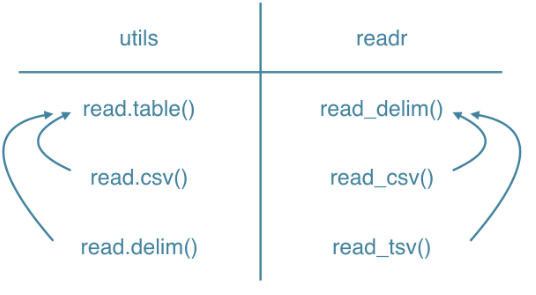

# Chapter 1: Importing data from flat files with `utils`

A lot of data comes in the form of flat files: simple tabular text files. Learn how to import the common formats of flat file data with base R functions.

## Video 1.1: Introduction & `read.csv`

5 types of files:

1.  **Flat files**: simple text files that display data as tables

2.  Data from Excel

3.  Databases

4.  Web

5.  Statistical software

### `utils` - `read.csv`

-   Loaded by default when you start R

```{r}
read.csv("datasets/states.csv")
```

-   What if file in datasets folder of home directory (`~`)?

```{r}
path <- file.path("datasets/states.csv")
```

-   Can now use `path` within `read.csv`:

```{r}
read.csv(path)
```

## **read.csv**

The `utils` package, which is automatically loaded in your R session on startup, can import CSV files with the `read.csv()` function.

In this exercise, you'll be working with `swimming_pools.csv` ([**view**](http://assets.datacamp.com/production/course_1477/datasets/swimming_pools.csv)); it contains data on swimming pools in Brisbane, Australia. The file contains the column names in the first row. It uses a comma to separate values within rows.

Type `dir()` in the console to list the files in your working directory. You'll see that it contains `swimming_pools.csv`, so you can start straight away.

**Instructions**

-   Use `read.csv()` to import `"swimming_pools.csv"`, which is located in the current directory, as a data frame with the name `pools`.

-   Print the structure of `pools` using `str()`.

```{r}
# Import swimming_pools.csv: pools
pools <- read.csv("datasets/swimming_pools.csv")

# Print the structure of pools
str(pools)
```

## Video 1.2: `read.delim` & `read.table`

### Tab-delimited file

-   Import with `read.delim`

```{r}
read.delim("datasets/states.txt")
```

### Exotic file format

```         
# 
# state/capital/pop_mill/area_sqm
# South Dakota/Pierre/0.853/77116
# New York/Albany/19.746/54555
# Oregon/Salem/3.970/98381
# Vermont/Montpelier/0.627/9616
# Hawaii/Honolulu/1.420/10931
```

### `read.table()`

-   Read any tabular file as a data frame

-   Number of arguments is huge

```{r}
# Read data with the first row as column headers
read.table("datasets/states2.txt", 
           header = TRUE, 
           sep = "/")
```

## **read.delim**

Aside from `.csv` files, there are also the `.txt` files which are basically text files. You can import these files with `read.delim()`. By default, it sets the `sep` argument to `"\t"` (fields in a record are delimited by tabs) and the `header` argument to `TRUE` (the first row contains the field names).

In this exercise, you will import `hotdogs.txt` ([**view**](http://s3.amazonaws.com/assets.datacamp.com/production/course_1477/datasets/hotdogs.txt)), containing information on sodium and calorie levels in different hotdogs (Source: [**UCLA**](http://wiki.stat.ucla.edu/socr/index.php/SOCR_012708_ID_Data_HotDogs)). The dataset has 3 variables, but the variable names are *not* available in the first line of the file. The file uses tabs as field separators.

**Instructions**

-   Import `"hotdogs.txt"` with `read.delim()`. Call the resulting data frame `hotdogs`. The variable names are **not** on the first line, so make sure to set the `header` argument appropriately.

-   Call `summary()` on `hotdogs`. This will print out some summary statistics about all variables in the data frame.

```{r}
# Import hotdogs.txt: hotdogs
hotdogs <- read.delim("datasets/hotdogs.txt", 
                      header = FALSE)

# Summarize hotdogs
summary(hotdogs)
```

## **Assigning column names**

You’ve probably noticed that the `hotdogs.txt` file lacks column names, and R has assigned default, random names to the columns.

To make the data more understandable and easier to work with, you can assign appropriate column names while reading the file into R.

```         
head(hotdogs)     
   V1  V2  V3 
1 Beef 186 495 
2 Beef 181 477 
3 Beef 176 425 
4 Beef 149 322 
5 Beef 184 482 
6 Beef 190 587 
```

**Instructions**

-   Complete the `read.delim()` function call by assigning the column names to "type", "calories", and "sodium".

```{r}
# Finish the read.delim() call
hotdogs <- read.delim("datasets/hotdogs.txt", 
                      header = FALSE, 
                      col.names = c("type", 
                                    "calories", 
                                    "sodium")
                      )

# Select the hot dog with the least calories: lily
lily <- hotdogs[which.min(hotdogs$calories), ]

# Select the observation with the most sodium: tom
tom <- hotdogs[which.max(hotdogs$sodium), ]

# Print lily and tom
lily
tom
```

## **Column classes**

The `colClasses` argument allows you to specify the data types for each column of the file you are reading. This can improve the efficiency of the import process and ensure that the columns are read in with the correct data types.

You can do this by setting the `colClasses` argument:

```         
read.delim("my_file.txt",             colClasses = c("character",                           "numeric",                           "logical")) 
```

If a column is set to `"NULL"` in the `colClasses` vector, this column will be skipped and will not be loaded into the data frame.

**Instructions**

-   The `hotdogs` data frame has been loaded. Go ahead and display the structure of `hotdogs`.

-   In the `colClasses` argument of the second `read.delim()` call, set the first, second, and third columns to `'character'`, `'NULL'` and `'numeric'`.

-   Display the structure of `hotdogs2` and look for the difference.

```{r}
# Previous call to import hotdogs.txt
hotdogs <- read.delim("datasets/hotdogs.txt", 
                      header = FALSE, 
                      col.names = c("type", 
                                    "calories", 
                                    "sodium")
                      )

# Display structure of hotdogs
str(hotdogs)

# Edit the colClasses argument to import the data correctly: hotdogs2
hotdogs2 <- read.delim("datasets/hotdogs.txt", 
                       header = FALSE, 
                       col.names = c("type", 
                                     "calories", 
                                     "sodium"),
                       colClasses = c("factor", 
                                      "NULL", 
                                      "numeric"))


# Display structure of hotdogs2
str(hotdogs2)
```

## **`read.table`**

If you're dealing with more exotic flat file formats, you'll want to use `read.table()`. It's the most basic importing function; you can specify tons of different arguments in this function. Unlike `read.csv()` and `read.delim()`, the `header` argument defaults to `FALSE` and the `sep` argument is `""` by default.

Up to you again! The data is still `hotdogs.txt` ([**view**](http://s3.amazonaws.com/assets.datacamp.com/production/course_1477/datasets/hotdogs.txt)). It has no column names in the first row, and the field separators are tabs. This time, though, the file is in the `data` folder inside your current working directory. A variable `path` with the location of this file is already coded for you.

**Instructions**

-   Finish the `read.table()` call to load the *tab-delimited* file found at `path`.

-   Call `head()` on `hotdogs`; this will print the first 6 observations in the data frame.

```{r}
# Path to the hotdogs.txt file: path
path <- file.path("datasets", "hotdogs.txt")

# Import the hotdogs.txt file: hotdogs
hotdogs <- read.table(path, 
                      sep = "\t", 
                      col.names = c("type", "calories", "sodium"))

# Call head() on hotdogs
head(hotdogs)
```

## Video 1.3: Final Thoughts

### Wrappers

-   `read.table()` is the main function

-   `read.csv()` = wrapper for CSV

-   `read.delim()` = wrapper for tab-delimited files

### `read.csv()`

-   Defaults

    -   `header = TRUE`

    -   `sep = ","`

```{r}
read.table("datasets/states.csv", 
           header = TRUE, 
           sep = ",")
```

```{r}
read.csv("datasets/states.csv")
```

### `read.delim()`

-   Defaults:

    -   `header = TRUE`

    -   `sep = "\t"`

### Documentation

```{r}
?read.table
```

### Locale differences

`read.csv` and `read.csv2` are identical to `read.table` except for the defaults. They are intended for reading ‘comma separated value’ files (‘.csv’) or (`read.csv2`) the variant used in countries that use a comma as decimal point and a semicolon as field separator.

Similarly, `read.delim` and `read.delim2` are for reading delimited files, defaulting to the TAB character for the delimiter. Notice that `header = TRUE` and `fill = TRUE` in these variants, and that the comment character is disabled.

```{r}
read.csv("datasets/states_aye.csv",
         header = TRUE,
         sep = ",",
         quote = "\"",
         dec = ".",
         fill = TRUE,
         comment.char = "")
```

```{r}
read.csv2("datasets/states_nay.csv",
         header = TRUE,
         sep = ";",
         quote = "\"",
         dec = ",",
         fill = TRUE,
         comment.char = "")
```

```{r}
read.delim("datasets/states.txt",
         header = TRUE,
         sep = "\t",
         quote = "\"",
         dec = ".",
         fill = TRUE,
         comment.char = "")
```

```{r}
# read.delim2(file,
#          header = TRUE,
#          sep = "\t",
#          quote = "\"",
#          dec = ",",
#          fill = TRUE,
#          comment.char = "")
```

| Function      | Package | Purpose                           |
|---------------|---------|-----------------------------------|
| `read.csv`    | `utils` | `,` separator using `.` decimal   |
| `read.csv2`   | `utils` | `;` separator using `,` decimal   |
| `read.delim`  | `utils` | `tab` separator using `.` decimal |
| `read.delim2` | `utils` | `tab` separator using `,` decimal |

: Functions to accomodate locale differences when importing flat files.

------------------------------------------------------------------------

## `utils::read.table Documentation`

### Description

Reads a file in table format and creates a data frame from it, with cases corresponding to lines and variables to fields in the file.

### Usage

```{r}
# read.table(file,
#            header = FALSE, 
#            sep = "",
#            quote = "\"'",
#            dec = ".", 
#            numerals = c("allow.loss", "warn.loss", "no.loss"),            
#            row.names, 
#            col.names, 
#            as.is = !stringsAsFactors, 
#            tryLogical = TRUE,            
#            na.strings = "NA", 
#            colClasses = NA, 
#            nrows = -1,            
#            skip = 0, 
#            check.names = TRUE, 
#            fill = !blank.lines.skip,            
#            strip.white = FALSE, 
#            blank.lines.skip = TRUE,
#            comment.char = "#",    
#            allowEscapes = FALSE, 
#            flush = FALSE,            
#            stringsAsFactors = FALSE,
#            fileEncoding = "",
#            encoding = "unknown", 
#            text, 
#            skipNul = FALSE
#        )  
# 
# read.csv(file, header = TRUE, sep = ",", quote = "\"", dec = ".", fill = TRUE, comment.char = "", ...)  
# 
# read.csv2(file, header = TRUE, sep = ";", quote = "\"", dec = ",", fill = TRUE, comment.char = "", ...)  
# 
# read.delim(file, header = TRUE, sep = "\t", quote = "\"", dec = ".", fill = TRUE, comment.char = "", ...)  
# 
# read.delim2(file, header = TRUE, sep = "\t", quote = "\"", dec = ",", fill = TRUE, comment.char = "", ...) 
```

```         
```

### Arguments

+--------------------+--------------------------------------------------------------------------------------------------------------------------------------------------------------------------------------------------------------------------------------------------------------------------------------------------------------------------------------------------------------------------------------------------------------------------------------------------------------------------------------------------------------------------------------------------------------------------------------------------------+
| `file`             | the name of the file which the data are to be read from. Each row of the table appears as one line of the file. If it does not contain an *absolute* path, the file name is *relative* to the current working directory, [`getwd`](http://127.0.0.1:45439/help/library/utils/help/getwd)`()`. Tilde-expansion is performed where supported. This can be a compressed file (see [`file`](http://127.0.0.1:45439/help/library/utils/help/file)).                                                                                                                                                         |
|                    |                                                                                                                                                                                                                                                                                                                                                                                                                                                                                                                                                                                                        |
|                    | Alternatively, `file` can be a readable text-mode [connection](http://127.0.0.1:45439/help/library/utils/help/connection) (which will be opened for reading if necessary, and if so [`close`](http://127.0.0.1:45439/help/library/utils/help/close)d (and hence destroyed) at the end of the function call). (If [`stdin`](http://127.0.0.1:45439/help/library/utils/help/stdin)`()` is used, the prompts for lines may be somewhat confusing. Terminate input with a blank line or an EOF signal, `Ctrl-D` on Unix and `Ctrl-Z` on Windows. Any pushback on `stdin()` will be cleared before return.) |
|                    |                                                                                                                                                                                                                                                                                                                                                                                                                                                                                                                                                                                                        |
|                    | `file` can also be a complete URL. (For the supported URL schemes, see the ‘URLs’ section of the help for [`url`](http://127.0.0.1:45439/help/library/utils/help/url).)                                                                                                                                                                                                                                                                                                                                                                                                                                |
+--------------------+--------------------------------------------------------------------------------------------------------------------------------------------------------------------------------------------------------------------------------------------------------------------------------------------------------------------------------------------------------------------------------------------------------------------------------------------------------------------------------------------------------------------------------------------------------------------------------------------------------+
| `header`           | a logical value indicating whether the file contains the names of the variables as its first line. If missing, the value is determined from the file format: `header` is set to `TRUE` if and only if the first row contains one fewer field than the number of columns.                                                                                                                                                                                                                                                                                                                               |
+--------------------+--------------------------------------------------------------------------------------------------------------------------------------------------------------------------------------------------------------------------------------------------------------------------------------------------------------------------------------------------------------------------------------------------------------------------------------------------------------------------------------------------------------------------------------------------------------------------------------------------------+
| `sep`              | the field separator character. Values on each line of the file are separated by this character. If `sep = ""` (the default for `read.table`) the separator is ‘white space’, that is one or more spaces, tabs, newlines or carriage returns.                                                                                                                                                                                                                                                                                                                                                           |
+--------------------+--------------------------------------------------------------------------------------------------------------------------------------------------------------------------------------------------------------------------------------------------------------------------------------------------------------------------------------------------------------------------------------------------------------------------------------------------------------------------------------------------------------------------------------------------------------------------------------------------------+
| `quote`            | the set of quoting characters. To disable quoting altogether, use `quote = ""`. See [`scan`](http://127.0.0.1:45439/help/library/utils/help/scan) for the behaviour on quotes embedded in quotes. Quoting is only considered for columns read as character, which is all of them unless `colClasses` is specified.                                                                                                                                                                                                                                                                                     |
+--------------------+--------------------------------------------------------------------------------------------------------------------------------------------------------------------------------------------------------------------------------------------------------------------------------------------------------------------------------------------------------------------------------------------------------------------------------------------------------------------------------------------------------------------------------------------------------------------------------------------------------+
| `dec`              | the character used in the file for decimal points.                                                                                                                                                                                                                                                                                                                                                                                                                                                                                                                                                     |
+--------------------+--------------------------------------------------------------------------------------------------------------------------------------------------------------------------------------------------------------------------------------------------------------------------------------------------------------------------------------------------------------------------------------------------------------------------------------------------------------------------------------------------------------------------------------------------------------------------------------------------------+
| `numerals`         | string indicating how to convert numbers whose conversion to double precision would lose accuracy, see [`type.convert`](http://127.0.0.1:45439/help/library/utils/help/type.convert). Can be abbreviated. (Applies also to complex-number inputs.)                                                                                                                                                                                                                                                                                                                                                     |
+--------------------+--------------------------------------------------------------------------------------------------------------------------------------------------------------------------------------------------------------------------------------------------------------------------------------------------------------------------------------------------------------------------------------------------------------------------------------------------------------------------------------------------------------------------------------------------------------------------------------------------------+
| `row.names`        | a vector of row names. This can be a vector giving the actual row names, or a single number giving the column of the table which contains the row names, or character string giving the name of the table column containing the row names.                                                                                                                                                                                                                                                                                                                                                             |
|                    |                                                                                                                                                                                                                                                                                                                                                                                                                                                                                                                                                                                                        |
|                    | If there is a header and the first row contains one fewer field than the number of columns, the first column in the input is used for the row names. Otherwise if `row.names` is missing, the rows are numbered.                                                                                                                                                                                                                                                                                                                                                                                       |
|                    |                                                                                                                                                                                                                                                                                                                                                                                                                                                                                                                                                                                                        |
|                    | Using `row.names = NULL` forces row numbering. Missing or `NULL` `row.names` generate row names that are considered to be ‘automatic’ (and not preserved by [`as.matrix`](http://127.0.0.1:45439/help/library/utils/help/as.matrix)).                                                                                                                                                                                                                                                                                                                                                                  |
+--------------------+--------------------------------------------------------------------------------------------------------------------------------------------------------------------------------------------------------------------------------------------------------------------------------------------------------------------------------------------------------------------------------------------------------------------------------------------------------------------------------------------------------------------------------------------------------------------------------------------------------+
| `col.names`        | a vector of optional names for the variables. The default is to use `"V"` followed by the column number.                                                                                                                                                                                                                                                                                                                                                                                                                                                                                               |
+--------------------+--------------------------------------------------------------------------------------------------------------------------------------------------------------------------------------------------------------------------------------------------------------------------------------------------------------------------------------------------------------------------------------------------------------------------------------------------------------------------------------------------------------------------------------------------------------------------------------------------------+
| `as.is`            | controls conversion of character variables (insofar as they are not converted to logical, numeric or complex) to factors, if not otherwise specified by `colClasses`. Its value is either a vector of logicals (values are recycled if necessary), or a vector of numeric or character indices which specify which columns should not be converted to factors.                                                                                                                                                                                                                                         |
|                    |                                                                                                                                                                                                                                                                                                                                                                                                                                                                                                                                                                                                        |
|                    | Note: to suppress all conversions including those of numeric columns, set `colClasses = "character"`.                                                                                                                                                                                                                                                                                                                                                                                                                                                                                                  |
|                    |                                                                                                                                                                                                                                                                                                                                                                                                                                                                                                                                                                                                        |
|                    | Note that `as.is` is specified per column (not per variable) and so includes the column of row names (if any) and any columns to be skipped.                                                                                                                                                                                                                                                                                                                                                                                                                                                           |
+--------------------+--------------------------------------------------------------------------------------------------------------------------------------------------------------------------------------------------------------------------------------------------------------------------------------------------------------------------------------------------------------------------------------------------------------------------------------------------------------------------------------------------------------------------------------------------------------------------------------------------------+
| `tryLogical`       | a [`logical`](http://127.0.0.1:45439/help/library/utils/help/logical) determining if columns consisting entirely of `"F"`, `"T"`, `"FALSE"`, and `"TRUE"` should be converted to [`logical`](http://127.0.0.1:45439/help/library/utils/help/logical); passed to [`type.convert`](http://127.0.0.1:45439/help/library/utils/help/type.convert), true by default.                                                                                                                                                                                                                                        |
+--------------------+--------------------------------------------------------------------------------------------------------------------------------------------------------------------------------------------------------------------------------------------------------------------------------------------------------------------------------------------------------------------------------------------------------------------------------------------------------------------------------------------------------------------------------------------------------------------------------------------------------+
| `na.strings`       | a character vector of strings which are to be interpreted as [`NA`](http://127.0.0.1:45439/help/library/utils/help/NA) values. Blank fields are also considered to be missing values in logical, integer, numeric and complex fields. Note that the test happens *after* white space is stripped from the input (if enabled), so `na.strings` values may need their own white space stripped in advance.                                                                                                                                                                                               |
+--------------------+--------------------------------------------------------------------------------------------------------------------------------------------------------------------------------------------------------------------------------------------------------------------------------------------------------------------------------------------------------------------------------------------------------------------------------------------------------------------------------------------------------------------------------------------------------------------------------------------------------+
| `colClasses`       | character. A vector of classes to be assumed for the columns. If unnamed, recycled as necessary. If named, names are matched with unspecified values being taken to be `NA`.                                                                                                                                                                                                                                                                                                                                                                                                                           |
|                    |                                                                                                                                                                                                                                                                                                                                                                                                                                                                                                                                                                                                        |
|                    | Possible values are `NA` (the default, when [`type.convert`](http://127.0.0.1:45439/help/library/utils/help/type.convert) is used), `"NULL"` (when the column is skipped), one of the atomic vector classes (logical, integer, numeric, complex, character, raw), or `"factor"`, `"Date"` or `"POSIXct"`. Otherwise there needs to be an `as` method (from package **methods**) for conversion from `"character"` to the specified formal class.                                                                                                                                                       |
|                    |                                                                                                                                                                                                                                                                                                                                                                                                                                                                                                                                                                                                        |
|                    | Note that `colClasses` is specified per column (not per variable) and so includes the column of row names (if any).                                                                                                                                                                                                                                                                                                                                                                                                                                                                                    |
+--------------------+--------------------------------------------------------------------------------------------------------------------------------------------------------------------------------------------------------------------------------------------------------------------------------------------------------------------------------------------------------------------------------------------------------------------------------------------------------------------------------------------------------------------------------------------------------------------------------------------------------+
| `nrows`            | integer: the maximum number of rows to read in. Negative and other invalid values are ignored.                                                                                                                                                                                                                                                                                                                                                                                                                                                                                                         |
+--------------------+--------------------------------------------------------------------------------------------------------------------------------------------------------------------------------------------------------------------------------------------------------------------------------------------------------------------------------------------------------------------------------------------------------------------------------------------------------------------------------------------------------------------------------------------------------------------------------------------------------+
| `skip`             | integer: the number of lines of the data file to skip before beginning to read data.                                                                                                                                                                                                                                                                                                                                                                                                                                                                                                                   |
+--------------------+--------------------------------------------------------------------------------------------------------------------------------------------------------------------------------------------------------------------------------------------------------------------------------------------------------------------------------------------------------------------------------------------------------------------------------------------------------------------------------------------------------------------------------------------------------------------------------------------------------+
| `check.names`      | logical. If `TRUE` then the names of the variables in the data frame are checked to ensure that they are syntactically valid variable names. If necessary they are adjusted (by [`make.names`](http://127.0.0.1:45439/help/library/utils/help/make.names)) so that they are, and also to ensure that there are no duplicates.                                                                                                                                                                                                                                                                          |
+--------------------+--------------------------------------------------------------------------------------------------------------------------------------------------------------------------------------------------------------------------------------------------------------------------------------------------------------------------------------------------------------------------------------------------------------------------------------------------------------------------------------------------------------------------------------------------------------------------------------------------------+
| `fill`             | logical. If `TRUE` then in case the rows have unequal length, blank fields are implicitly added. See ‘Details’.                                                                                                                                                                                                                                                                                                                                                                                                                                                                                        |
+--------------------+--------------------------------------------------------------------------------------------------------------------------------------------------------------------------------------------------------------------------------------------------------------------------------------------------------------------------------------------------------------------------------------------------------------------------------------------------------------------------------------------------------------------------------------------------------------------------------------------------------+
| `strip.white`      | logical. Used only when `sep` has been specified, and allows the stripping of leading and trailing white space from unquoted `character` fields (`numeric` fields are always stripped). See [`scan`](http://127.0.0.1:45439/help/library/utils/help/scan) for further details (including the exact meaning of ‘white space’), remembering that the columns may include the row names.                                                                                                                                                                                                                  |
+--------------------+--------------------------------------------------------------------------------------------------------------------------------------------------------------------------------------------------------------------------------------------------------------------------------------------------------------------------------------------------------------------------------------------------------------------------------------------------------------------------------------------------------------------------------------------------------------------------------------------------------+
| `blank.lines.skip` | logical: if `TRUE` blank lines in the input are ignored.                                                                                                                                                                                                                                                                                                                                                                                                                                                                                                                                               |
+--------------------+--------------------------------------------------------------------------------------------------------------------------------------------------------------------------------------------------------------------------------------------------------------------------------------------------------------------------------------------------------------------------------------------------------------------------------------------------------------------------------------------------------------------------------------------------------------------------------------------------------+
| `comment.char`     | character: a character vector of length one containing a single character or an empty string. Use `""` to turn off the interpretation of comments altogether.                                                                                                                                                                                                                                                                                                                                                                                                                                          |
+--------------------+--------------------------------------------------------------------------------------------------------------------------------------------------------------------------------------------------------------------------------------------------------------------------------------------------------------------------------------------------------------------------------------------------------------------------------------------------------------------------------------------------------------------------------------------------------------------------------------------------------+
| `allowEscapes`     | logical. Should C-style escapes such as ‘⁠\\n⁠’ be processed or read verbatim (the default)? Note that if not within quotes these could be interpreted as a delimiter (but not as a comment character). For more details see [`scan`](http://127.0.0.1:45439/help/library/utils/help/scan).                                                                                                                                                                                                                                                                                                              |
+--------------------+--------------------------------------------------------------------------------------------------------------------------------------------------------------------------------------------------------------------------------------------------------------------------------------------------------------------------------------------------------------------------------------------------------------------------------------------------------------------------------------------------------------------------------------------------------------------------------------------------------+
| `flush`            | logical: if `TRUE`, `scan` will flush to the end of the line after reading the last of the fields requested. This allows putting comments after the last field.                                                                                                                                                                                                                                                                                                                                                                                                                                        |
+--------------------+--------------------------------------------------------------------------------------------------------------------------------------------------------------------------------------------------------------------------------------------------------------------------------------------------------------------------------------------------------------------------------------------------------------------------------------------------------------------------------------------------------------------------------------------------------------------------------------------------------+
| `stringsAsFactors` | logical: should character vectors be converted to factors? Note that this is overridden by `as.is` and `colClasses`, both of which allow finer control.                                                                                                                                                                                                                                                                                                                                                                                                                                                |
+--------------------+--------------------------------------------------------------------------------------------------------------------------------------------------------------------------------------------------------------------------------------------------------------------------------------------------------------------------------------------------------------------------------------------------------------------------------------------------------------------------------------------------------------------------------------------------------------------------------------------------------+
| `fileEncoding`     | character string: if non-empty declares the encoding used on a file when given as a character string (not on an existing connection) so the character data can be re-encoded. See the ‘Encoding’ section of the help for [`file`](http://127.0.0.1:45439/help/library/utils/help/file), the ‘R Data Import/Export’ manual and ‘Note’.                                                                                                                                                                                                                                                                  |
+--------------------+--------------------------------------------------------------------------------------------------------------------------------------------------------------------------------------------------------------------------------------------------------------------------------------------------------------------------------------------------------------------------------------------------------------------------------------------------------------------------------------------------------------------------------------------------------------------------------------------------------+
| `encoding`         | encoding to be assumed for input strings. It is used to mark character strings as known to be in Latin-1 or UTF-8 (see [`Encoding`](http://127.0.0.1:45439/help/library/utils/help/Encoding)): it is not used to re-encode the input, but allows **R** to handle encoded strings in their native encoding (if one of those two). See ‘Value’ and ‘Note’.                                                                                                                                                                                                                                               |
+--------------------+--------------------------------------------------------------------------------------------------------------------------------------------------------------------------------------------------------------------------------------------------------------------------------------------------------------------------------------------------------------------------------------------------------------------------------------------------------------------------------------------------------------------------------------------------------------------------------------------------------+
| `text`             | character string: if `file` is not supplied and this is, then data are read from the value of `text` via a text connection. Notice that a literal string can be used to include (small) data sets within R code.                                                                                                                                                                                                                                                                                                                                                                                       |
+--------------------+--------------------------------------------------------------------------------------------------------------------------------------------------------------------------------------------------------------------------------------------------------------------------------------------------------------------------------------------------------------------------------------------------------------------------------------------------------------------------------------------------------------------------------------------------------------------------------------------------------+
| `skipNul`          | logical: should NULs be skipped?                                                                                                                                                                                                                                                                                                                                                                                                                                                                                                                                                                       |
+--------------------+--------------------------------------------------------------------------------------------------------------------------------------------------------------------------------------------------------------------------------------------------------------------------------------------------------------------------------------------------------------------------------------------------------------------------------------------------------------------------------------------------------------------------------------------------------------------------------------------------------+
| `...`              | Further arguments to be passed to `read.table`.                                                                                                                                                                                                                                                                                                                                                                                                                                                                                                                                                        |
+--------------------+--------------------------------------------------------------------------------------------------------------------------------------------------------------------------------------------------------------------------------------------------------------------------------------------------------------------------------------------------------------------------------------------------------------------------------------------------------------------------------------------------------------------------------------------------------------------------------------------------------+

### Details

This function is the principal means of reading tabular data into **R**.

Unless `colClasses` is specified, all columns are read as character columns and then converted using [`type.convert`](http://127.0.0.1:45439/help/library/utils/help/type.convert) to logical, integer, numeric, complex or (depending on `as.is`) factor as appropriate. Quotes are (by default) interpreted in all fields, so a column of values like `"42"` will result in an integer column.

A field or line is ‘blank’ if it contains nothing (except whitespace if no separator is specified) before a comment character or the end of the field or line.

If `row.names` is not specified and the header line has one less entry than the number of columns, the first column is taken to be the row names. This allows data frames to be read in from the format in which they are printed. If `row.names` is specified and does not refer to the first column, that column is discarded from such files.

The number of data columns is determined by looking at the first five lines of input (or the whole input if it has less than five lines), or from the length of `col.names` if it is specified and is longer. This could conceivably be wrong if `fill` or `blank.lines.skip` are true, so specify `col.names` if necessary (as in the ‘Examples’).

`read.csv` and `read.csv2` are identical to `read.table` except for the defaults. They are intended for reading ‘comma separated value’ files (‘.csv’) or (`read.csv2`) the variant used in countries that use a comma as decimal point and a semicolon as field separator. Similarly, `read.delim` and `read.delim2` are for reading delimited files, defaulting to the TAB character for the delimiter. Notice that `header = TRUE` and `fill = TRUE` in these variants, and that the comment character is disabled.

The rest of the line after a comment character is skipped; quotes are not processed in comments. Complete comment lines are allowed provided `blank.lines.skip = TRUE`; however, comment lines prior to the header must have the comment character in the first non-blank column.

Quoted fields with embedded newlines are supported except after a comment character. Embedded NULs are unsupported: skipping them (with `skipNul = TRUE`) may work.

### Value

A data frame ([`data.frame`](http://127.0.0.1:45439/help/library/utils/help/data.frame)) containing a representation of the data in the file.

Empty input is an error unless `col.names` is specified, when a 0-row data frame is returned: similarly giving just a header line if `header = TRUE` results in a 0-row data frame. Note that in either case the columns will be logical unless `colClasses` was supplied.

Character strings in the result (including factor levels) will have a declared encoding if `encoding` is `"latin1"` or `"UTF-8"`.

### CSV files

See the help on [`write.csv`](http://127.0.0.1:45439/help/library/utils/help/write.csv) for the various conventions for `.csv` files. The commonest form of CSV file with row names needs to be read with `read.csv(..., row.names = 1)` to use the names in the first column of the file as row names.

### Memory usage

These functions can use a surprising amount of memory when reading large files. There is extensive discussion in the ‘R Data Import/Export’ manual, supplementing the notes here.

Less memory will be used if `colClasses` is specified as one of the six [atomic](http://127.0.0.1:45439/help/library/utils/help/atomic) vector classes. This can be particularly so when reading a column that takes many distinct numeric values, as storing each distinct value as a character string can take up to 14 times as much memory as storing it as an integer.

Using `nrows`, even as a mild over-estimate, will help memory usage.

Using `comment.char = ""` will be appreciably faster than the `read.table` default.

`read.table` is not the right tool for reading large matrices, especially those with many columns: it is designed to read *data frames* which may have columns of very different classes. Use [`scan`](http://127.0.0.1:45439/help/library/utils/help/scan) instead for matrices.

### Note

The columns referred to in `as.is` and `colClasses` include the column of row names (if any).

There are two approaches for reading input that is not in the local encoding. If the input is known to be UTF-8 or Latin1, use the `encoding` argument to declare that. If the input is in some other encoding, then it may be translated on input. The `fileEncoding` argument achieves this by setting up a connection to do the re-encoding into the current locale. Note that on Windows or other systems not running in a UTF-8 locale, this may not be possible.

### References

Chambers, J. M. (1992) *Data for models.* Chapter 3 of *Statistical Models in S* eds J. M. Chambers and T. J. Hastie, Wadsworth & Brooks/Cole.

### See Also

The ‘R Data Import/Export’ manual.

[`scan`](http://127.0.0.1:45439/help/library/utils/help/scan), [`type.convert`](http://127.0.0.1:45439/help/library/utils/help/type.convert), [`read.fwf`](http://127.0.0.1:45439/help/library/utils/help/read.fwf) for reading *f*ixed *w*idth *f*ormatted input; [`write.table`](http://127.0.0.1:45439/help/library/utils/help/write.table); [`data.frame`](http://127.0.0.1:45439/help/library/utils/help/data.frame).

[`count.fields`](http://127.0.0.1:45439/help/library/utils/help/count.fields) can be useful to determine problems with reading files which result in reports of incorrect record lengths (see the ‘Examples’ below).

<https://www.rfc-editor.org/rfc/rfc4180> for the IANA definition of CSV files (which requires comma as separator and CRLF line endings).

**Examples**

[Run examples](http://127.0.0.1:45439/help/library/utils/Example/read.table)

```         
## using count.fields to handle unknown maximum number of fields ## when fill = TRUE test1 <- c(1:5, "6,7", "8,9,10") tf <- tempfile() writeLines(test1, tf)  read.csv(tf, fill = TRUE) # 1 column ncol <- max(count.fields(tf, sep = ",")) read.csv(tf, fill = TRUE, header = FALSE,          col.names = paste0("V", seq_len(ncol))) unlink(tf)  ## "Inline" data set, using text= ## Notice that leading and trailing empty lines are auto-trimmed  read.table(header = TRUE, text = " a b 1 2 3 4 ") 
```

[Package *utils* version 4.4.2 [Index](http://127.0.0.1:45439/help/library/utils/html/00Index.html)]

------------------------------------------------------------------------

# Chapter 2: `readr` and `data.table`

In addition to base R, there are dedicated packages to easily and efficiently import flat file data. We'll talk about two such packages: readr and data.table.

## Video 2.1: `read_csv` & `read_tsv`

### Overview

-   Before: `utils` package

-   Specific R packages

    -   `readr`

    -   `data.table`

### `readr`

-   Hadley Wickham

-   Fast, easy to use, consistent

-   `utils`: verbose, slower

```{r}
# install.packages("readr")
library(readr)
```

### Wrapping in `utils` and `readr`

-   Just like in `utils`, both the `read_csv` and `read_tsv` functions are wrappers around a "mother import function" called `read_delim`



## **read_csv**

CSV files can be imported with `read_csv()`. It's a wrapper function around `read_delim()` that handles all the details for you. For example, it will assume that the first row contains the column names.

The dataset you'll be working with here is `potatoes.csv` ([**view**](http://s3.amazonaws.com/assets.datacamp.com/production/course_1477/datasets/potatoes.csv)). It gives information on the impact of storage period and cooking on potatoes' flavor. It uses commas to delimit fields in a record, and contains column names in the first row. The file is available in your workspace. Remember that you can inspect your workspace with `dir()`.

**Instructions**

-   Load the `readr` package with `library()`. You **do not** need to install the package, it is already installed on DataCamp's servers.

-   Import `"potatoes.csv"` using `read_csv()`. Assign the resulting data frame to the variable `potatoes`.

```{r}
# Load the readr package
library(readr)

# Import potatoes.csv with read_csv(): potatoes
potatoes <- read_csv("datasets/potatoes.csv")
```

## **read_tsv**

Where you use `read_csv()` to easily read in CSV files, you use `read_tsv()` to easily read in TSV files. TSV is short for tab-separated values.

This time, the potatoes data comes in the form of a tab-separated values file; `potatoes.txt` ([**view**](http://s3.amazonaws.com/assets.datacamp.com/production/course_1477/datasets/potatoes.txt)) is available in your workspace. In contrast to `potatoes.csv`, this file does **not** contain columns names in the first row, though.

There's a vector `properties` that you can use to specify these column names manually.

**Instructions**

-   Use `read_tsv()` to import the potatoes data from `potatoes.txt` and store it in the data frame `potatoes`. In addition to the path to the file, you'll also have to specify the `col_names` argument; you can use the `properties` vector for this.

-   Call `head()` on `potatoes` to show the first observations of your dataset.

```{r}
# readr is already loaded

# Column names
properties <- c("area", 
                "temp", 
                "size", 
                "storage", 
                "method",
                "texture", 
                "flavor", 
                "moistness"
                )

# Import potatoes.txt: potatoes
potatoes <- read_tsv("datasets/potatoes.txt", 
                     col_names = properties)

# Call head() on potatoes
head(potatoes)
```

## Video 2.2: `readr`: `read_delim`

```         
states2.txt

state/capital/pop_mill/area_sqm
South Dakota/Pierre/0.853/77116
New York/Albany/19.746/54555
Oregon/Salem/3.970/98381
Vermont/Montpelier/0.627/9616
Hawaii/Honolulu/1.420/10931
```

### `states2.txt`

```{r}
# utils
read.table("datasets/states2.txt",
           header = TRUE,
           sep = "/")
```

```{r}
# readr
read_delim("datasets/states2.txt",
           delim = "/")
```

```         
states3.txt

South Dakota/Pierre/0.853/77116
New York/Albany/19.746/54555
Oregon/Salem/3.970/98381
Vermont/Montpelier/0.627/9616
Hawaii/Honolulu/1.420/10931
```

### `col_names`

```{r}
read_delim("datasets/states3.txt", 
           delim = "/",
           col_names = FALSE)
```

```{r}
read_delim("datasets/states3.txt",
           delim = "/",
           col_names = c("state",
                         "city",
                         "pop",
                         "area"
                         )
           )
```

### `col_types`

```{r}
read_delim("datasets/states2.txt",
           delim = "/")
```

```{r}
read_delim("datasets/states2.txt",
           delim = "/",
           col_types = "ccdd")
```

### `skip` and `nmax`

```{r}
read_delim("datasets/states2.txt",
           delim = "/",
           skip = 2,
           n_max = 3
           )
```

```{r}
read_delim("datasets/states2.txt",
           delim = "/",
           skip = 2,
           n_max = 3
           )
```

## **read_delim**

Just as `read.table()` was the main `utils` function, `read_delim()` is the main `readr` function.

`read_delim()` takes two mandatory arguments:

-   `file`: the file that contains the data

-   `delim`: the character that separates the values in the data file

You'll again be working with `potatoes.txt` ([**view**](http://s3.amazonaws.com/assets.datacamp.com/production/course_1477/datasets/potatoes.txt)); the file uses tabs (`"\t"`) to delimit values and does **not** contain column names in its first line. It's available in your working directory so you can start right away. As before, the vector `properties` is available to set the `col_names`.

**Instructions**

-   Import all the data in `"potatoes.txt"` using `read_delim()`; store the resulting data frame in `potatoes`.

-   Print out `potatoes`.

```{r}
# readr is already loaded

# Column names
properties <- c("area", 
                "temp", 
                "size", 
                "storage", 
                "method",
                "texture", 
                "flavor", 
                "moistness"
                )

# Import potatoes.txt using read_delim(): potatoes
potatoes <- read_delim("datasets/potatoes.txt", 
                       delim="\t", 
                       col_names = properties
                       )

# Print out potatoes
print(potatoes)
```

## **skip and n_max**

Through `skip` and `n_max` you can control *which part* of your flat file you're actually importing into R.

-   `skip` specifies the number of lines you're ignoring in the flat file before actually starting to import data.

-   `n_max` specifies the number of lines you're actually importing.

Say for example you have a CSV file with 20 lines, and set `skip = 2` and `n_max = 3`, you're only reading in lines 3, 4 and 5 of the file.

Watch out: Once you `skip` some lines, you also skip the first line that can contain column names!

`potatoes.txt` ([**view**](http://s3.amazonaws.com/assets.datacamp.com/production/course_1477/datasets/potatoes.txt)), a flat file with tab-delimited records and without column names, is available in your workspace.

**Instructions**

-   Finish the first `read_tsv()` call to import observations 7, 8, 9, 10 and 11 from `potatoes.txt`.

```{r}
# readr is already loaded

# Column names
properties <- c("area", 
                "temp", 
                "size", 
                "storage", 
                "method",
                "texture", 
                "flavor", 
                "moistness"
                )

# Import 5 observations from potatoes.txt: potatoes_fragment
potatoes_fragment <- read_tsv("datasets/potatoes.txt", 
                              skip = 6, 
                              n_max = 5, 
                              col_names = properties
                              )
```

## **col_types**

You can also specify which types the columns in your imported data frame should have. You can do this with `col_types`. If set to `NULL`, the default, functions from the `readr` package will try to find the correct types themselves. You can manually set the types with a string, where each character denotes the class of the column: `c`haracter, `d`ouble, `i`nteger and `l`ogical. `_` skips the column as a whole.

`potatoes.txt` ([**view**](http://s3.amazonaws.com/assets.datacamp.com/production/course_1477/datasets/potatoes.txt)), a flat file with tab-delimited records and without column names, is again available in your workspace.

**Instructions**

-   In the second `read_tsv()` call, edit the `col_types` argument to import *all* columns as characters (`c`). Store the resulting data frame in `potatoes_char`.

-   Print out the structure of `potatoes_char` and verify whether all column types are `chr`, short for `character`.

```{r}
# readr is already loaded

# Column names
properties <- c("area", 
                "temp", 
                "size", 
                "storage", 
                "method",
                "texture", 
                "flavor", 
                "moistness"
                )

# Import all data, but force all columns to be character: potatoes_char
potatoes_char <- read_tsv("datasets/potatoes.txt", 
                          col_types = "cccccccc", 
                          col_names = properties
                          )

# Print out structure of potatoes_char
print(str(potatoes_char))
```

## **col_types with collectors**

Another way of setting the types of the imported columns is using **collectors**. Collector functions can be passed in a `list()` to the `col_types` argument of `read_` functions to tell them how to interpret values in a column.

For a complete list of collector functions, you can take a look at the `collector` documentation. For this exercise you will need two collector functions:

-   `col_integer()`: the column should be interpreted as an integer.

-   `col_factor(levels, ordered = FALSE)`: the column should be interpreted as a factor with `levels`.

In this exercise, you will work with `hotdogs.txt` ([**view**](http://s3.amazonaws.com/assets.datacamp.com/production/course_1477/datasets/hotdogs.txt)), which is a tab-delimited file without column names in the first row.

**Instructions**

-   `hotdogs` is created for you without setting the column types. Inspect its summary using the `summary()` function.

-   Two collector functions are defined for you: `fac` and `int`. Have a look at them, do you understand what they're collecting?

-   In the second `read_tsv()` call, edit the `col_types` argument: Pass a `list()` with the elements `fac`, `int` and `int`, so the first column is imported as a factor, and the second and third column as integers.

-   Create a `summary()` of `hotdogs_factor`. Compare this to the summary of `hotdogs`.

```{r}
# readr is already loaded

# Import without col_types
hotdogs <- read_tsv("datasets/hotdogs.txt", 
                    col_names = c("type", 
                                  "calories", 
                                  "sodium"
                                  )
                    )

# Display the summary of hotdogs
summary(hotdogs)

# The collectors you will need to import the data
fac <- col_factor(levels = c("Beef", 
                             "Meat", 
                             "Poultry"
                             )
                  )

int <- col_integer()

# Edit the col_types argument to import the data correctly: hotdogs_factor
hotdogs_factor <- read_tsv("datasets/hotdogs.txt",
                           col_names = c("type", 
                                         "calories", 
                                         "sodium"
                                         ),
                           col_types = list(fac, 
                                            int, 
                                            int
                                            )
                           )

# Display the summary of hotdogs_factor
summary(hotdogs_factor)
```

## Video 2.3: `data.table`: `fread`

### `data.table`

-   Matt Dowle & Arun Srinivasan

-   Key metric: speed

-   Data manipulation in R

-   Function to import data: `fread()`

```{r}
# install.packages("data.table")
library(data.table)
```

-   Similar to `read.table()`

```         
states.csv

state,capital,pop_mill,area_sqm
South Dakota,Pierre,0.853,77116
New York,Albany,19.746,54555
Oregon,Salem,3.970,98381
Vermont,Montpelier,0.627,9616
Hawaii,Honolulu,1.420,10931

states2.csv

South Dakota,Pierre,0.853,77116
New York,Albany,19.746,54555
Oregon,Salem,3.970,98381
Vermont,Montpelier,0.627,9616
Hawaii,Honolulu,1.420,10931
```

### `fread()`

-   Infer column types and separators

-   It simply works

-   Extremely, ridiculously fast

-   Possible to specify numerous parameters

-   Improved `read.table()`

-   Fast, convenient, customizable

## **fread**

You still remember how to use `read.table()`, right? Well, `fread()` is a function that does the same job with very similar arguments. It is extremely easy to use and blazingly fast! Often, simply specifying the path to the file is enough to successfully import your data.

Don't take our word for it, try it yourself! You'll be working with the `potatoes.csv` ([**view**](http://s3.amazonaws.com/assets.datacamp.com/production/course_1477/datasets/potatoes.csv)) file, that's available in your workspace. Fields are delimited by commas, and the first line contains the column names.

**Instructions**

-   Use `library()` to load (NOT install) the `data.table` package. You **do not** need to install the package, it is already installed on DataCamp's servers.

-   Import `"potatoes.csv"` with `fread()`. Simply pass it the file path and see if it worked. Store the result in a variable `potatoes`.

-   Print out `potatoes`.

```{r}
# load the data.table package using library()
library(data.table)

# Import potatoes.csv with fread(): potatoes
potatoes <- fread("datasets/potatoes.csv")

# Print out potatoes
print(potatoes)
```

## **fread: more advanced use**

Now that you know the basics about `fread()`, you should know about two arguments of the function: `drop` and `select`, to drop or select variables of interest.

Suppose you have a dataset that contains 5 variables and you want to keep the first and fifth variable, named "a" and "e". The following options will all do the trick:

```         
fread("path/to/file.txt", drop = 2:4) 
fread("path/to/file.txt", select = c(1, 5)) 
fread("path/to/file.txt", drop = c("b", "c", "d")) 
fread("path/to/file.txt", select = c("a", "e")) 
```

Let's stick with potatoes since we're particularly fond of them here at DataCamp. The data is again available in the file `potatoes.csv` ([**view**](http://s3.amazonaws.com/assets.datacamp.com/production/course_1477/datasets/potatoes.csv)), containing comma-separated records.

**Instructions**

-   Using `fread()` and `select` or `drop` as arguments, only import the `texture` and `moistness` columns of the flat file. They correspond to the columns 6 and 8 in `"potatoes.csv"`. Store the result in a variable `potatoes`.

-   `plot()` 2 columns of the `potatoes` data frame: `texture` on the x-axis, `moistness` on the y-axis. Use the dollar sign notation twice. Feel free to name your axes and plot.

```{r}
# fread is already loaded

# Import columns 6 and 8 of potatoes.csv: potatoes
potatoes <- fread("datasets/potatoes.csv", 
                  select=c(6,8)
                  )

# Plot texture (x) and moistness (y) of potatoes
plot(x=potatoes$texture, 
     y=potatoes$moistness
     )
```

# Chapter 3: Import Excel Data

Excel is a widely used data analysis tool. If you prefer to do your analyses in R, though, you'll need an understanding of how to import `.csv` data into R. This chapter will show you how to use `readxl` to do so.

## Video 3.1: `readxl`

-   Common data analysis tool

-   Many R packages to interact with Excel

-   `readxl` by Hadley Wickham

-   Typical structure: different sheets with tabular data

### `readxl`

-   `excel_sheets()`: list different sheets

-   `read_excel()`: actually import data into R

```{r}
# install.packages("readxl")
library(readxl)
```

### `excel_sheets()`

-   `dir()` -\> `"cities.xlsx" "the_rest_is_secret.txt"`

```{r}
excel_sheets("datasets/urbanpop.xlsx")
```

### `read_excel()`

```{r}
read_excel("datasets/urbanpop.xlsx")
```

```{r}
read_excel("datasets/urbanpop.xlsx", sheet = "1975-2011")
```

## **List the sheets of an Excel file**

Before you can start importing from Excel, you should find out which sheets are available in the workbook. You can use the `excel_sheets()` function for this.

You will find the Excel file `urbanpop.xlsx` ([**view**](http://s3.amazonaws.com/assets.datacamp.com/production/course_1477/datasets/urbanpop.xlsx)) in your working directory (type `dir()` to see it). This dataset contains urban population metrics for practically all countries in the world throughout time (Source: [**Gapminder**](http://www.gapminder.org/)). It contains three sheets for three different time periods. In each sheet, the first row contains the column names.

**Instructions**

-   Load the `readxl` package using `library()`. It's already installed on DataCamp's servers.

-   Use `excel_sheets()` to print out the names of the sheets in `urbanpop.xlsx`.

```{r}
# Load the readxl package
library(readxl)

# Print the names of all worksheets
excel_sheets("datasets/urbanpop.xlsx")
```

## **Import an Excel sheet**

Now that you know the names of the sheets in the Excel file you want to import, it is time to import those sheets into R. You can do this with the `read_excel()` function. Have a look at this recipe:

```         
data <- read_excel("data.xlsx", sheet = "my_sheet") 
```

This call simply imports the sheet with the name `"my_sheet"` from the `"data.xlsx"` file. You can also pass a number to the `sheet` argument; this will cause `read_excel()` to import the sheet with the given sheet number. `sheet = 1` will import the first sheet, `sheet = 2` will import the second sheet, and so on.

In this exercise, you'll continue working with the `urbanpop.xlsx` ([**view**](http://s3.amazonaws.com/assets.datacamp.com/production/course_1477/datasets/urbanpop.xlsx)) file.

**Instructions**

-   The code to import the first and second sheets is already included. Can you add a command to also import the third sheet, and store the resulting data frame in `pop_3`?

-   Store the data frames `pop_1`, `pop_2` and `pop_3` in a list, that you call `pop_list`.

-   Display the structure of `pop_list`.

```{r}
# The readxl package is already loaded

# Read the sheets, one by one
pop_1 <- read_excel("datasets/urbanpop.xlsx", sheet = 1)
pop_2 <- read_excel("datasets/urbanpop.xlsx", sheet = 2)
pop_3 <- read_excel("datasets/urbanpop.xlsx", sheet = 3)

# Put pop_1, pop_2 and pop_3 in a list: pop_list
pop_list <- list(pop_1, pop_2, pop_3)

# Display the structure of pop_list
str(pop_list)
```

## **Reading a workbook**

In the previous exercise you generated a list of three Excel sheets that you imported. However, loading in every sheet manually and then merging them in a list can be quite tedious. Luckily, you can automate this with `lapply()`.

Have a look at the example code below:

```         
my_workbook <- lapply(excel_sheets("data.xlsx"),
                      read_excel,
                      path = "data.xlsx") 
```

The `read_excel()` function is called multiple times on the `"data.xlsx"` file and each sheet is loaded in one after the other. The result is a list of data frames, each data frame representing one of the sheets in `data.xlsx`.

You're still working with the `urbanpop.xlsx` ([**view**](http://s3.amazonaws.com/assets.datacamp.com/production/course_1477/datasets/urbanpop.xlsx)) file.

**Instructions**

-   Use `lapply()` in combination with `excel_sheets()` and `read_excel()` to read all the Excel sheets in `"urbanpop.xlsx"`. Name the resulting list `pop_list`.

-   Print the structure of `pop_list`.

```{r}
# The readxl package is already loaded

# Read all Excel sheets with lapply(): pop_list
pop_list <- lapply(excel_sheets("datasets/urbanpop.xlsx"),
                read_excel,
                path = "datasets/urbanpop.xlsx")

# Display the structure of pop_list
str(pop_list)
```

## Video 3.2: `readxl` (2)

### `read_excel()`

```{r}
# read_excel(path,
#            sheet = 1,
#            col_names = TRUE, #TRUE/FALSE/char vector
#            col_types = NULL,
#            skip = 0   # num rows to skip before importing data
# )
```

### `read_excel()` - `col_names`

-   `col_names = FALSE`: R assigns names itself

-   `col_names = (character vector)`: manually specify names

### `read_excel()` - `col_types`

```{r}
read_excel("datasets/cities.xlsx",
           col_types = c("text",
                         "text"
                         )
           )
```

```{r}
read_excel("datasets/cities.xlsx",
           col_types = c("text",
                         "blank"
                         )
           )
```

### `read_excel()` - `skip`

```{r}
read_excel("datasets/cities.xlsx",
           col_names = c("Capital",  # must specify since skipped
                         "Population"
                        ),
           skip = 2
           )
```

## **The `col_names` argument**

Apart from `path` and `sheet`, there are several other arguments you can specify in `read_excel()`. One of these arguments is called `col_names`.

By default it is `TRUE`, denoting whether the first row in the Excel sheets contains the column names. If this is not the case, you can set `col_names` to `FALSE`. In this case, R will choose column names for you. You can also choose to set `col_names` to a character vector with names for each column. It works exactly the same as in the `readr` package.

You'll be working with the `urbanpop_nonames.xlsx` ([**view**](http://s3.amazonaws.com/assets.datacamp.com/production/course_1477/datasets/urbanpop_nonames.xlsx)) file. It contains the same data as `urbanpop.xlsx` ([**view**](http://s3.amazonaws.com/assets.datacamp.com/production/course_1477/datasets/urbanpop.xlsx)) but has no column names in the first row of the excel sheets.

**Instructions**

-   Import the *first* Excel sheet of `"urbanpop_nonames.xlsx"` and store the result in `pop_a`. Have R set the column names of the resulting data frame itself.

-   Import the first Excel sheet of `urbanpop_nonames.xlsx`; this time, use the `cols` vector that has already been prepared for you to specify the column names. Store the resulting data frame in `pop_b`.

-   Print out the summary of `pop_a`.

-   Print out the summary of `pop_b`. Can you spot the difference with the other summary?

```{r}
# The readxl package is already loaded

# Import the first Excel sheet of urbanpop_nonames.xlsx (R gives names): pop_a
pop_a <- read_excel("datasets/urbanpop_nonames.xlsx", 
                    col_names = FALSE
                    )

# Import the first Excel sheet of urbanpop_nonames.xlsx (specify col_names): pop_b
cols <- c("country", paste0("year_", 1960:1966)
          )
pop_b <- read_excel("datasets/urbanpop_nonames.xlsx", 
                    col_names = cols
                    )

# Print the summary of pop_a
summary(pop_a)

# Print the summary of pop_b
summary(pop_b)
```

## **The skip argument**

Another argument that can be very useful when reading in Excel files that are less tidy, is `skip`. With `skip`, you can tell R to ignore a specified number of rows inside the Excel sheets you're trying to pull data from. Have a look at this example:

```         
read_excel("data.xlsx", skip = 15) 
```

In this case, the first 15 rows in the first sheet of `"data.xlsx"` are ignored.

If the first row of this sheet contained the column names, this information will also be ignored by `readxl`. Make sure to set `col_names` to `FALSE` or manually specify column names in this case!

The file `urbanpop.xlsx` ([**view**](http://s3.amazonaws.com/assets.datacamp.com/production/course_1477/datasets/urbanpop.xlsx)) is available in your directory; it has column names in the first rows.

**Instructions**

-   Import the *second* sheet of `"urbanpop.xlsx"`, but skip the first 21 rows. Make sure to set `col_names = FALSE`. Store the resulting data frame in a variable `urbanpop_sel`.

-   Select the first observation from `urbanpop_sel` and print it out.

```{r}
# The readxl package is already loaded

# Import the second sheet of urbanpop.xlsx, skipping the first 21 rows: urbanpop_sel
urbanpop_sel <- read_excel("datasets/urbanpop.xlsx", 
                           sheet = 2, 
                           skip = 21, 
                           col_names = FALSE
                           )

# Print out the first observation from urbanpop_sel
print(urbanpop_sel[1,])

```

# Chapter 4: Reproducible Excel work with XLConnect

Beyond importing data from Excel, you can take things one step further with XLConnect. Learn all about it and bridge the gap between R and Excel.

## Video 4.1: Reading sheets

### `XLConnect`

-   Martin Struder

-   Work with Excel through R

-   Bridge between Excel and R

-   XLS and XLSX

-   Easy-to-use functionality

### Installation

```{r}
# install.packages("XLConnect")
```

-   Problems?

    -   Install Oracle's Java Development Kit (JDK)

    -   Google your error!

### `loadWorkbook()`

```{r}
library("XLConnect")
book <- loadWorkbook("datasets/cities.xlsx")
str(book)
```

### `getSheets()`

```{r}
getSheets(book)
```

```{r}
library(readxl)
excel_sheets("datasets/cities.xlsx")
```

### `readWorksheet()`

```{r}
readWorksheet(book, sheet = "Sheet1")
```

```{r}
readWorksheet(book, 
              sheet ="Sheet1",              
              startRow =3,              
              endRow = 4,              
              startCol = 2,              
              header = FALSE)
```

## **Connect to a workbook**

When working with `XLConnect`, the first step will be to load a workbook in your R session with `loadWorkbook()`; this function will build a "bridge" between your Excel file and your R session.

In this and the following exercises, you will continue to work with `urbanpop.xlsx` ([**view**](http://s3.amazonaws.com/assets.datacamp.com/production/course_1477/datasets/urbanpop.xlsx)), containing urban population data throughout time. The Excel file is available in your current working directory.

**Instructions**

-   Load the `XLConnect` package using `library()`; it is already installed on DataCamp's servers.

-   Use `loadWorkbook()` to build a connection to the `"urbanpop.xlsx"` file in R. Call the workbook `my_book`.

-   Print out the class of `my_book` using the `class()` function. What does this tell you?

```{r}
# urbanpop.xlsx is available in your working directory

# Load the XLConnect package
library(XLConnect)

# Build connection to urbanpop.xlsx: my_book
my_book <- loadWorkbook("datasets/urbanpop.xlsx")

# Print out the class of my_book
print(class(my_book))
```

## **List and read Excel sheets**

Just as `readxl` and `gdata`, you can use `XLConnect` to import data from Excel file into R.

To list the sheets in an Excel file, use `getSheets()`. To actually import data from a sheet, you can use `readWorksheet()`. Both functions require an XLConnect workbook object as the first argument. When using the `readWorksheet()` function, the sheet argument can accept either the name of the sheet (as a string) or the sheet's position number (as an integer) within the workbook.

You'll again be working with `urbanpop.xlsx` ([**view**](http://s3.amazonaws.com/assets.datacamp.com/production/course_1477/datasets/urbanpop.xlsx)). The `my_book` object that links to this Excel file has already been created.

**Instructions**

-   Print out the sheets of the Excel file that `my_book` links to.

-   Import the second sheet in `my_book` as a data frame. Print it out.

```{r}
# XLConnect is already available

# Build connection to urbanpop.xlsx
my_book <- loadWorkbook("datasets/urbanpop.xlsx")

# List the sheets in my_book
getSheets(my_book)

# Import the second sheet in my_book
print(readWorksheet(my_book, sheet = 2))
```

## **Customize `readWorksheet`**

To get a clear overview about `urbanpop.xlsx` ([**view**](http://s3.amazonaws.com/assets.datacamp.com/production/course_1477/datasets/urbanpop.xlsx)) without having to open up the Excel file, you can execute the following code:

```         
my_book <- loadWorkbook("urbanpop.xlsx") sheets <- getSheets(my_book) all <- lapply(sheets, readWorksheet, object = my_book) str(all) 
```

Suppose we're only interested in urban population data of the years 1968, 1969 and 1970. The data for these years is in the columns 3, 4, and 5 of the second sheet. Only selecting these columns will leave us in the dark about the actual countries the figures belong to.

**Instructions**

-   Extend the `readWorksheet()` command with the `startCol` and `endCol` arguments to only import the columns 3, 4, and 5 of the second sheet.

-   `urbanpop_sel` no longer contains information about the countries now. Can you write another `readWorksheet()` command that imports only the first column from the second sheet? Store the resulting data frame as `countries`.

-   Use `cbind()` to paste together `countries` and `urbanpop_sel`, in this order. Store the result as `selection`.

```{r}
# XLConnect is already available

# Build connection to urbanpop.xlsx
my_book <- loadWorkbook("datasets/urbanpop.xlsx")

# Import columns 3, 4, and 5 from second sheet in my_book: urbanpop_sel
urbanpop_sel <- readWorksheet(my_book, 
                              sheet = 2, 
                              startCol = 3, 
                              endCol = 5
                              )

# Import first column from second sheet in my_book: countries
countries <- readWorksheet(my_book, 
                           sheet = 2, 
                           startCol = 1, 
                           endCol = 1
                           )

# cbind() urbanpop_sel and countries together: selection
selection <- cbind(countries, 
                   urbanpop_sel
                   )
```

## Video 4.2: Adapting sheets

### New data!

```{r}
pop_2010 <- data.frame(
  Capital = c("New York", "Berlin", "Madrid", "Stockholm"),
  Population = c(8191900, 3460725, 3273000, 1372565)
                      )
pop_2010
```

```{r}
library(XLConnect)
book <- loadWorkbook("datasets/cities.xlsx")
createSheet(book, name = "year_2010")
writeWorksheet(book, pop_2010, sheet = "year_2010")
saveWorkbook(book, file = "datasets/cities2.xlsx")
```

```{r}
getSheets(book)
```

```{r}
# renameSheet(book, "Sheet1", "Y2000")
# renameSheet(book, "year_2010", "Y2010")
# saveWorkbook(book, file = "datasets/cities3.xlsx")
```

### `removeSheet()`

```{r}
# removeSheet(book, sheet = "Y2010")
# saveWorkbook(book, file = "datasets/cities4.xlsx")
```

### Wrap-up

-   Basic operations

-   Reproducibility is the key!

-   More functionality:

    -   Styling cells

    -   Working with formulas

    -   Arranging cells

    -   ...

## **Add worksheet**

Where `readxl` and `gdata` were only able to import Excel data, `XLConnect`'s approach of providing an actual interface to an Excel file makes it able to edit your Excel files from inside R. In this exercise, you'll create a new sheet. In the next exercise, you'll populate the sheet with data, and save the results in a new Excel file.

You'll continue to work with `urbanpop.xlsx` ([**view**](http://s3.amazonaws.com/assets.datacamp.com/production/course_1477/datasets/urbanpop.xlsx)). The `my_book` object that links to this Excel file is already available.

**Instructions**

-   Use `createSheet()`, to create a new sheet in `my_book`, named `"data_summary"`.

-   Use `getSheets()` to verify that `my_book` now represents an Excel file with four sheets.

```{r}
# XLConnect is already available

# Build connection to urbanpop.xlsx
my_book <- loadWorkbook("datasets/urbanpop.xlsx")

# Add a worksheet to my_book, named "data_summary"
createSheet(my_book, name = "data_summary")

# Use getSheets() on my_book
getSheets(my_book)
```

## **Populate worksheet**

The first step of creating a sheet is done; let's populate it with some data now! `summ`, a data frame with some summary statistics on the two Excel sheets is already coded so you can take it from there.

**Instructions**

-   Use `writeWorksheet()` to populate the `"data_summary"` sheet with the `summ` data frame.

-   Call `saveWorkbook()` to store the adapted Excel workbook as a new file, `"summary.xlsx"`.

```{r}
# XLConnect is already available

# Build connection to urbanpop.xlsx
my_book <- loadWorkbook("datasets/urbanpop.xlsx")

# Add a worksheet to my_book, named "data_summary"
createSheet(my_book, "data_summary")

# Create data frame: summ
sheets <- getSheets(my_book)[1:3]
dims <- sapply(sheets, function(x) dim(readWorksheet(my_book, sheet = x)), USE.NAMES = FALSE)
summ <- data.frame(sheets = sheets,
                   nrows = dims[1, ],
                   ncols = dims[2, ])

# Add data in summ to "data_summary" sheet
writeWorksheet(my_book, data=summ, sheet="data_summary")

# Save workbook as summary.xlsx
saveWorkbook(my_book, "datasets/summary.xlsx")
```

## **Renaming sheets**

Come to think of it, `"data_summary"` is not an ideal name. As the summary of these excel sheets is always data-related, you simply want to name the sheet `"summary"`.

The code to build a connection to `"urbanpop.xlsx"` and create `my_book` is already provided for you. It refers to an Excel file with 4 sheets: the three data sheets, and the `"data_summary"` sheet.

**Instructions**

-   Use `renameSheet()` to rename the fourth sheet to `"summary"`.

-   Next, call `getSheets()` on `my_book` to print out the sheet names.

-   Finally, make sure to actually save the `my_book` object to a new Excel file, `"renamed.xlsx"`.

```{r}
# # Build connection to urbanpop.xlsx: my_book
# my_book <- loadWorkbook("datasets/urbanpop.xlsx")
# 
# # Rename "data_summary" sheet to "summary"
# renameSheet(my_book, "data_summary", "summary")
# 
# # Print out sheets of my_book
# print(getSheets(my_book))
# 
# # Save workbook to "renamed.xlsx"
# saveWorkbook(my_book, "datasets/renamed.xlsx")
```

## **Removing sheets**

After presenting the new Excel sheet to your peers, it appears not everybody is a big fan. Why summarize sheets and store the info in Excel if all the information is implicitly available? To hell with it, just remove the entire fourth sheet!

**Instructions**

-   Build a connection to `"renamed.xlsx"`, the Excel file that you've built in the previous exercise; it's available in your working directory. Store this connection as `my_book`.

-   Use `removeSheet()` to remove the fourth sheet from `my_book`. The sheet name is `"summary"`. Recall that `removeSheet()` accepts either the index or the name of the sheet as the second argument.

-   Save the resulting workbook, `my_book`, to a file `"clean.xlsx"`.

```{r}
# # Load the XLConnect package
# library(XLConnect)
# 
# # Build connection to renamed.xlsx: my_book
# my_book <- loadWorkbook("renamed.xlsx")
# 
# # Remove the fourth sheet
# removeSheet(my_book, sheet = 4)
# 
# # Save workbook to "clean.xlsx"
# saveWorkbook(my_book, file = "clean.xlsx")
```
