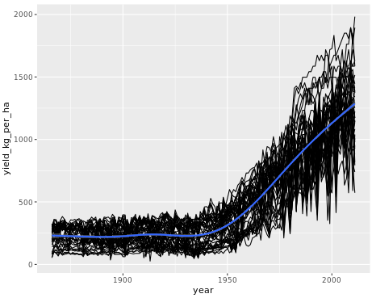
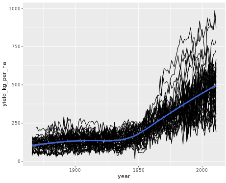
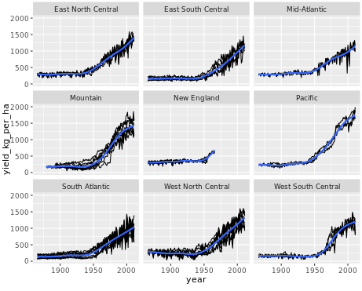
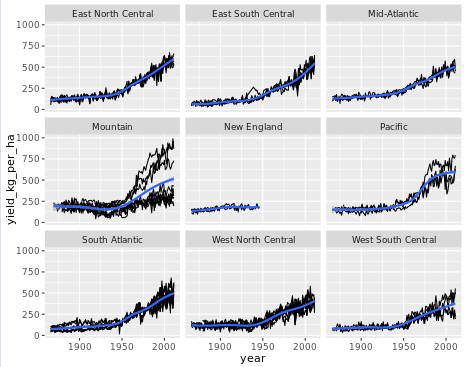
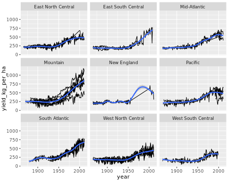

# Chapter 1: How to write a function

## Video 1.1: Why you should use functions

### The arguments to `mean()`

Mean has 3 arguments: - `x`: a numeric or datetime vector - `trim`: the proportion of outliers from each end to remove before calculating - `na.rm`: remove before calculating

### Calling `mean()`

-   Pass arguments by position:
    -   `mean(numbers, 0.1, TRUE)`
-   Pass arguments by name:
    -   `mean(na.rm = TRUE, trim = 0.1, x = numbers)`
-   Common arguments by position, rare arguments by name:
    -   `mean(numbers, trim = 0.1, na.rm = TRUE)`

### Benefits of writing functions

-   Functions eliminate repetition from your code, which - can reduce your workload, and - help avoid errors.

-   Functions also allow code reuse and sharing.

## Calling functions

One way to make your code more readable is to be careful about the order you pass arguments when you call functions, and whether you pass the arguments by position or by name.

`gold_medals`, a numeric vector of the number of gold medals won by each country in the 2016 Summer Olympics, is provided.

For convenience, the arguments of `median()` and `rank()` are displayed using `args()`. Setting `rank()`'s `na.last` argument to `"keep"` means "keep the rank of NA values as NA".

Best practice for calling functions is to include them in the order shown by `args()`, and to only name rare arguments.

**Instructions 1/2**

-   *The final line calculates the median number of gold medals each country won.*

    Rewrite the call to `median()`, following best practices.

    ```         
    # Look at the gold medals data
    gold_medals

    # Note the arguments to median()
    args(median)

    # Rewrite this function call, following best practices
    median(gold_medals, na.rm = TRUE)
    ```

-   [**2**]

    *The final line calculates each country's ranking by number of gold medals. It uses negative `gold_medals` so that the country with the most medals will have 1st place: the largest positive value in `gold_medals` is the smallest ("most negative") value in `-gold_medals`.*

    ```         
    # Note the arguments to rank()
    args(rank)

    # Rewrite this function call, following best practices
    rank(-gold_medals, na.last = "keep",ties.method = "min")
    ```

    Rewrite the call to `rank()`, following best practices.

-   `args()` function used to check function arguments

## Video 1.2: Converting scripts into functions

-   A great workflow is to write a script, then convert any repeated chunks of code in that script into functions.

### A basic function template

```         
function_name <- function(arg1, arg2) { # the signature
  # Do something with arg1 and arg2     # the body
  return(something)
}
```

### 1) Make a template

```         
import_test_scores <- function() {
  
  
  
  
}
```

### 2) Choose the arguments

-   Paste your script inside the braces

```         
import_test_scores <- function(filename) { # <- only 1 argument
    test_scores_geography_raw <- read_csv("test_scores_geography.csv")  
    test_scores_geography_clean <- test_scores_geography_raw %>%     
      select(person_id, first_name, last_name, test_date, score) %>%    
      mutate(test_date = mdy(test_date)) %>%    
      filter(!is.na(score))  
}
```

### 3) Replace specific values with arguments

```         
import_test_scores <- function(filename) { # <- only 1 argument
    test_scores_geography_raw <- read_csv(filename) # <- replace specific filename  
    test_scores_geography_clean <- raw_data %>%     
      select(person_id, first_name, last_name, test_date, score) %>%    
      mutate(test_date = mdy(test_date)) %>%    
      filter(!is.na(score))  
}
```

### 4) Generalize variable names

```         
import_test_scores <- function(filename) { 
    test_scores_raw <- read_csv(filename) # <- variable names generalized
    test_scores_clean <- test_scores_raw %>%     # <- variable names generalized
      select(person_id, first_name, last_name, test_date, score) %>%    
      mutate(test_date = mdy(test_date)) %>%    
      filter(!is.na(score))  
}
```

### 5) Remove the final assignment

```         
import_test_scores <- function(filename) {  
  test_scores_raw <- read_csv(filename)  
  
  test_scores_raw %>%  # <- remove assignment    
    select(person_id, first_name, last_name, test_date, score) %>%    
    mutate(test_date = mdy(test_date)) %>%    
    filter(!is.na(score))}
```

### 6) Use your function

```         
test_scores_geography <- import_test_scores("test_scores_geography.csv")
test_scores_english <- import_test_scores("test_scores_english.csv")
test_scores_art <- import_test_scores("test_scores_art.csv")
test_scores_spanish <- import_test_scores("test_scores_spanish.csv")
```

## Your first function: tossing a coin

Time to write your first function! It's a really good idea when writing functions to start simple. You can always make a function more complicated later if it's really necessary, so let's not worry about arguments for now.

**Instructions 1/4**

-   Simulate a single coin toss by using `sample()` to sample from `coin_sides` once.

```{r}
coin_sides <- c("head", "tail")

# Sample from coin_sides once
sample(coin_sides, 1)
```

**2/4**

-   Write a template for your function, naming it `toss_coin`. The function should take no arguments. Don't include the body of the function yet.

```         
toss_coin <- function () {

}
```

**3/4**

-   Copy your script, and paste it into the function body.

```{r}
# Your script, from a previous step
coin_sides <- c("head", "tail")
sample(coin_sides, 1)

# Paste your script into the function body
toss_coin <- function() {
  coin_sides <- c("head", "tail")
  sample(coin_sides, 1)
  
}
```

**4/4**

-   Call your function.

```{r}
toss_coin()
```

## Inputs to functions

Most functions require some sort of input to determine what to compute. The inputs to functions are called **arguments**. You specify them inside the parentheses after the word "function."

As mentioned in the video, the following exercises assume that you are using `sample()` to do random sampling.

**Instructions 1/2**

-   Sample from `coin_sides` `n_flips` times with replacement.

```{r}
coin_sides <- c("head", "tail")
n_flips <- 10

# Sample from coin_sides n_flips times with replacement
sample(coin_sides, n_flips, replace = TRUE)
```

**2/2**

-   Update the definition of `toss_coin()` to accept a single argument, `n_flips`. The function should sample `coin_sides` `n_flips` times with replacement. *Remember to change the signature and the body.*

-   Generate 10 coin flips.

```{r}
# Update the function to return n coin tosses
toss_coin <- function(n_flips) {
  coin_sides <- c("head", "tail")
  sample(coin_sides, n_flips, replace = TRUE)
}

# Generate 10 coin tosses
toss_coin(10)
```

## Multiple inputs to functions

If a function should have more than one argument, list them in the function signature, separated by commas.

To solve this exercise, you need to know how to specify sampling weights to `sample()`. Set the `prob` argument to a numeric vector with the same length as `x`. Each value of `prob` is the probability of sampling the corresponding element of `x`, so their values add up to one. In the following example, each sample has a 20% chance of `"bat"`, a 30% chance of `"cat"` and a 50% chance of `"rat"`.

```         
sample(c("bat", "cat", "rat"), 10, replace = TRUE, prob = c(0.2, 0.3, 0.5)) 
```

**Instructions 1/2**

-   Bias the coin by weighting the sampling. Specify the `prob` argument so that heads are sampled with probability `p_head` (and tails are sampled with probability `1 - p_head`).

```{r}
coin_sides <- c("head", "tail")
n_flips <- 10
p_head <- 0.8

# Define a vector of weights
weights <- c(p_head, 1 - p_head)

# Update so that heads are sampled with prob p_head
sample(coin_sides, n_flips, replace = TRUE, prob = weights)
```

**2/2**

-   Update the definition of `toss_coin()` so it accepts an argument, `p_head`, and weights the samples using the code you wrote in the previous step.

-   Generate 10 coin tosses with an 80% chance of each head.

```{r}
# Update the function so heads have probability p_head
toss_coin <- function(n_flips, p_head) {
  coin_sides <- c("head", "tail")
  # Define a vector of weights
  weights <- c(p_head, 1 - p_head)
  # Modify the sampling to be weighted
  sample(coin_sides, n_flips, replace = TRUE, prob = weights)
}

# Generate 10 coin tosses
toss_coin(10, 0.8)
```

## Video 1.3: Y kant I reed ur code?

### `dplyr` verbs

-   `select()` *selects* columns
-   `filter()` *filters* rows

### Function names should contain a verb

-   get
-   calculate (or just calc)
-   run
-   process
-   import
-   clean
-   tidy
-   draw

### `lm()` is badly named

-   Acronyms aren't self-explanatory

-   It doesn't contain a verb

-   There are lots of different linear models.

A better name would be `run_linear_regression()`

### Readability vs. Typeability

-   Understanding code \>\> typing code

    -   The amount of time spent reading and understanding code is almost always longer than the time to type it.

-   Code editors have autocomplete

-   You can alias/assign functions just like any other variable type

```{r}
h <- head
data(cats, package = "MASS")
h(cats)
```

### Arguments of `lm()`

```{r}
args(lm)
```

### Types of argument

-   **Data arguments**: what you compute on
-   **Detail arguments**: how you perform the computation

```{r}
args(cor)
```

### Data args should precede detail args

This won't work

```         
data %>% 
  lm(formula)
```

because the data argument isn't first.

### Our revised function for linear regression

```{r}
run_linear_regression <- function(data, formula) {
  lm(formula, data)
}
```

```{r}
library(dplyr)
cats %>% 
  run_linear_regression(Hwt ~ Bwt + Sex)
```

## Renaming GLM

R's generalized linear regression function, `glm()`, suffers the same usability problems as `lm()`: its name is an acronym, and its `formula` and `data` arguments are in the wrong order.

To solve this exercise, you need to know two things about generalized linear regression:

1.  `glm()` formulas are specified like `lm()` formulas: response is on the left, and explanatory variables are added on the right.

2.  To model count data, set `glm()`'s `family` argument to `poisson`, making it a Poisson regression.

Here you'll use data on the [**number of yearly visits to Snake River**](https://www.rdocumentation.org/packages/COUNT/topics/loomis) at Jackson Hole, Wyoming, `snake_river_visits`.

**Instructions 1/3** - Run a generalized linear regression by calling `glm()`. Model `n_visits` vs. `gender`, `income`, and `travel` on the `snake_river_visits` dataset, setting the `family` to `poisson`.

```{r}
snake_river_visits <- readRDS("data/snake_river_visits.rds")
# Run a generalized linear regression 
model <- glm(
  # Model no. of visits vs. gender, income, travel
  n_visits ~ gender + income + travel, 
  # Use the snake_river_visits dataset
  data = snake_river_visits, 
  # Make it a Poisson regression
  family = "poisson"
)
```

**2/3**

-   Define a function, `run_poisson_regression()`, to run a Poisson regression. This should take two arguments: `data` and `formula`, and call `glm()`, passing those arguments and setting `family` to `poisson`.

```{r}
# Write a function to run a Poisson regression
run_poisson_regression <- function(data, formula) {
glm(formula, data, family = "poisson")
}
```

**3/3**

-   Recreate the Poisson regression model from the first step, this time by calling your `run_poisson_regression()` function.

```{r}
# From previous step
run_poisson_regression <- function(data, formula) {
  glm(formula, data, family = poisson)
}

# Re-run the Poisson regression, using your function
model <- snake_river_visits %>%
  run_poisson_regression(n_visits ~ gender + income + travel)

# # Run this to see the predictions
# snake_river_explanatory %>%
#   mutate(predicted_n_visits = predict(model, ., type = "response"))%>%
#   arrange(desc(predicted_n_visits))
```

# Chapter 2: All About Arguments

## Video 2.1: Default Arguments

### `toss_coin` troubles

```{r}
toss_coin <- function(n_flips, p_head) {
  coin_sides <- c("head", "tail")
  weights <- c(p_head, 1 - p_head)
  sample(coin_sides, n_flips, replace = TRUE, prob = weights)
}
```

**Set the default in the signature.**

```{r}
toss_coin <- function(n_flips, p_head = 0.5) {
  coin_sides <- c("head", "tail")
  weights <- c(p_head, 1 - p_head)
  sample(coin_sides, n_flips, replace = TRUE, prob = weights)
}
```

### A template with defaults

```{r}
my_fun <- function(data_arg1, data_arg2, detail_arg1 = default1) {
  # do something
}
```

### Other types of default

```{r}
args(median)
```

```{r}
library(jsonlite)
args(fromJSON)
```

-   if you specify `simplifyVector`, you will change all three arguments together.

### `NULL` defaults

By convention, this means

> The function will do some special handling of this argument. Please read the docs.

```{r}
args(set.seed)
```

### Categorical Defaults

1.  Pass a character vector of all choices in the signature, then
2.  Call `match.arg()` in the body.

```{r}
args(prop.test)
```

**Inside the body**

```         
alternative <- match.arg(alternative)
```

### Cutting vector by a quantile

```{r}
cut_by_quantile <- function(x, n, na.rm, labels, interval_type){
  probs <- seq(0, 1, length.out = n + 1)
  quantiles <- quantile(x, probs, na.rm = na.rm, names = FALSE)
  right <- switch(interval_type, "(lo, hi]" = TRUE, "[lo, hi)" = FALSE)
  cut(x, quantiles, labels = labels, right = right, include.lowest = TRUE)
}
```

-   `x`: a numeric vector to cut
-   `n`: the number of categories to cut `x` into
-   `na.rm`: should missing value be removed?
-   `labels`: character labels for the categories
-   `interval_type`: should ranges be open on the left or the right?

### Cat heart weights

```{r}
data(cats, package = "MASS")
quantile(cats$Hwt)
```

### Cutting by quantile

```         
cut(x, quantile(x))
```

## Numeric defaults

`cut_by_quantile()` converts a numeric vector into a categorical variable where quantiles define the cut points. This is a useful function, but at the moment you have to specify five arguments to make it work. This is too much thinking and typing.

By specifying default arguments, you can make it easier to use. Let's start with `n`, which specifies how many categories to cut `x` into.

A numeric vector of the number of visits to Snake River is provided as `n_visits`.

```{r}
snake_river_visits <- readRDS("data/snake_river_visits.rds")
n_visits <- snake_river_visits$n_visits
summary(n_visits)
```

**Instructions**

-   Update the definition of `cut_by_quantile()` so that the `n` argument defaults to `5`.
-   Remove the `n` argument from the call to `cut_by_quantile()`.

```{r}
# Set the default for n to 5
cut_by_quantile <- function(x, n = 5, na.rm, labels, interval_type) {
  probs <- seq(0, 1, length.out = n + 1)
  qtiles <- quantile(x, probs, na.rm = na.rm, names = FALSE)
  right <- switch(interval_type, "(lo, hi]" = TRUE, "[lo, hi)" = FALSE)
  cut(x, qtiles, labels = labels, right = right, include.lowest = TRUE)
}

# Remove the n argument from the call
cut_by_quantile(
  n_visits,
  na.rm = FALSE,
  labels = c("very low", "low", "medium", "high", "very high"),
  interval_type = "(lo, hi]"
)
```

## Logical defaults

`cut_by_quantile()` is now slightly easier to use, but you still always have to specify the `na.rm` argument. This removes missing values—it behaves the same as the `na.rm` argument to `mean()` or `sd()`.

Where functions have an argument for removing missing values, the best practice is to **not** remove them by default (in case you hadn't spotted that you had missing values). That means that the default for `na.rm` should be `FALSE`.

**Instructions**

-   Update the definition of `cut_by_quantile()` so that the `na.rm` argument defaults to `FALSE`.
-   Remove the `na.rm` argument from the call to `cut_by_quantile()`.

```{r}
# Set the default for na.rm to FALSE
cut_by_quantile <- function(x, n = 5, na.rm = FALSE, labels, interval_type) {
  probs <- seq(0, 1, length.out = n + 1)
  qtiles <- quantile(x, probs, na.rm = na.rm, names = FALSE)
  right <- switch(interval_type, "(lo, hi]" = TRUE, "[lo, hi)" = FALSE)
  cut(x, qtiles, labels = labels, right = right, include.lowest = TRUE)
}

# Remove the na.rm argument from the call
cut_by_quantile(
  n_visits,
  labels = c("very low", "low", "medium", "high", "very high"),
  interval_type = "(lo, hi]"
)
```

## NULL defaults

The `cut()` function used by `cut_by_quantile()` can automatically provide sensible labels for each category. The code to generate these labels is [**pretty complicated**](https://github.com/wch/r-source/blob/29a9e663a2352843a6ea26b259725b0b97d0e4bd/src/library/base/R/cut.R#L42-L60), so rather than appearing in the function signature directly, its `labels` argument defaults to `NULL`, and the calculation details are shown on the `cut()` help page ([**docs**](https://www.rdocumentation.org/packages/base/topics/cut)).

**Instructions**

-   Update the definition of `cut_by_quantile()` so that the `labels` argument defaults to `NULL`.

-   Remove the `labels` argument from the call to `cut_by_quantile()`.

```{r}
# Set the default for labels to NULL
cut_by_quantile <- function(x, n = 5, na.rm = FALSE, labels = NULL, interval_type) {
  probs <- seq(0, 1, length.out = n + 1)
  qtiles <- quantile(x, probs, na.rm = na.rm, names = FALSE)
  right <- switch(interval_type, "(lo, hi]" = TRUE, "[lo, hi)" = FALSE)
  cut(x, qtiles, labels = labels, right = right, include.lowest = TRUE)
}

# Remove the labels argument from the call
cut_by_quantile(
  n_visits,
  interval_type = "(lo, hi]"
)
```

## Categorical defaults

When cutting up a numeric vector, you need to worry about what happens if a value lands exactly on a boundary. You can either put this value into a category of the lower interval or the higher interval. That is, you can choose your intervals to include values at the top boundary but not the bottom (in mathematical terminology, "open on the left, closed on the right", or `(lo, hi]`). Or you can choose the opposite ("closed on the left, open on the right", or `[lo, hi)`). `cut_by_quantile()` should allow these two choices.

The pattern for categorical defaults is:

```         
function(cat_arg = c("choice1", "choice2")) {   
    cat_arg <- match.arg(cat_arg) 
} 
```

**Free hint**: In the console, type `head(rank)` to see the start of `rank()`'s definition, and look at the `ties.method` argument.

**Instructions**

-   Update the signature of `cut_by_quantile()` so that the `interval_type` argument can be `"(lo, hi]"` or `"[lo, hi)"`. *Note the space after each comma.*

-   Update the body of `cut_by_quantile()` to match the `interval_type` argument.

-   Remove the `interval_type` argument from the call to `cut_by_quantile()`.

```{r}
# Set the categories for interval_type to "(lo, hi]" and "[lo, hi)"
cut_by_quantile <- function(x, n = 5, na.rm = FALSE, labels = NULL,
                            interval_type = c("(lo, hi]", "[lo, hi)")) {
  # Match the interval_type argument
  interval_type <- match.arg(interval_type)
  probs <- seq(0, 1, length.out = n + 1)
  qtiles <- quantile(x, probs, na.rm = na.rm, names = FALSE)
  right <- switch(interval_type, "(lo, hi]" = TRUE, "[lo, hi)" = FALSE)
  cut(x, qtiles, labels = labels, right = right, include.lowest = TRUE)
}

# Remove the interval_type argument from the call
cut_by_quantile(n_visits)
```

## Video 2.2: Passing arguments between functions

### Calculating the geometric mean

```{r}
# x %>% 
#   log() %>% 
#   mean() %>% 
#   exp()
# 
# Error: object 'x' not found
```

### Wrapping this in a function

```{r}
calc_geometric_mean <- function(x) {
  x %>% 
  log() %>% 
  mean() %>% 
  exp()
}
```

### Handling missing values

```{r}
calc_geometric_mean <- function(x, na.rm = FALSE) {
  x %>% 
  log() %>% 
  mean(na.rm = na.rm) %>% 
  exp()
}
```

### Using `...`

```{r}
calc_geometric_mean <- function(x, ...) {
  x %>% 
    log() %>% 
    mean(...) %>% 
    exp()
}
```

### The tradeoff

**Benefits** - Less typing for you - No need to match signatures

**Drawbacks** - You need to trust the inner function - The interface is not as obvious to users

## Harmonic mean

The harmonic mean is the reciprocal of the arithmetic mean of the reciprocal of the data. That is

$harmonic\_mean(x) = 1/arithmetic\_mean(1/x)$

The harmonic mean is often used to average ratio data. You'll be using it on the price/earnings ratio of stocks in the Standard and Poor's 500 index, provided as `std_and_poor500`. Price/earnings ratio is a measure of how expensive a stock is.

The `dplyr` package is loaded.

**Instructions 1/3**

-   *Look at `std_and_poor500` (you'll need this later).* Write a function, `get_reciprocal`, to get the reciprocal of an input `x`. Its only argument should be `x`, and it should return one over `x`.

```{r}
std_and_poor500 <- readRDS("data/std_and_poor500_with_pe_2019-06-21.rds")
# Look at the Standard and Poor 500 data
glimpse(std_and_poor500)

# Write a function to calculate the reciprocal
get_reciprocal <- function(x) {
  return (1/x)
}
```

**2/3** - Write a function, `calc_harmonic_mean()`, that calculates the harmonic mean of its only input, `x`.

```{r}
# From previous step
get_reciprocal <- function(x) {
  1 / x
}

# Write a function to calculate the harmonic mean
calc_harmonic_mean <- function(x) {
  x %>%
    log() %>%
    mean() %>%
    exp()
}
```

**3/3** - Using `std_and_poor500`, group by `sector`, and summarize to calculate the harmonic mean of the price/earning ratios in the `pe_ratio` column.

```{r}
# From previous steps
get_reciprocal <- function(x) {
  1 / x
}
calc_harmonic_mean <- function(x) {
  x %>%
    get_reciprocal() %>%
    mean() %>%
    get_reciprocal()
}

std_and_poor500 %>% 
  # Group by sector
  group_by(sector) %>% 
  # Summarize, calculating harmonic mean of P/E ratio
  summarize(hmean_pe_ratio = calc_harmonic_mean(pe_ratio))
```

## Dealing with missing values

In the last exercise, many sectors had an `NA` value for the harmonic mean. It would be useful for your function to be able to remove missing values before calculating.

Rather than writing your own code for this, you can outsource this functionality to `mean()`.

The `dplyr` package is loaded.

**Instructions 1/2** - Modify the signature and body of `calc_harmonic_mean()` so it has an `na.rm` argument, defaulting to false, that gets passed to `mean()`.

```{r}
# Add an na.rm arg with a default, and pass it to mean()
calc_harmonic_mean <- function(x, na.rm = FALSE) {
  x %>%
    get_reciprocal() %>%
    mean(na.rm = na.rm) %>%
    get_reciprocal()
}
```

**2/2**

-   Using `std_and_poor500`, group by `sector`, and summarize to calculate the harmonic mean of the price/earning ratios in the `pe_ratio` column, removing missing values.

```{r}
# From previous step
calc_harmonic_mean <- function(x, na.rm = FALSE) {
  x %>%
    get_reciprocal() %>%
    mean(na.rm = na.rm) %>%
    get_reciprocal()
}

std_and_poor500 %>% 
  # Group by sector
  group_by(sector) %>% 
  # Summarize, calculating harmonic mean of P/E ratio
  summarize(hmean_pe_ratio = calc_harmonic_mean(pe_ratio, na.rm = TRUE))
```

## Passing arguments with `...`

Rather than explicitly giving `calc_harmonic_mean()` and `na.rm` argument, you can use `...` to simply "pass other arguments" to `mean()`.

The `dplyr` package is loaded.

**Instructions 1/2**

-   Replace the `na.rm` argument with `...` in the signature and body of `calc_harmonic_mean()`.

```{r}
# Swap na.rm arg for ... in signature and body
calc_harmonic_mean <- function(x, ...) {
  x %>%
    get_reciprocal() %>%
    mean(...) %>%
    get_reciprocal()
}
```

**2/2**

-   Using `std_and_poor500`, group by `sector`, and summarize to calculate the harmonic mean of the price/earning ratios in the `pe_ratio` column, removing missing values.

```{r}
calc_harmonic_mean <- function(x, ...) {
  x %>%
    get_reciprocal() %>%
    mean(...) %>%
    get_reciprocal()
}

std_and_poor500 %>% 
  # Group by sector
  group_by(sector) %>% 
  # Summarize, calculating harmonic mean of P/E ratio
  summarize(hmean_pe_ratio = calc_harmonic_mean(pe_ratio, na.rm = TRUE))
```

## Video 2.3: Checking arguments

### The geometric mean

```{r}
# calc_geometric_mean <- function(x, na.rm = FALSE) {
#   x %>% 
#     log() %>% 
#     mean(na.rm = na.rm) %>% 
#     exp()
# }
```

```{r}
# calc_geometric_mean(letters)
# 
# Error in log(.) : non-numeric argument to mathematical function
```

### Checking for numeric values

```{r}
# calc_geometric_mean <- function(x, na.rm = FALSE) {
#   if(!is.numeric(x)) {
#     stop("x is not of class 'numeric'; it has class '", class(x), "'.")
#   }
#   x %>% 
#     log() %>% 
#     mean(na.rm = na.rm) %>% 
#     exp()
# }
```

```{r}
# calc_geometric_mean(letters)
# 
# Error in calc_geometric_mean(letters) : 
#   x is not of class 'numeric'; it has class 'character'.
```

### `assertive` makes errors easy

Except it really, really does **NOT** because CRAN archived the `assertive` package, so it is not compatible with current R versions, in RStudio -or- DataCamp.

### Checking types of inputs

-   `assert_is_numeric()`
-   `assert_is_character()`
-   `is_data.frame()`
-   ...
-   `is_two_sided_formula()`
-   `is_tskernel()`

### Using `assertive` to check `x`

```{r}
# calc_geometric_mean <- function(x, na.rm = FALSE) {
#   assert_is_numeric(x)
#   x %>% 
#     log() %>% 
#     mean(na.rm = na.rm) %>% 
#     exp()
# }
```

```         
Error in calc_geometric_mean(letters) :   
  is_numeric : x is not of class 'numeric'; it has class 'character'.
```

### Checking `x` is positive

```{r}
# calc_geometric_mean <- function(x, na.rm = FALSE) {
#   assert_is_numeric(x)
#   assert_all_are_positive(x)
#   x %>% 
#     log() %>% 
#     mean(na.rm = na.rm) %>% 
#     exp()
# }
```

```{r}
# calc_geometric_mean(c(1, -1))
```

```         
Error in calc_geometric_mean(c(1, -1)) :  
  is_positive : x contains non-positive values.
There was 1 failure:  
  Position Value   Cause
1        2    -1 too low
```

### `is_*` functions

-   `assert_is_numeric()`
-   `assert_all_are_positive()`
-   `is_numeric()` (returns logical value)
-   `is_positive` (returns logical vector
-   `is_non_positive()`

### Custom checks

```{r}
# calc_geometric_mean <- function(x, na.rm = FALSE) {
#   assert_is_numeric(x)
#   if(any(is_non_positive(x), na.rm = TRUE)) {
#     stop("x contains non-positive values, so the geometric mean makes no sense")
#   }
#   x %>% 
#     log() %>% 
#     mean(na.rm = na.rm) %>% 
#     exp()
# }
```

```{r}
# calc_geometric_mean(c(1, -1))
```

```         
Error in calc_geometric_mean(c(1, -1)) :   
  x contains non-positive values, so the geometric mean makes no sense.
```

### Fixing input

```{r}
# use_first(c(1, 4, 9, 16))
```

```         
[1] 1
Warning message:
Only the first value of c(1, 4, 9, 16) (= 1) will be used
```

```{r}
# coerce_to(c(1, 4, 9, 16), "character")
```

```         
[1] "1" "4" "9" "16"

Warning message:Coercing c(1, 4, 9, 16) to class ‘character’.
```

### Fixing `na.rm`

```{r}
# calc_geometric_mean <- function(x, na.rm = FALSE) {
#   assert_is_numeric(x)
#   if(any(is_non_positive(x), na.rm = TRUE)) {
#     stop("x contains non-positive values, so the geometric mean makes no sense")
#   }
#   na.rm <- coerce_to(use_first(na.rm), target_class = "logical")
#   x %>% 
#     log() %>% 
#     mean(na.rm = na.rm) %>% 
#     exp()
# }
```

```{r}
# calc_geometric_mean(1:5, na.rm = 1:5)
```

```         
[1] 2.605171
Warning messages:
1: Only the first value of na.rm (= 1) will be used. 
2: Coercing use_first(na.rm) to class ‘logical’.
```

## Throwing errors with bad arguments

If a user provides a bad input to a function, the best course of action is to throw an error letting them know. The two rules are

1.  Throw the error message as soon as you realize there is a problem (typically at the start of the function).

2.  Make the error message easily understandable.

You can use the `assert_*()` functions from `assertive` to check inputs and throw errors when they fail.

**Instructions** - Add a line to the body of `calc_harmonic_mean()` to assert that `x` is numeric. - *Look at what happens when you pass a character argument to `calc_harmonic_mean()`*

```{r}
# calc_harmonic_mean <- function(x, na.rm = FALSE) {
#   # Assert that x is numeric
#   assert_is_numeric(x)
#   x %>%
#     get_reciprocal() %>%
#     mean(na.rm = na.rm) %>%
#     get_reciprocal()
# }
# 
# # See what happens when you pass it strings
# calc_harmonic_mean(std_and_poor500$sector)

# Error: is_numeric : x is not of class 'numeric'; it has class 'character'.
```

## Custom error logic

Sometimes the `assert_*()` functions in `assertive` don't give the most informative error message. For example, the assertions that check if a number is in a numeric range will tell the user that a value is out of range, but the won't say why that's a problem. In that case, you can use the `is_*()` functions in conjunction with messages, warnings, or errors to define custom feedback.

The harmonic mean only makes sense when `x` has all positive values. (Try calculating the harmonic mean of one and minus one to see why.) Make sure your users know this!

**Instructions**

-   If any values of `x` are non-positive (ignoring `NA`s) then throw an error.

-   *Look at what happens when you pass a character argument to `calc_harmonic_mean()`*

```{r}
# calc_harmonic_mean <- function(x, na.rm = FALSE) {
#   assert_is_numeric(x)
#   # Check if any values of x are non-positive
#   if(any(is_non_positive(x), na.rm = TRUE)) {
#     # Throw an error
#     stop("x contains non-positive values, so the harmonic mean makes no sense.")
#   }
#   x %>%
#     get_reciprocal() %>%
#     mean(na.rm = na.rm) %>%
#     get_reciprocal()
# }
# 
# # See what happens when you pass it negative numbers
# calc_harmonic_mean(std_and_poor500$pe_ratio - 20)
# 
# Error: x contains non-positive values, so the harmonic mean makes no sense.
```

## Fixing function arguments

The harmonic mean function is almost complete. However, you still need to provide some checks on the `na.rm` argument. This time, rather than throwing errors when the input is in an incorrect form, you are going to try to fix it.

`na.rm` should be a logical vector with one element (that is, `TRUE`, or `FALSE`).

The `assertive` package is loaded for you.

**Instructions**

-   Update `calc_harmonic_mean()` to fix the `na.rm` argument by using `use_first()` to select the first `na.rm` element, and `coerce_to()` to change it to logical.

```{r}
# # Update the function definition to fix the na.rm argument
# calc_harmonic_mean <- function(x, na.rm = FALSE) {
#   assert_is_numeric(x)
#   if(any(is_non_positive(x), na.rm = TRUE)) {
#     stop("x contains non-positive values, so the harmonic mean makes no sense.")
#   }
#   # Use the first value of na.rm, and coerce to logical
#   na.rm <- coerce_to(use_first(na.rm), target_class = "logical")
#   x %>%
#     get_reciprocal() %>%
#     mean(na.rm = na.rm) %>%
#     get_reciprocal()
# }
# 
# # See what happens when you pass it malformed na.rm
# calc_harmonic_mean(std_and_poor500$pe_ratio, na.rm = 1:5)
# 
# Warning message: Only the first value of na.rm (= 1) will be used.
# Warning message: Coercing use_first(na.rm) to class ‘logical’.
# 
# [1] 18.23871
```

# Chapter 3: Return Values and Scope

## Video 3.1: Returning Values from Functions

### A simple sum function

```{r}
simple_sum <- function(x) {
  if(anyNA(x)) {
    return(NA)
  }
  total <- 0
  for(value in x) {
    total <- total + value
  }
}

simple_sum(c(0, 1, 3, 6, NA, 7))
```

### Geometrics means again

```{r}
# calc_geometric_mean <- function(x, na.rm = FALSE) {  
#   assert_is_numeric(x)
#   if(any(is_non_positive(x), na.rm = TRUE)) {
#     stop("x contains non-positive values, so the geometric mean makes no sense.")  
#   }  
#   na.rm <- coerce_to(use_first(na.rm), "logical")  
#   x %>%    
#     log() %>%    
#     mean(na.rm = na.rm) %>%    
#     exp()}
```

### Returning `NaN` with a warning

```{r}
# calc_geometric_mean <- function(x, na.rm = FALSE) {  
#   assert_is_numeric(x)
#   if(any(is_non_positive(x), na.rm = TRUE)) {
#     warning("x contains non-positive values, so the geometric mean makes no sense.")
#     return(NaN)
#   }  
#   na.rm <- coerce_to(use_first(na.rm), "logical")  
#   x %>%    
#     log() %>%    
#     mean(na.rm = na.rm) %>%    
#     exp()}
```

### Reasons for returning early

1.  You already know the answer.
2.  The input is an edge case.

### Hiding the return value

```{r}
simple_sum <- function(x) {
  if(anyNA(x)) {
    return(NA)  
  }  
  total <- 0
  for(value in x) {    
    total <- total + value  
  }  
  total
}

simple_sum(c(0, 1, 3, 6, 2, 7))
```

```{r}
simple_sum <- function(x) {
  if(anyNA(x)) {
    return(NA)  
  }  
  total <- 0
  for(value in x) {    
    total <- total + value  
  }  
  invisible(total)
}

simple_sum(c(0, 1, 3, 6, 2, 7))
```

### Many plots invisibly return things

```{r}
library(ggplot2)
srv_hist <- ggplot(snake_river_visits, aes(n_visits)) +
  geom_histogram(binwidth = 10)
srv_hist
```

```{r}
str(srv_hist, max.level = 0)
```

## **Returning early**

Sometimes, you don't need to run through the whole body of a function to get the answer. In that case you can return early from that function using `return()`.

To check if `x` is divisible by `n`, you can use `is_divisible_by(x, n)` from `assertive`.

Alternatively, use the modulo operator, `%%`. `x %% n` gives the remainder when dividing `x` by `n`, so `x %% n == 0` determines whether `x` is divisible by `n`. Try `1:10 %% 3 == 0` in the console.

To solve this exercise, you need to know that a leap year is every 400th year (like the year 2000) or every 4th year that isn't a century (like 1904 but not 1900 or 1905).

`assertive` is loaded.

**Instructions**

-   Complete the definition of `is_leap_year()`, checking for the cases of `year` being divisible by 400, then 100, then 4, returning early from the function in each case.

```{r}
is_leap_year <- function(year) {
  # If year is div. by 400 return TRUE
  if(year %% 400 == 0) {
    return(TRUE)
  }
  # If year is div. by 100 return FALSE
  if(year %% 100 == 0) {
    return(FALSE)
  }  
  # If year is div. by 4 return TRUE
  if(year %% 4 == 0) {
    return(TRUE)
  }
  
  
  # Otherwise return FALSE
  else(FALSE)
}
```

## **Returning invisibly**

When the main purpose of a function is to generate output, like drawing a plot or printing something in the console, you may not want a return value to be printed as well. In that case, the value should be [**invisibly returned**](https://www.rdocumentation.org/packages/base/topics/invisible).

The base R plot function returns `NULL`, since its main purpose is to draw a plot. This isn't helpful if you want to use it in piped code: instead it should invisibly return the plot data to be piped on to the next step.

Recall that `plot()` has a [**formula interface**](https://www.rdocumentation.org/packages/graphics/topics/plot.formula): instead of giving it vectors for `x` and `y`, you can specify a formula describing which columns of a data frame go on the `x` and `y` axes, and a `data` argument for the data frame. Note that just like `lm()`, the arguments are the wrong way round because the detail argument, `formula`, comes before the `data` argument.

```         
plot(y ~ x, data = data) 
```

**Instructions 1/2**

-   Use the `cars` dataset and the formula interface to `plot()`, draw a scatter plot of `dist` versus `speed`.

```{r}
data(cars)
# str(cars)

plt_dist_vs_speed <- plot(dist ~ speed, data = cars)
plt_dist_vs_speed
```

**2/2**

-   Give `pipeable_plot()` `data` and `formula` arguments (in that order) and make it draw the plot, then invisibly return `data`.

-   Draw the scatter plot of dist vs. speed again by calling `pipeable_plot()`.

```{r}
# Define a pipeable plot fn with data and formula args
pipeable_plot <- function(data, formula) {
  # Call plot() with the formula interface
  plot(formula, data)
  # Invisibly return the input dataset
  invisible(data)
}

# Draw the scatter plot of dist vs. speed again
plt_dist_vs_speed <- cars %>% 
  pipeable_plot(dist ~ speed)

# Now the plot object has a value
plt_dist_vs_speed
```

## Video 3.2: Returning Multiple Values from Functions

### Getting the session information

```{r}
R.version.string
```

```{r}
Sys.info()[c("sysname", "release")]
```

```{r}
loadedNamespaces()
```

### Defining `session()`

```{r}
session <- function() {
  list(
    r_version = R.version.string,
    operating_system = Sys.info()[c("sysname", "release")],
    loaded_pkgs = loadedNamespaces()
  )
}
session()
```

### Multi-assignment

```{r}
library(zeallot)
c(vrsn, os, pkgs) %<-% session()
```

```{r}
vrsn
```

```{r}
os
```

### Attributes

```{r}
month_no <- setNames(1:12, month.abb)
month_no
```

```{r}
attributes(month_no)
```

```{r}
attr(month_no, "names")
```

```{r}
attr(month_no, "names") <- month.name
month_no
```

### Attributes of a data frame

```{r}
data(Orange, package = "datasets")
orange_trees <- Orange
orange_trees
```

```{r}
attributes(orange_trees)
```

### Attributes added by `group_by()`

```{r}
library(dplyr)
orange_trees %>%
  group_by(Tree) %>%
  attributes()
```

### When to use each technique

-   If you need the result to have a particular type, add additional return values as attributes.
-   Otherwise, collect all return values into a list.

### `broom`

Model objects are converted into 3 data frames:

| function    | level       | example            |
|-------------|-------------|--------------------|
| `glance()`  | model       | degrees of freedom |
| `tidy()`    | coefficient | p-values           |
| `augment()` | observation | residuals          |

## **Returning many things**

Functions can only return one value. If you want to return multiple things, then you can store them all in a list.

If users want to have the list items as separate variables, they can assign each list element to its own variable using `zeallot`'s multi-assignment operator, `%<-%`.

`glance()`, `tidy()`, and `augment()` each take the model object as their only argument.

The Poisson regression model of Snake River visits is available as `model`. `broom` and `zeallot` are loaded.

**Instructions 1/3**

-   Examine the structure of `model`.

-   Use `broom` functions on `model` to create a list containing the model-, coefficient-, and observation-level parts of `model`.

```{r}
library(dplyr)
library(broom)
# Look at the structure of model (it's a mess!)
str(model)

# Use broom tools to get a list of 3 data frames
list(
  # Get model-level values
  model = glance(model),
  # Get coefficient-level values
  coefficients = tidy(model),
  # Get observation-level values
  observations = augment(model)
)
```

**2/3**

-   Wrap the code into a function, `groom_model()`, that accepts `model` as its only argument.

```{r}
# Wrap this code into a function, groom_model
groom_model <- function(model) { 
  list(
    model = glance(model),
    coefficients = tidy(model),
    observations = augment(model)
  )
}
```

**3/3**

-   Call `groom_model()` on `model`, multi-assigning the result to three variables at once: `mdl`, `cff`, and `obs`.

```{r}
# Call groom_model on model, assigning to 3 variables
c(mdl, cff, obs) %<-% groom_model(model)

# See these individual variables
mdl; cff; obs
```

## **Returning metadata**

Sometimes you want to return multiple things from a function, but you want the result to have a particular class (for example, a data frame or a numeric vector), so returning a list isn't appropriate. This is common when you have a result plus metadata about the result. (Metadata is "data about the data". For example, it could be the file a dataset was loaded from, or the username of the person who created the variable, or the number of iterations for an algorithm to converge.)

In that case, you can store the metadata in attributes. Recall the syntax for assigning attributes is as follows.

```         
attr(object, "attribute_name") <- attribute_value 
```

**Instructions**

-   Update `pipeable_plot()` so the result has an attribute named `"formula"` with the value of `formula`.

-   *`plt_dist_vs_speed`, that you previously created, is shown.* Examine its updated structure.

```{r}
pipeable_plot <- function(data, formula) {
  plot(formula, data)
  # Add a "formula" attribute to data
  attr(data, "formula") <- formula
  invisible(data)
}

# From previous exercise
plt_dist_vs_speed <- cars %>% 
  pipeable_plot(dist ~ speed)

# Examine the structure of the result
str(plt_dist_vs_speed)
```

## Video 3.3: Environments

-   a type of variable that is used to store *other variables*.

-   Most of the time, you can think of them as "special lists."

### Environments are like lists

```{r}
datacamp_lst <- list(
  name = "DataCamp",
  founded = 2013,
  website = "https://www.datacamp.com"
)
```

```{r}
ls.str(datacamp_lst)
```

```{r}
datacamp_env <- list2env(datacamp_lst)
```

```{r}
ls.str(datacamp_env)
```

### Environments have parents

-   You can think of the environments as being inside their parents (i.e. Matryoshka / Russian nesting dolls).

### Getting the parent environment

```{r}
parent <- parent.env(datacamp_env)
environmentName(parent)
```

```{r}
grandparent <- parent.env(parent)
environmentName(grandparent)
```

-   The `search` function shows all the parent environments from the global environment onwards.

-   At the end, the base environment has a special environment called the empty environment, which is equivalent to the biggest doll in the set.

```{r}
search()
```

### Does a variable exist?

Let's take `founding_year` out of `datacamp_env` and put it in the global environment. You can test for the existence of a variable in an environment using `exists`. Do you think `founding_year` exists in `datacamp_env`? It does! That might not be what you expected, since `founding_year` is actually in the global environment, not `datacamp_env`. If R cannot find a variable in an environment, it will look in the parent, then the grandparent, and so on until it finds it. You can think of the exists function as a greedy child. If the environment doesn't have the variable it wants, it will ask the parent, and if the parent says "no", it will asked the grandparent, and keep going until it gets what it wants, or there are no ancestors left to ask. You can force R to only look in the environment you asked for by setting inherits to `FALSE`.

```{r}
datacamp_lst <- list(
  name = "DataCamp",
  website = "https://www.datacamp.com"
)
datacamp_env <- list2env(datacamp_lst)
founding_year <- 2013
```

```{r}
exists("founding_year", envir = datacamp_env)
```

```{r}
exists("founding_year", envir = datacamp_env, inherits = FALSE)
```

## **Creating and exploring environments**

Environments are used to store other variables. Mostly, you can think of them as lists, but there's an important extra property that is relevant to writing functions. Every environment has a **parent environment** (except the **empty environment**, at the root of the environment tree). This determines which variables R know about at different places in your code.

Facts about the Republic of South Africa are contained in `capitals`, `national_parks`, and `population`.

**Instructions 1/3**

-   Create `rsa_lst`, a named list from `capitals`, `national_parks`, and `population`. Use those values as the names.

-   List the structure of each element of `rsa_lst` using `ls.str()`.

```{r}
# # Add capitals, national_parks, & population to a named list
# rsa_lst <- list(
#   capitals = capitals,
#   national_parks = national_parks,
#   population = population
# )
# 
# # List the structure of each element of rsa_lst
# ls.str(rsa_lst)
```

**2/3**

-   Convert the list to an environment, `rsa_env`, using `list2env()`.

-   List the structure of each element of `rsa_env`

```{r}
# # From previous step
# rsa_lst <- list(
#   capitals = capitals,
#   national_parks = national_parks,
#   population = population
# )
# 
# # Convert the list to an environment
# rsa_env <- list2env(rsa_lst)
# 
# # List the structure of each variable
# ls.str(rsa_env)
```

**3/3**

-   Find the parent environment of `rsa_env` and print its name.

```{r}
# # From previous steps
# rsa_lst <- list(
#   capitals = capitals,
#   national_parks = national_parks,
#   population = population
# )
# rsa_env <- list2env(rsa_lst)
# 
# # Find the parent environment of rsa_env
# parent <- parent.env(rsa_env)
# 
# # Print its name
# environmentName(parent)
```

## **Do variables exist?**

If R cannot find a variable in the current environment, it will look in the parent environment, then the grandparent environment, and so on until it finds it.

`rsa_env` has been modified so it includes `capitals` and `national_parks`, but not `population`.

**Instructions**

-   Check if `population` exists in `rsa_env`, using default inheritance rules.

-   Check if `population` exists in `rsa_env`, ignoring inheritance.

```{r}
# # Compare the contents of the global environment and rsa_env
# ls.str(globalenv())
# ls.str(rsa_env)
# 
# # Does population exist in rsa_env?
# exists("population", envir = rsa_env)
# 
# # Does population exist in rsa_env, ignoring inheritance?
# exists("population", envir = rsa_env, inherits = FALSE)
```

## Video 3.4: Scope and precedence

You might be wondering why the course took a diversion into playing with environments.

### Accessing variables outside functions

The answer is that when you call a function, R gives it an environment to store its variables. With this example, x will be added to the environment, then the x times y calculation will be performed in that environment. You may have noticed a problem: there is no y argument to the function. So when you call the function, you get an error stating that y wasn't found. Let's make one small change to the code: we define y outside the function. Now the function call works. R used the same process here as you saw earlier with the exists function. *When it couldn't find y inside the function's environment, it looked in the parent environment.*

```{r}
x_times_y <- function(x) {
  x * y
}

# x_times_y(10)

# Error in x_times_y(10) : object 'y' not found
```

```{r}
x_times_y <- function(x) {
  x * y
}
y <- 4
x_times_y(10)
```

### Accessing function variables from outside

Now you've run your multiplication code, what happens if you try to print x? x is being looked for in the global environment, but it isn't there. *The function's environment isn't a parent of the global environment -- it's a child instead.* So R can't look there, which means that x can't be found, and you get an error. *So a function can look for variables outside its environment, but the reverse isn't true: you can't look inside the function's environment from outside.*

```{r}
x_times_y <- function(x) {
  x * y
}
y <- 4
x_times_y(10)
```

```{r}
# print(x)
# Error: object 'x' not found
```

### What's best? Inside or outside?

In this variation, y is defined inside the function and in the global environment. If you call x_times_y, which version gets used? Remember that R will search for variables inside the function first. If it finds y there, it doesn't need to look in the parent environment. So the answer is ten times six.

```{r}
x_times_y <- function(x) {
  y <- 6
  x * y
}
y <- 4
x_times_y(10)
```

### Passed in vs. defined in

One extra line has been added to the code. Now x is passed into the function and also defined inside the function body. So which gets used? When the function is first called, x is set to ten in the function's environment. Then, as R works through the function body, x is changed to nine. So *values defined inside the function take precedence over values passed into the function*, and the answer is nine times six.

```{r}
x_times_y <- function(x) {
  x <- 9
  y <- 6
  x * y
}
y <- 4
```

```{r}
x_times_y(10)
```

## **Can a function find its variables?**

Consider this function

```{r}
x_plus_y <- function(x) {   
  x + y 
}
```

```{r}
x <- 3
x_plus_y(5)
```

```{r}
x_plus_y(5)
```

## **Can you access variables from inside functions?**

Suppose you ran this code in a fresh R session.

```         
x_plus_y <- function(x) {   
  x + y 
} 
y <- 7 
x_plus_y(5) 
```

## **Variable precedence 2**

Consider this (slightly different) code, run in a fresh R session.

```         
x_plus_y <- function(x) {   
  x <- 6   
  y <- 3  
  x + y 
} 
y <- 7 
```

If you now call `x_plus_y(5)`, what is the result?

# Chapter 4: Case Study on Grain Yields

## Video 4.1: Grain yields and unit conversion

### USDA NASS

In this chapter, you'll be exploring historic grain yield data provided by the National Agricultural Statistics Service, part of the United States Department of Agriculture.

### Corn and wheat

To start with, you'll get to play with the corn and wheat datasets. Here's some corn and some wheat. Don't you wish you were in a field right now? It's a great dataset, but unfortunately the areas and grain yields are in US units, so you'll have to convert them to metric units.

```{r}
library(dplyr)
barley <- readRDS("data/nass.barley.rds")
corn <- readRDS("data/nass.corn.rds")
wheat <- readRDS("data/nass.wheat.rds")
str(barley)


```

```{r}
str(corn)
```

```{r}
str(wheat)
```

-   **1 acre = area of land 2 oxen can plow in a day**

-   **1 hectare = 2 football fields**

-   **1 hectare = 150 New York apartments**

-   **1 bushel = 2 baskets of peaches**

-   **1 kilogram = 1 squirrel monkey**

### `magrittr`'s pipeable operator replacements

| operator | functional alternative    |
|----------|---------------------------|
| `x * y`  | `x %>% multiply_by(y)`    |
| `x ^ y`  | `x %>% raise_to_power(y)` |
| `x[y]`   | `x %>% extract(y)`        |

## **Converting areas to metric 1**

In this chapter, you'll be working with [**grain yield data**](https://www.rdocumentation.org/packages/agridat/topics/nass.corn) from the [**United States Department of Agriculture, National Agricultural Statistics Service**](https://quickstats.nass.usda.gov/). Unfortunately, they report all areas in acres. So, the first thing you need to do is write some utility functions to convert areas in acres to areas in hectares.

To solve this exercise, you need to know the following:

1.  There are 4840 square yards in an acre.

2.  There are 36 inches in a yard and one inch is 0.0254 meters.

3.  There are 10000 square meters in a hectare.

**Instructions 1/3**

-   Write a function, `acres_to_sq_yards()`, to convert areas in acres to areas in square yards. This should take a single argument, `acres`.

```{r}
# Write a function to convert acres to sq. yards
acres_to_sq_yards <- function(acres) {
  acres * 4840
}
```

-   **2/3**: Write a function, `yards_to_meters()`, to convert distances in yards to distances in meters. This should take a single argument, `yards`.

```{r}
# Write a function to convert yards to meters
yards_to_meters <- function(yards) {
    yards * 36 * 0.0254
}
```

-   **3/3**: Write a function, `sq_meters_to_hectares()`, to convert areas in square meters to areas in hectares. This should take a single argument, `sq_meters`.

```{r}
# Write a function to convert sq. meters to hectares
sq_meters_to_hectares <- function(sq_meters) {
    sq_meters / 10000
}
```

## **Converting areas to metric 2**

You're almost there with creating a function to convert acres to hectares. You need another utility function to deal with getting from square yards to square meters. Then, you can bring everything together to write the overall acres-to-hectares conversion function. Finally, in the next exercise you'll be calculating area conversions in the denominator of a ratio, so you'll need a harmonic acre-to-hectare conversion function.

Free hints: magrittr's `raise_to_power()` will be useful here.

The three utility functions from the last exercise (`acres_to_sq_yards()`, `yards_to_meters()`, and `sq_meters_to_hectares()`) are available, as is your `get_reciprocal()` from Chapter 2. `magrittr` is loaded.

**Instructions 1/3**

-   Write a function to convert distance in square yards to square meters. It should take the square root of the input, then convert yards to meters, then square the result.

```{r}
# Write a function to convert sq. yards to sq. meters
sq_yards_to_sq_meters <- function(sq_yards) {
  sq_yards %>%
    # Take the square root
    sqrt() %>%
    # Convert yards to meters
    yards_to_meters() %>%
    # Square it
    raise_to_power(2)
}
```

-   **2/3**: Write a function to convert areas in acres to hectares. The function should convert the input from acres to square yards, then to square meters, then to hectares.

```{r}
# Write a function to convert sq. yards to sq. meters
sq_yards_to_sq_meters <- function(sq_yards) {
  sq_yards %>%
    # Take the square root
    sqrt() %>%
    # Convert yards to meters
    yards_to_meters() %>%
    # Square it
    raise_to_power(2)
}

# Write a function to convert acres to hectares
acres_to_hectares <- function(acres) {
  acres %>%
    # Convert acres to sq yards
    acres_to_sq_yards() %>%
    # Convert sq yards to sq meters
    sq_yards_to_sq_meters() %>%
    # Convert sq meters to hectares
    sq_meters_to_hectares
}
```

-   **3/3**: Write a function to harmonically convert areas in acres to hectares. The function should get the reciprocal of the input, then convert from acres to hectares, then get the reciprocal again.

```{r}
# Write a function to convert sq. yards to sq. meters
sq_yards_to_sq_meters <- function(sq_yards) {
  sq_yards %>%
    # Take the square root
    sqrt() %>%
    # Convert yards to meters
    yards_to_meters() %>%
    # Square it
    raise_to_power(2)
}

# Write a function to convert acres to hectares
acres_to_hectares <- function(acres) {
  acres %>%
    # Convert acres to sq yards
    acres_to_sq_yards() %>%
    # Convert sq yards to sq meters
    sq_yards_to_sq_meters() %>%
    # Convert sq meters to hectares
    sq_meters_to_hectares
}

# Define a harmonic acres to hectares function
harmonic_acres_to_hectares <- function(acres) {
  acres %>% 
    # Get the reciprocal
    get_reciprocal() %>%
    # Convert acres to hectares
    acres_to_hectares() %>% 
    # Get the reciprocal again
    get_reciprocal()
}
```

## **Converting yields to metric**

The yields in the NASS corn data are also given in US units, namely bushels per acre. You'll need to write some more utility functions to convert this unit to the metric unit of kg per hectare. This time it'll be a harmonic method to account for bigger differences in numbers.

Bushels historically meant a volume of 8 gallons, but in the context of grain, they are now defined as masses. This mass differs for each grain! To solve this exercise, you need to know these facts.

1.  One pound (lb) is 0.45359237 kilograms (kg).

2.  One bushel is 48 lbs of barley, 56 lbs of corn, or 60 lbs of wheat.

`magrittr` is loaded.

**Instructions 1/4**

-   Write a function to convert masses in lb to kg. This should take a single argument, `lbs`.

```{r}
# Write a function to convert lb to kg
lbs_to_kgs <- function(lbs) {
    lbs * 0.45359237
}
```

-   **2/4**: Write a function to convert masses in bushels to lbs. This should take two arguments, `bushels` and `crop`. It should define a lookup vector of scale factors for each crop (barley, corn, wheat), extract the scale factor for the crop, then multiply this by the number of bushels.

```{r}
# Write a function to convert bushels to lbs
bushels_to_lbs <- function(bushels, crop) {
  # Define a lookup table of scale factors
  c(barley = 48, corn = 56, wheat = 60) %>%
    # Extract the value for the crop
    extract(crop) %>%
    # Multiply by the no. of bushels
    multiply_by(bushels)
}
```

-   **3/4**: Write a function to convert masses in bushels to kgs. This should take two arguments, `bushels` and `crop`. It should convert the mass in bushels to lbs then to kgs.

```{r}
# Write a function to convert lb to kg
lbs_to_kgs <- function(lbs) {
    lbs * 0.45359237
}

# Write a function to convert bushels to lbs
bushels_to_lbs <- function(bushels, crop) {
  # Define a lookup table of scale factors
  c(barley = 48, corn = 56, wheat = 60) %>%
    # Extract the value for the crop
    extract(crop) %>%
    # Multiply by the no. of bushels
    multiply_by(bushels)
}

# Write a function to convert bushels to kg
bushels_to_kgs <- function(bushels, crop) {
  bushels %>%
    # Convert bushels to lbs for this crop
    bushels_to_lbs(crop) %>%
    # Convert lbs to kgs
    lbs_to_kgs()
}
```

-   **4/4**: Write a function to convert yields in bushels/acre to kg/ha. The arguments should be `bushels_per_acre` and `crop`. Three choices of `crop` should be allowed: `"barley"`, `"corn"`, and `"wheat"`. It should match the `crop` argument, then convert bushels to kgs, then convert harmonic acres to hectares.

```{r}
# Write a function to convert lb to kg
lbs_to_kgs <- function(lbs) {
    lbs * 0.45359237
}

# Write a function to convert bushels to lbs
bushels_to_lbs <- function(bushels, crop) {
  # Define a lookup table of scale factors
  c(barley = 48, corn = 56, wheat = 60) %>%
    # Extract the value for the crop
    extract(crop) %>%
    # Multiply by the no. of bushels
    multiply_by(bushels)
}

# Write a function to convert bushels to kg
bushels_to_kgs <- function(bushels, crop) {
  bushels %>%
    # Convert bushels to lbs for this crop
    bushels_to_lbs(crop) %>%
    # Convert lbs to kgs
    lbs_to_kgs()
}

# Write a function to convert bushels/acre to kg/ha
bushels_per_acre_to_kgs_per_hectare <- function(bushels_per_acre, crop = c("barley", "corn", "wheat")) {
  # Match the crop argument
  crop <- match.arg(crop)
  bushels_per_acre %>%
    # Convert bushels to kgs for this crop
    bushels_to_kgs(crop) %>%
    # Convert harmonic acres to ha
    harmonic_acres_to_hectares()
}
```

## **Applying the unit conversion**

Now that you've written some functions, it's time to apply them! The NASS `corn` dataset is available, and you can fortify it (jargon for "adding new columns") with metrics areas and yields.

This fortification process can also be turned into a function, so you'll define a function for this, and test it on the NASS `wheat` dataset.

**Instructions 1/2**

-   *Look at the `corn` dataset.* Add two columns: `farmed_area_ha` should be `farmed_area_acres` converted to hectares; `yield_kg_per_ha` should be `yield_bushels_per_acre` converted to kilograms per hectare.

```{r}
# View the corn dataset
glimpse(corn)

# corn %>%
#   # Add some columns
#   mutate(
#     # Convert farmed area from acres to ha
#     farmed_area_ha = acres_to_hectares(farmed_area_acres),
#     # Convert yield from bushels/acre to kg/ha
#     yield_kg_per_ha = bushels_per_acre_to_kgs_per_hectare(
#       yield_bushels_per_acre,
#       crop = "corn"
#     )
#   )
```

**2/2**:

-   Wrap the mutation code into a function called `fortify_with_metric_units` that takes two arguments, `data` and `crop` with no defaults. (In the function body, swap `corn` for the `data` argument and pass the function's local `crop` variable to the `crop` argument.)

-   Use `fortify_with_metric_units()` on the `wheat` dataset.

```{r}
# # Wrap this code into a function
# fortify_with_metric_units <- function(data, crop) {
#   data %>%
#     mutate(
#       farmed_area_ha = acres_to_hectares(farmed_area_acres),
#       yield_kg_per_ha = bushels_per_acre_to_kgs_per_hectare(
#         yield_bushels_per_acre, crop
#       )
#     )
# }
# 
# # Try it on the wheat dataset
# fortify_with_metric_units(wheat, "wheat")
```

## Video 4.2: Visualizing grain yields

### The corn dataset

### ggplot2: drawing multiple lines

```         
ggplot(dataset, aes(x, y)) +
  geom_line(aes(group = group))
```

### ggplot2: smooth trends

```         
ggplot(dataset, aes(x, y)) +
  geom_line(aes(group = group)) +
  geom_smooth()
```

### ggplot2: facetting

```         
ggplot(dataset, aes(x, y)) +
  geom_line(aes(group = group)) +
  geom_smooth() +
  facet_wrap(vars(facet))
```

### USA census regions

### `dplyr` inner joins

```         
dataset1 %>% 
  inner_join(dataaset2, by = "column_to_join_on")
```

## **Plotting yields over time**

Now that the units have been dealt with, it's time to explore the datasets. An obvious question to ask about each crop is, "how do the yields change over time in each US state?" Let's draw a line plot to find out!

`ggplot2` is loaded, and `corn` and `wheat` datasets are available with metric units.

**Instructions 1/2**

-   Using the `corn` dataset, plot `yield_kg_per_ha` versus `year`. Add a line layer grouped by `state` and a smooth trend layer.

```         
# Using corn, plot yield (kg/ha) vs. year
ggplot(corn, aes(x = year, y = yield_kg_per_ha)) +
  # Add a line layer, grouped by state
  geom_line(aes(group = state)) +
  # Add a smooth trend layer
  geom_smooth()
```



**2/2**

-   Turn the plotting code into a function, `plot_yield_vs_year()`. This should accept a single argument, `data`.

```         
# Wrap this plotting code into a function
plot_yield_vs_year <- function(data) {
  ggplot(data, aes(year, yield_kg_per_ha)) +
    geom_line(aes(group = state)) +
    geom_smooth()
}

# Test it on the wheat dataset
plot_yield_vs_year(wheat)
```



## **A nation divided**

The USA has a varied climate, so we might expect yields to differ between states. Rather than trying to reason about 50 states separately, we can use the USA Census Regions to get 9 groups.

The "Corn Belt", where most US corn is grown is in the "West North Central" and "East North Central" regions. The "Wheat Belt" is in the "West South Central" region.

`dplyr` is loaded, the `corn` and `wheat` datasets are available, as is `usa_census_regions`.

**Instructions 1/2**

-   Inner join `corn` to `usa_census_regions` by `"state"`.

```         
# Inner join the corn dataset to usa_census_regions by state
corn %>%
  inner_join(usa_census_regions, on = "state")
```

**2/2**: Turn the code into a function, `fortify_with_census_region()`. This should accept a single argument, `data`.

```         
# Wrap this code into a function
fortify_with_census_region <- function(data) {
  data %>%
    inner_join(usa_census_regions, by = "state")
}

# Try it on the wheat dataset
fortify_with_census_region(wheat)
```

## **Plotting yields over time by region**

So far, you have used a function to plot yields over time for each crop, and you've added a `census_region` column to the crop datasets. Now you are ready to look at how the yields change over time in each region of the USA.

`ggplot2` is loaded. `corn` and `wheat` have been fortified with census regions. `plot_yield_vs_year()` is available.

**Instructions 1/2**

-   Use the function you wrote to plot yield versus year for the `corn` dataset, then facet the plot, wrapped by `census_region`.

```         
# Plot yield vs. year for the corn dataset
plot_yield_vs_year(corn) +
  # Facet, wrapped by census region
  facet_wrap(vars(census_region))
```



**2/2**: Turn the code into a function, `plot_yield_vs_year_by_region()`, that should take a single argument, `data`.

```         
# Wrap this code into a function
plot_yield_vs_year_by_region <- function(data) {
  plot_yield_vs_year(data) +
    facet_wrap(vars(census_region))
}

# Try it on the wheat dataset
plot_yield_vs_year_by_region(wheat)
```



## Video 4.3: Modeling grain yields

### Linear models vs. generalized additive models

A linear model:

```         
lm(
  response_var ~ explanatory_var1 + explanatory_var2,
  data = dataset
)
```

A generalized additive model:

```         
library(mgcv)
gam(
  response_var ~ s(explanatory_var1) + explanatory
)
```

### Predicting GAMs

```         
predict_this <- data.frame(
  explanatory_var1 = c("some", "values"),
  explanatory_var2 = c("more", "values")
)
```

```         
predicted_responses <- predict(model, predict_this, type = "response")
```

```         
predict_this %>% 
  mutate(predicted_responses = predicted_responses)
```

## **Running a model**

The smooth trend line you saw in the plots of yield over time use a generalized additive model (GAM) to determine where the line should lie. This sort of model is ideal for fitting nonlinear curves. So we can make predictions about future yields, let's explicitly run the model. The syntax for running this GAM takes the following form.

```         
gam(response ~ s(explanatory_var1) + explanatory_var2, data = dataset) 
```

Here, `s()` means "make the variable smooth", where smooth very roughly means nonlinear.

`mgcv` and `dplyr` are loaded; the `corn` and `wheat` datasets are available and have been expanded to include metric units and census region information.

**Instructions 1/2**

-   Run a GAM of `yield_kg_per_ha` versus smoothed year and census region, using the `corn` dataset.

```         
# Run a generalized additive model of yield vs. smoothed year and census region
gam(yield_kg_per_ha ~ s(year) + census_region, data = corn)
```

**2/2:** Wrap the modeling code into a function, `run_gam_yield_vs_year_by_region`. This should take a single argument, `data`, with no default.

```         
# Wrap the model code into a function
run_gam_yield_vs_year_by_region <- function(data) {
  gam(yield_kg_per_ha ~ s(year) + census_region, data = corn)
}

# Try it on the wheat dataset
run_gam_yield_vs_year_by_region(wheat)
```

## **Making yield predictions**

The fun part of modeling is using the models to make predictions. You can do this using a call to `predict()`, in the following form.

```         
predict(model, cases_to_predict, type = "response") 
```

`mgcv` and `dplyr` are loaded; GAMs of the corn and wheat datasets are available as `corn_model` and `wheat_model`. A character vector of census regions is stored as `census_regions`.

**Instructions 1/2**

-   In `predict_this`, set the prediction year to 2050.

-   Predict the yield using `corn_model` and the cases specified in `predict_this`.

-   Mutate `predict_this` to add the prediction vector as a new column named `pred_yield_kg_per_ha`.

```         
# Make predictions in 2050  
predict_this <- data.frame(
  year = 2050,
  census_region = census_regions
) 

# Predict the yield
pred_yield_kg_per_ha <- predict(corn_model, predict_this, type = "response")

predict_this %>%
  # Add the prediction as a column of predict_this 
  mutate(pred_yield_kg_per_ha = pred_yield_kg_per_ha)
```

**2/2**

-   Wrap the script into a function, `predict_yields`. It should take two arguments, `model` and `year`, with no defaults. *Remember to update 2050 to the `year` argument.* Try `predict_yields()` on `wheat_model` with `year` set to `2050`.

```         
# Wrap this prediction code into a function
predict_yields <- function(model, year) {
  predict_this <- data.frame(
    year = year,
    census_region = census_regions
  ) 
  pred_yield_kg_per_ha <- predict(model, predict_this, type = "response")
  predict_this %>%
    mutate(pred_yield_kg_per_ha = pred_yield_kg_per_ha)
}

# Try it on the wheat dataset
predict_yields(wheat_model, 2050)
```

```         
  year      census_region pred_yield_kg_per_ha
1 2050        New England             721.4165
2 2050       Mid-Atlantic             710.8364
3 2050 East North Central             716.6605
4 2050 West North Central             652.9921
5 2050     South Atlantic             665.5007
6 2050 East South Central             653.2159
7 2050 West South Central             624.1999
8 2050           Mountain             715.0535
9 2050            Pacific             747.8053
```

## **Do it all over again**

Hopefully, by now, you've realized that the real benefit to writing functions is that you can reuse your code easily. Now you are going to rerun the whole analysis from this chapter on a new crop, barley. Since all the infrastructure is in place, that's less effort than it sounds!

Barley prefers a cooler climate compared to corn and wheat and is commonly grown in the US mountain states of Idaho and Montana.

`dplyr` and `ggplot2`, and `mgcv` are loaded; `fortify_with_metric_units()`, `fortify_with_census_region()`, `plot_yield_vs_year_by_region()`, `run_gam_yield_vs_year_by_region()`, and `predict_yields()` are available.

**Instructions 1/3**

-   Fortify the `barley` data with metric units, then with census regions.

```         
fortified_barley <- barley %>% 
  # Fortify with metric units
  fortify_with_metric_units() %>%
  # Fortify with census regions
  fortify_with_census_region()

# See the result
glimpse(fortified_barley)
```

```         
Rows: 4,839
Columns: 7
$ year                   <int> 1866, 1866, 1866, 1866, 1866, 1866, 1866, 1866,…
$ state                  <chr> "Connecticut", "Illinois", "Indiana", "Iowa", "…
$ farmed_area_acres      <dbl> 1000, 96000, 11000, 66000, 2000, 10000, 34000, …
$ yield_bushels_per_acre <dbl> 22.5, 23.4, 23.0, 22.0, 23.0, 23.5, 21.5, 25.5,…
$ farmed_area_ha         <dbl> 404.6856, 38849.8217, 4451.5421, 26709.2524, 80…
$ yield_kg_per_ha        <dbl> 198.2473, 206.1772, 202.6528, 193.8418, 202.652…
$ census_region          <chr> "New England", "East North Central", "East Nort…
```

**2/3:** Using the fortified barley data, plot the yield versus year by census region.

```         
# From previous step
fortified_barley <- barley %>% 
  fortify_with_metric_units() %>%
  fortify_with_census_region()

# Plot yield vs. year by region
plot_yield_vs_year_by_region(fortified_barley)
```



**3/3:** Using the fortified barley data, run a GAM of yield versus year by census region, then predict the yields in 2050.

```         
# From previous step
fortified_barley <- barley %>% 
  fortify_with_metric_units() %>%
  fortify_with_census_region()

fortified_barley %>% 
  # Run a GAM of yield vs. year by region
  run_gam_yield_vs_year_by_region()  %>% 
  # Make predictions of yields in 2050
  predict_yields(2050)
```

```         
year      census_region pred_yield_kg_per_ha
1 2050        New England             692.7372
2 2050       Mid-Atlantic             695.6051
3 2050 East North Central             689.5561
4 2050 West North Central             629.5246
5 2050     South Atlantic             695.7666
6 2050 East South Central             657.6750
7 2050 West South Central             595.9212
8 2050           Mountain             759.6959
9 2050            Pacific             698.9621
```

## Video 4.4: Congratulations!

### Chapter 1

-   Writing functions lets you reuse your own code.

-   There is a simple process for turning scripts into functions.

-   Data arguments come before detail arguments.

### Chapter 2

-   Defaults can be set using `name = value` syntax.

-   Arguments can be passed between functions using their name of `...`.

-   Checking user inputs can be done using `assertive.`

### Chapter 3

-   You can return early from a function using `return()`.

-   You can prevent return values from being printed with `invisible()`.

-   Functions can return multiple values using lists or attributes.

-   R has rules about *scope* that determine which variables can be seen.

### Chapter 4

-   Writing your own functions can be useful for your data analyses.

-   Even simple, one-line functions can be helpful.

### More modeling

**Logistic regression** is covered in:

-   Introduction to Regression in R

-   Intermediate Regression in R

-   Generalized Linear Models in R

**Generalized additive models** are covered in

-   Nonlinear Modeling in R with GAMs

**Tidying models** with `broom` is covered in:

-   Exploratory Data Analysis: Case Study

-   Machine Learning in the tidyverse

-   Reshaping Data with `tidyr`

**Unit testing** code is covered in:

-   Developing R packages

**Environments** are covered in

-   Object-Oriented Programming with S3 and R6 in R
